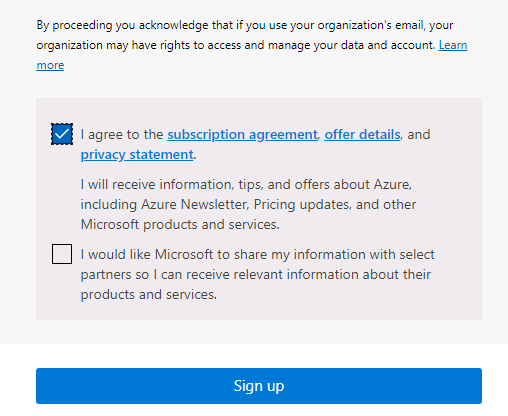

---
lab:
    title: '00 - Lab Setup Testing'
    learning path: '01'
    module: 'Module 01 - Implement an identity management solution'
---

# Lab 00: Lab Environment Setup

## Lab scenario

You need to create a new Azure subscription and request a Azure AD P2 license to be ready to complete the upcoming labs.

#### Estimated time: 5 minutes

## Create an Azure account and add Azure Active Directory Premium P2 trial licenses

The tasks in this exercise and the exercises in this learning path require you to already have an Azure subscription that you can use or to sign up for an Azure trial account. If you already have your own Azure subscription, you may skip this task and continue to the next.

1. In a web browser, go to [https://azure.microsoft.com/free](https://azure.microsoft.com/free).

1. Scroll down through the page to learn more about the benefits and free services available.

1. Select **Start free**.

1. Use the wizard to sign up for your Azure trial subscription.

1. You will need to an Azure AD P2 license to complete some of the exercises. In the organization you created, search for and then select **Azure Active Directory**.

1. In the left navigation menu, select **Getting started**.

1. Under Getting started with Azure AD, select **Get a free trial for Azure AD Premium**.

1. In the Activate pane, under **AZURE AD PREMIUM P2**, select **Free trial** and then select **Activate**.

1. In the navigation menu on the left, select **Overview**.

1. Refresh the browser until you see Azure AD Premium P2 under the organization name. It may take a couple of minutes.

1. You may need to sign out and sign back into Microsoft Azure if you encounter any problems with expected features not being available.

#### Redeem Azure Pass

1. Open a browser and navigate to: [www.microsoftazurepass.com](https://www.microsoftazurepass.com).

1. It is recommended you close all browsers and open a new In-Private Browser session. Other log-ins can persist and cause errors during the activation step.

1. Select the **Start** button to get started.

1. Verify that the username is the same as the lab provider tenant account.

1. Enter the Azure Pass voucher code in the **Enter Promo code** field. And verify you are a human if requested. 

1. Enter address information in the **Profile** fields.
    - **Address line 1**: 1 Microsoft Way
    - **City**: Redmond
    - **State**: Washington
    - **ZIP code**: 98052

1. Select the box to agree to the subscription agreement and select **Sign up**.

    

1. Browse to the [https://portal.azure.com](https://portal.azure.com) and sign in using a Global administrator account for the directory.

1. Navigate to **Subscriptions** and verify that the **Azure Pass - Sponsorship** is showing **Active** status. 
