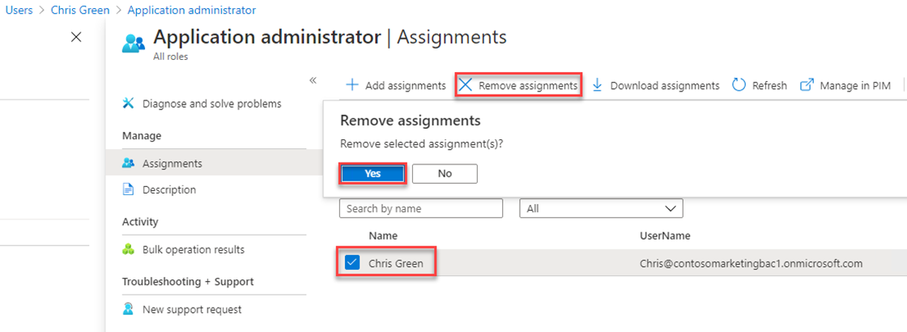

---
lab:
    title: '01 - Manage user roles'
    learning path: '01'
    module: 'Module 01 - Implement an identity management solution'
---

# Lab 01: Manage user roles

## Lab scenario

Your company recently hired a new employee who will perform duties as an application administrator. You must create a new user and assign the appropriate role.

#### Estimated time: 10 minutes

## Exercise 1 - Create a new user and test their application admin rights

### Task 1 - Add a new user

1. Sign in to the [https://portal.azure.com](https://portal.azure.com) as a Global administrator

2. Search for and then select **Azure Active Directory**.

3. In the left navigation menu, under **Manage**, select **Users > + New User**.

4. Ensure that Create User is selected.  Create a user using the following information:

    | **Setting**| **Value**|
    | :--- | :--- |
    | User name| ChrisG|
    | Name| Chris Green|
    | First name| Chris|
    | Last name| Green|

5. Mark the **Let me create the password**

6. Use password = **Pass@word1**

     *You will have to change the password upon first login to this account*

7. Select **Create**. The user is now created and registered to your organization.

### Task 2 - Login and try to create an app

1. Launch a new InPrivate browser window.
2. Open the Azure Portal [https://portal.azure.com](https://portal.azure.com) as Chris Green.

    | **Setting**| **Value**|
    | :--- | :--- |
    | User name| ChrisG@`your domain name.com`|
    | Password| Pass@word1|

3. Update your password.

    | **Setting**| **Value**|
    | :--- | :--- |
    | Current Password| Pass@word1|
    | New Password| Pa$$w.rd1234|
    | Confirm Password| Pa$$w.rd1234|

4. If you see a **Welcome to Microsoft Azure** tour dialog, click the **Maybe Later** button.

5. Search on and select **Enterprise applications** in the search dialog at the top of the screen.
6. Notice that **+ New Application** is unavailable.
7. Try clicking on some of the other settings like **Application Proxy**, **User settings**, and others to see the **Chris Green** does not have rights.
8. Click on **ChrisG** name in the upper-right corner and sign out.

## Exercise 2 - Assign the application admin role and create an app

### Assign a role to a user

Using Azure Active Directory (Azure AD), you can designate limited administrators to manage identity tasks in less-privileged roles. Administrators can be assigned for such purposes as adding or changing users, assigning administrative roles, resetting user passwords, managing user licenses, and managing domain names.

1. In Azure Active Directory, All users blade, select **Chris Green**.

1. On the **user’s profile** page, select **Assigned roles**. The **Assigned roles** page appears.

1. Select **Add assignments**, select the **Application administrator** role and then select **Add**.

    

The newly assigned Application administrator role appears on the user’s **Assigned roles** page.

## Remove a role assignment

If you need to remove the role assignment from a user, you can also do that from the **Assigned roles** page.

1. In **Azure Active Directory**, select **Users**, and then select the user getting the role assignment removed. For example, *Chris Green*.

1. Select **Assigned roles**, select the name of the role your wish to removed.

1. Select the check box for the user who will be removed from the role, and then select **Remove assignments**.

    

The Application administrator role is removed from the user and it no longer appears on the **Chris Green – Assigned roles** page.

