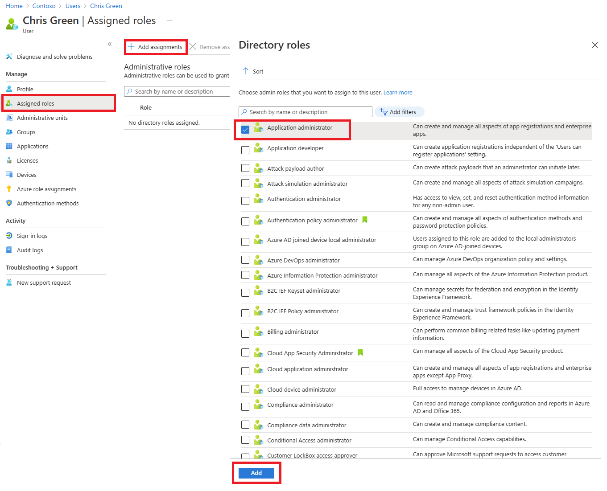
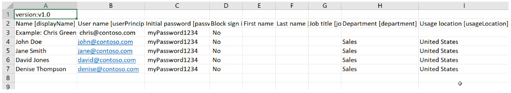
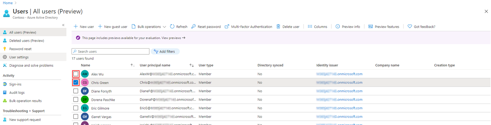

---
lab:
    title: '01 - Manage User Roles'
    learning path: '01'
    module: 'Module 01 - Implement an Identity Management Solution'
---

# WWL Tenants - Terms of Use

If you are being provided with a tenant as a part of an instructor-led training delivery, please note that the tenant is made available for the purpose of supporting the interactive labs in the instructor-led training. Tenants should not be shared or used for purposes outside of interactive labs. The tenant used in this course is a trial tenant and cannot be used or accessed after the class is over and are not eligible for extension. Tenants must not be converted to a paid subscription. Tenants obtained as a part of this course remain the property of Microsoft Corporation and we reserve the right to obtain access and repossess at any time.

# Two different log in options

This lab has two different log in options, used to different parts of the lab. One log-in style is for labs that require Azure resources, the other is for labs that only need Microsoft Entra and Microsoft 365 resources. Log-in types:

  - Azure Resource based log-in
  - Microsoft 365 + E5 tenant log-in
      - MOD Administrator account

You will be told which login to use in each of the labs.


# Lab 01: Manage user roles

### Login type = Microsoft 365 + E5 tenant log-in

## Lab scenario

Your company recently hired a new employee who will perform duties as an application administrator. You must create a new user and assign the appropriate role.

#### Estimated time: 30 minutes

### Exercise 1 - Create a new user and test their application admin rights

#### Task 1 - Add a new user

1. Sign in to the [https://entra.microsoft.com](https://entra.microsoft.com) as a Global administrator.
 - Use the **Microsoft 365 admin** account.

2. In the menu on the left select **Identity**.

3. In the left navigation menu, under **Users**, select **All Users**, then select **+ New User** and **Create new user**.

4. Mark the **Create user** button. Then, create a user with the following information:

    | **Setting**| **Value**|
    | :--- | :--- |
    | User principal name| ChrisG|
    | Display Name| Chris Green|

5. Mark the **Auto-generate password** option.

6. Copy the generated password to a location you can remember it for the next task.

     *You will have to change the password upon first login to this account*

7. Select **Review + Create**. Then select **Create** on the review screen. The user is now created and registered to your organization.

#### Task 2 - Login and try to create an app

1. Launch a new InPrivate browser window.
2. Open the Microsoft Entra admin center [https://entra.microsoft.com](https://entra.microsoft.com) as Chris Green.

    | **Setting**| **Value**|
    | :--- | :--- |
    | User name| ChrisG@`your domain name.com`|
    | Password| Enter the auto-generated password from previous task. |

3. Update your password.

    | **Setting**| **Value**|
    | :--- | :--- |
    | Current Password| Use auto-generated password|
    | New Password| Enter a unique and secure password |
    | Confirm Password| Reenter a unique and secure password |

4. Search on and select **Enterprise applications** in the search dialog at the top of the screen.

5. Select on **+ New application**. Notice that **+ Create your own application** is unavailable.

6. Try Selecting on some of the other settings like **Application Proxy**, **User settings**, and others to see that **Chris Green** does not have rights.

7. Select on **ChrisG** name in the upper-right corner and sign out.


### Exercise 2 - Assign the application admin role and create an app

#### Task 1 - Assign a role to a user

Using Microsoft Entra ID, you can designate limited administrators to manage identity tasks in less-privileged roles. Administrators can be assigned for such purposes as adding or changing users, assigning administrative roles, resetting user passwords, managing user licenses, and managing domain names.

1. If you are not already logged in as a Global Administrator role, open the Microsoft Entra admin center and log in.
2. Navigate to Identity and then select Users page.
3. Select on **All users** under the Manage section of the menu.
4. Select on **Chris Green** account.
5. Choose **Assigned roles** from the Manage menu.
6. Select **+ Add assignments**.
7. Select `Application administrator` role in the dropdown.
8. Select the **Next** button.
9. Mark the **Active** value for **Assignment Type**.
10. Select **Assign**

    

**Note** - If the lab environment has already activated Microsoft Entra ID Premium P2, Privileged Identity Management (PIM) will be enabled and you wll need to select **Next** and assign a Permanent role to this user.

11. Select the **Refesh** button.

**Note - The newly assigned Application administrator role appears on the user’s Assigned roles page.**

#### Task 2 - Check application permissions

1. Launch a new InPrivate browser window.
2. Open the Microsoft Entra admin center [https://entra.microsoftcom](https://entra.microsoft.com) as Chris Green.

    | **Setting**| **Value**|
    | :--- | :--- |
    | User name| ChrisG@`your domain name.com`|
    | Password| Enter the unique and secure password you created earlier |

3. If you see a **Welcome to Microsoft Azure** tour dialog, Select the **Maybe Later** button.
4. Search on and select **Enterprise applications** in the search dialog at the top of the screen.
5. Notice that **+ New Application** is available now.
6. Select **+ New Application**
7. View the **+ Create your own application** is not grayed out.  If you pick a gallery app, you will see the **Create** button is available.

   **Note - This role now has the ability to add applications to the tenant.  We will experiment more with this feature in later labs.**

8. Sign out of the Chris Green instance of the portal and close the browser.

### Exercise 3 - Remove a role assignment

#### Task 1 - Remove the application administrator from Chris Green

This task will use an alternative method to remove the assigned role; it will use the **Roles and administrators** option in Micrisoft Entra ID.

1. If you are not already logged in as your Global Admin, launch the Microsoft Entra admin center and log in now.
2. In the search box type **Roles** and then launch Microsoft Entra ID roles and administration.
3. In **All roles** of **Roles and administrators**, select the **Application administrator** role from the list.
4. On the **Application administrator | Assignments** page you should see Chris Green's name listed.
5. Scroll all the way to the right on Chris Green.
6. Select **Remove** from the options at the top of the dialog.
7. Answer **Yes** when the confirmation box opens.
8. Close the screen.

### Exercise 4 - Bulk import of users

#### Task 1 - Bulk operations for creating users with a .csv file

1. In the Microsoft Entra ID menu, first open **Identity**, then select **Users** and then select **All users**.

2. On the **Users | All users** tile, select the **Bulk operations** drop-down arrow and then **Bulk create**.

3. Selecting **Bulk create** will open a new tile. This tile provides a **Download** link to a template file that you will edit to populate with your user information and upload to add the bulk creation of users.

4. Select **Download** to download the .csv file.

5. The .csv template provides you with the fields included with the user profile. This includes the required username, display name, and initial password. You can also complete optional fields, such as Department and Usage location, at this time. The following screenshot is an example of how you can complete the .csvfile: 

    

    You can modify this file to add users in bulk.  Note that you do not need to fill out all the field.  As per the sample data provide, you mainly need to add the name and username information.

6. A sample CSV has been provided in the Allfiles/Labs/Lab1 folder -- **SC300BulkUser.csv**.
   1. Open Notepad.
     - Inside the lab environment, select the START button and type Notepad.  
   1. Open the SC300BulkUser.csv file
   1. Change the **enter your domain name** to the domain of your Azure lab environment.
   1. Save the file.

7. On the **Bulk create users** dialog, select the file folder icon on step 3.

8. Path to the Allfiles/Labs/Lab1 folder and select **SC300BulkUser.csv** file.

9. Select **Open**.

7. You will be notified that the file uploaded successfully.  Choose **Submit** to add the users. 

After the users have been created, you will be prompted that the creation has succeeded.  Close the Bulk create users tile and the new users will be populated in the list of **Users | All users**. 

#### Task 2 - Bulk addition of users using PowerShell

1. Open PowerShell as an administrator.  This can be done by searching for PowerShell in Windows and choosing Run as administrator. 

**Note** - You need to have PowerShell version 7.2 or higher for this lab to function.  When PowerShell opens you will get a version at the top of the screen, if you are running and older version, follow the instructions on the screen to go to https://aka.ms/PowerShell-Release?tag=7.3.9. Scroll down to the assets section and select powershell-7.3.1-win-x64.msi. When the download has completed, select Open file. Install using all the defaults.

**Lab Tip** - TouchType does not work with PowerShell well in the lab environment.  To work around this issue, you open Notepad in you lab environment. Next use the TouchType feature to place the script into Notepad, then finally use Copy & Paste to put the command into PowerShell.  Apologies for this extra step.

2. You will need to Install the Microsoft.Graph PowerShell module if you have not used it before.  Run the following two commands and when prompted to confirm press Y:

    ```
    Install-Module Microsoft.Graph
    ```
3. Confirm the Microsoft.Graph module is installed:

    ```
    Get-InstalledModule Microsoft.Graph
    ```
    

4. Next, you will need to login to Microsoft Graph API by running:  

    ```
    Connect-MgGraph -Scopes "User.ReadWrite.All"
    ``` 
    The Edge browser will open and you will be prompted to sign-in.  Use the MOD Administrator account to connect.  Accept the permissions request; then close the browser window.

5. To verify that you are connected and to see existing users, run:  

    ``` 
    Get-MgUser 
    ```
    
7. To assign a common temporary password to all new users, run the following command and replace the <Enter a complex Password> with the password that you would like to provide to your users.  

    ``` 
    $PWProfile = @{
        Password = "<Enter a complex password you will>";
        ForceChangePasswordNextSignIn = $false
    }
    ```

8. You are ready to create a new users.  The following command will be populated with the user information and run.  If you have more than one user to add, you can use a notepad txt file to add the user information and copy/paste into PowerShell. 

    ```
    New-MgUser `
        -DisplayName "New PW User" `
        -GivenName "New" -Surname "User" `
        -MailNickname "newuser" `
        -UsageLocation "US" `
        -UserPrincipalName "newuser@<labtenantname.com>" `
        -PasswordProfile $PWProfile -AccountEnabled `
        -Department "Research" -JobTitle "Trainer"
    ```
**Note** - Replace **labtenantname.com** with the **onmicrosoft.com** name assigned by the lab tenant.

## Experiment with managing users

You can add and remove users with the Microsoft Entra ID page.  However, users can be created and roles can be assigned using the scripting.  Experiment with giving the Chris Green user account a different role using script. 
 

### Exercise 5 - Remove a user from Microsoft Entra ID

#### Task 1 - Remove a User

It may happen that an account is deleted and then needs to be recovered. You need to verify you can recover an account that has been deleted recently.

1. Browse to [https://entra.microsoft.com](Microsoft Entra admin center).

2. In the left navigation, under **Identity**, select **Users**.

3. Open the **All users** list, select the check box for a user that will be deleted. For example, select **Chris Green**.

    **Tip** - Selecting users from the list allows you to manage multiple users at the same time. If you select the user, to open that user’s page, you will only be managing that individual user.

    

4. With the user account selected, on the menu, select **Delete**.

5. Review the dialog box and then select **Yes**.

#### Task 2 - Restore a deleted user

1. In the Users page,select **All User** in the left navigation, select **Deleted users**.

2. Review the list of deleted users and select **Chris Green**.

    **Important** - By default, deleted user accounts are permanently removed from Azure Active Directory automatically after 30 days.

3. On the menu, select **Restore user**.

4. Review the dialog box and then select **OK**.

5. In the left navigation, select **All users**.

6. Verify the user has been restored.


### Exercise 6 - Add a Windows 10 license to a user account

#### Task 1 - Find your unlicensed user in Azure Active Directory

Some user accounts in your organization will not be provided all available products in their assigned license or will need updates or additions to their license assignment. You need to ensure you are able to update a user account's license assignment in Microsoft Entra ID.

1. Browse to [https://entra.microsoft.com]( https://entra.microsoft.com).

2. In the left navigation, under **Identity**, select **Users**, then select **All users**.

3. In the Users page, enter **Raul** into the search box.

4. Select on **Raul Razo**.

5. Review Raul's profile and ensure he has a Usage Location set.

    **Warning** - To assign a license to a user, the user must assigned a usage location.

6. Select the **Licenses** menu item in the menu on the left.

7. Ensure that Raul has "No license assignments found."

#### Task 2 - Add a Windows license to Raul

You have to add and remove licenses via the Microsoft 365 admin center. This is a relatively new change.

1. Open a new tab in your browser.

2. Connect to the Microsoft 365 admin center at [https://admin.microsoft.com](https://admin.microsoft.com).

3. Log in as your administrator account if prompted.

4. From the menu on the left, select **Billing** and then select **Licenses**.

5. Select **Windows 10/11 Enterprise E3** license from the list.

6. Choose the **+ Assign licenses** item.

7. Search for **Raul Razo** in the list.

8. Once you have added Raul, select **Assign**.

9. Return to the browser tab with **Microsoft Entra admin center** open.

10. Navigate back to the **All Users** in the left navigation, under **Identity**, select **Users**

11. In the Users page, select **Raul Razo**.

12. In the left navigation, select **Licenses**.

13. Notice that the license has been assigned.

14. You can exit out of the license screen.
