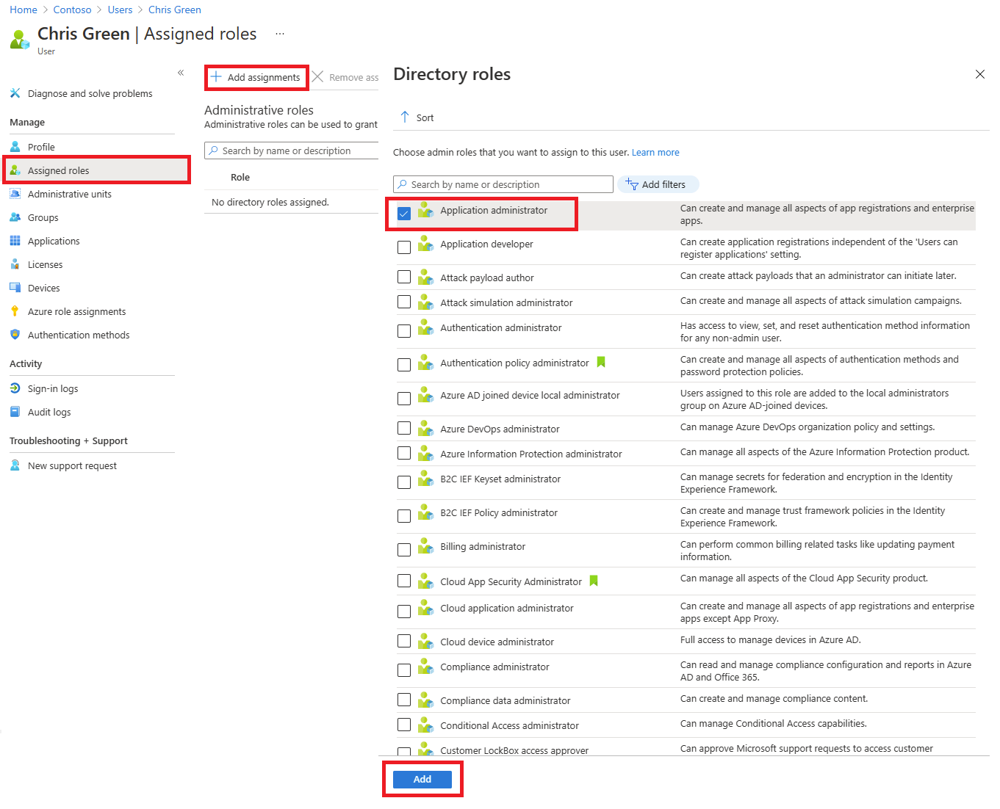
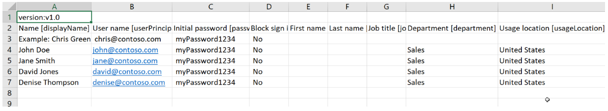
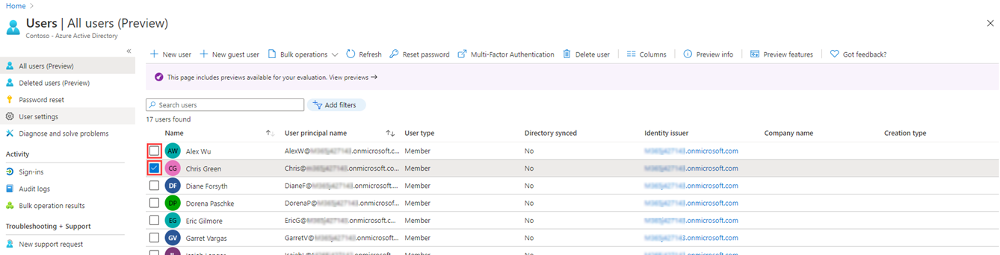

---
lab:
  title: 01 - Manage User Roles
  learning path: '01'
  module: Module 01 - Implement an Identity Management Solution
  description: Explore the different methods to create, remove, and add roles to new users in your Microsoft Entra tenant.
  duration: 30 minutes
  level: 300
  islab: true
---

# WWL Tenants - Terms of Use

If you are being provided with a tenant as a part of an instructor-led training delivery, please note that the tenant is made available for the purpose of supporting the interactive labs in the instructor-led training. Tenants should not be shared or used for purposes outside of interactive labs. The tenant used in this course is a trial tenant and cannot be used or accessed after the class is over and are not eligible for extension. Tenants must not be converted to a paid subscription. Tenants obtained as a part of this course remain the property of Microsoft Corporation and we reserve the right to obtain access and repossess at any time.

# Two different log in options

This lab has two different log in options, used to different parts of the lab. One log-in style is for labs that require Azure resources, the other is for labs that only need Microsoft Entra and Microsoft 365 resources. Log-in types:

  - Azure Resource based log-in
  - Microsoft 365 + E5 tenant log-in
      - MOD Administrator account

You will be told which login to use in each of the labs.


# Lab 01: Manage user roles

### Login type = Microsoft 365 + E5 tenant log-in

## Lab scenario

Your company recently hired a new employee who will perform duties as an application administrator. You must create a new user and assign the appropriate role.

#### Estimated time: 30 minutes

### Exercise 1 - Create a new user and test their application admin rights

#### Task 1 - Add a new user

1. Open Microsoft Edge, go to **`https://entra.microsoft.com`**, and sign in as a Global Administrator using the Microsoft 365 admin credentials provided by your authorized lab hoster (ALH).

1. In the left navigation menu, under **Entra ID**, select **Users**.

1. On the **Users** page, select **All users**, select **+ New user**, and then select **Create new user**.

1. Create a user with the following information:

    | **Setting**| **Value**|
    | :--- | :--- |
    | User principal name| ChrisG|
    | Display Name| Chris Green|

1. Ensure the **Auto-generate password** option is marked.

1. Copy the user name and the generated password to a location so you can access them in the next task.

     *You will have to change the password upon first login to this account*

1. Select **Review + Create**. Then select **Create** on the review screen. The user is now created and registered to your organization.

#### Task 2 - Login and try to create an app

1. Launch a new InPrivate browser window.

1. Open the Microsoft Entra admin center at **`https://entra.microsoft.com`** and sign in as **Chris Green**.

    | **Setting**| **Value**|
    | :--- | :--- |
    | User name| Enter the user name from previous task. |
    | Password| Enter the auto-generated password from previous task. |

1. Update your password.

    | **Setting**| **Value**|
    | :--- | :--- |
    | Current Password| Use auto-generated password|
    | New Password| Enter a unique and secure password |
    | Confirm Password| Reenter a unique and secure password |

  **Lab Tip** - it is recommended that you use the User Password provided in the lab environment.

1. In the search box at the top of the page, search for **Enterprise applications**, and then select it from the results.

1. Select **+ New application**, and notice that **+ Create your own application** is unavailable.

1. Try selecting other settings, such as **Consent and permissions** and **User settings**, to verify that **Chris Green** does not have sufficient permissions.

1. Select **ChrisG** in the upper-right corner, and then sign out.

### Exercise summary

In this exercise, you created a new user in Microsoft Entra ID and signed in as that user to confirm they could not yet manage applications. This exercise showed how new accounts have no privileged access by default.

### Exercise 2 - Assign the application admin role and create an app

#### Task 1 - Assign a role to a user

Using Microsoft Entra ID, you can designate limited administrators to manage identity tasks in less-privileged roles. Administrators can be assigned for such purposes as adding or changing users, assigning administrative roles, resetting user passwords, managing user licenses, and managing domain names.

1. If you are not already logged in as an Administrator role, open the Microsoft Entra admin center and log in.

1. In the left navigation menu, under **Entra ID**, select **Users**.

1. Select **All users** under the Manage section of the menu.

1. Select **Chris Green** account.

1. Choose **Assigned roles** from the Manage menu.

1. Select **+ Add assignments**.

1. Select **Application administrator** role from the dropdown.

1. Select the **Next** button.

1. Select the **Active** value for **Assignment Type**.

1. Enter as justification like +++Needed for lab+++. Then select **Assign**

    

    >**Note:** If the lab environment has already activated Microsoft Entra ID Premium P2, Privileged Identity Management (PIM) will be enabled and you will need to select **Next** and assign a Permanent role to this user.

1. Select the **Refresh** button.

    >**Note:** The newly assigned Application administrator role appears on the user’s Assigned roles page.

#### Task 2 - Check application permissions

1. Launch a new InPrivate browser window.

1. Open the Microsoft Entra admin center at **`https://entra.microsoft.com`** and sign in as **Chris Green**.

    | **Setting**| **Value**|
    | :--- | :--- |
    | User name| Enter the user name from previous task. |
    | Password| Enter the unique and secure password you created earlier |

1. In the search box at the top of the page, search for **Enterprise applications**, and then select it from the results.

1. Select **+ New application**.

1. Notice that **Create your own application** is now available and no longer grayed out.

1. Select **+ Create your own application**.

1. Notice that the **Create** button is now available at the bottom of the pane.

    >**Note:** After the Application Administrator role is assigned, this role now has the ability to add applications to the tenant. We will experiment more with this feature in later labs.

1. Sign out of the Chris Green instance of the portal and close the browser.

### Exercise summary

In this exercise, you assigned the Application Administrator role to the user and verified that they could now create enterprise applications. This exercise showed how directory roles grant scoped administrative permissions.

### Exercise 3 - Remove a role assignment

#### Task 1 - Remove the application administrator from Chris Green

This task will use an alternative method to remove the assigned role; it will use the **Roles and administrators** option in Microsoft Entra ID.

1. If you are not already logged in as an Admin, launch the Microsoft Entra admin center and log in now.

1. In the search box type **Roles** and then launch **Microsoft Entra roles and administration**.

1. In **All roles** of **Roles and administrators**, select the **Application administrator** role from the list.

1. On the **Application administrator | Assignments** page you should see Chris Green's name listed.

1. Scroll all the way to the right on Chris Green.

1. Select **Remove** from the options at the top of the dialog.

1. Answer **Yes** when the confirmation box opens.

1. Close the screen.

### Exercise summary

In this exercise, you removed the Application Administrator role from the user through Roles and administrators. This exercise showed an alternative path for managing role assignments and supports least-privilege governance.

### Exercise 4 - Bulk import of users

#### Task 1 - Bulk operations for creating users with a .csv file

1. In the Microsoft Entra ID menu, under **Entra ID**, select **Users** and then select **All users**.

1. On the **Users | All users** tile, select the **Bulk operations** drop-down arrow and then select **Bulk create**.

1. Selecting **Bulk create** will open a new tile. This tile provides a **Download** link to a template file that you will edit to populate with your user information and upload to add the bulk creation of users.

1. Select **Download** to download the **.csv** file.

1. The .csv template provides you with the fields included with the user profile. This includes the required username, display name, and initial password. You can also complete optional fields, such as Department and Usage location, at this time. The following screenshot is an example of how you can complete the .csvfile: 

    

    You can modify this file to add users in bulk.  Note that you do not need to fill out all the fields.  As per the sample data provide, you mainly need to add the name and username information.

1. A sample CSV has been provided in the Allfiles/Labs/Lab1 folder -- **SC300BulkUser.csv**.
   1. Open Notepad.
     - Inside the lab environment, select the START button and type Notepad.  
   1. Open the SC300BulkUser.csv file
   1. Change the **enter your domain name** to the domain of your Azure lab environment.
   1. Save the file.

1. On the **Bulk create users** dialog, select the file folder icon on step 3.

1. Path to the Allfiles/Labs/Lab1 folder and select **SC300BulkUser.csv** file.

1. Select **Open**.

1. You will be notified that the file uploaded successfully. Select **Submit** button to add the users. 

After the users have been created, you will be prompted that the creation has succeeded.  Close the Bulk create users tile and the new users will be populated in the list of **Users | All users**. 

#### Task 2 - Bulk addition of users using PowerShell

1. Open PowerShell from the Windows Start menu.

    >**Note:** You need to have PowerShell version 7.2 or higher for this lab to function.  When PowerShell opens you will get a version at the top of the screen, if you are running and older version, follow the instructions on the screen to go to `https://aka.ms/PowerShell-Release?tag=7.3.9`. Scroll down to the assets section and select powershell-7.3.1-win-x64.msi. When the download has completed, select Open file. Install using all the defaults.

    **Lab Tip** - TouchType does not work with PowerShell well in the lab environment.  To work around this issue, you open Notepad in your lab environment. Next use the TouchType feature to place the script into Notepad, then finally use Copy & Paste to put the command into PowerShell.  Apologies for this extra step.

1. You will need to Install the Microsoft.Graph PowerShell module if you have not used it before.  Run the following two commands and when prompted to confirm press Y:

    ```
    Install-Module Microsoft.Graph -Scope CurrentUser -Verbose
    ```

1. Confirm the Microsoft.Graph module is installed:

    ```
    Get-InstalledModule Microsoft.Graph
    ```

1. Next, you will need to login to Microsoft Graph API by running:  

    ```
    Connect-MgGraph -Scopes "User.ReadWrite.All"
    ``` 
    The Edge browser will open and you will be prompted to sign-in.  Use the MOD Administrator account to connect.  Accept the permissions request; then close the browser window.

1. To verify that you are connected and to see existing users, run:  

    ``` 
    Get-MgUser 
    ```
    
1. To assign a common temporary password to all new users, run the following command and replace the <Enter a complex Password> with the password that you would like to provide to your users.  

    ``` 
    $PWProfile = @{
        Password = "<Enter a complex password you will>";
        ForceChangePasswordNextSignIn = $false
    }
    ```

1. You are ready to create a new user. The following command will be populated with the user information and run.  If you have more than one user to add, you can use a notepad txt file to add the user information and copy/paste into PowerShell. 

    ```
    New-MgUser `
        -DisplayName "New PW User" `
        -GivenName "New" -Surname "User" `
        -MailNickname "newuser" `
        -UsageLocation "US" `
        -UserPrincipalName "newuser@<labtenantname.com>" `
        -PasswordProfile $PWProfile -AccountEnabled `
        -Department "Research" -JobTitle "Trainer"
    ```
    >**Note:** Replace **labtenantname.com** with the **onmicrosoft.com** name assigned by the lab tenant.

## Experiment with managing users

You can add and remove users with the Microsoft Entra ID page. However, users can be created and roles can be assigned using the scripting.  Experiment with giving the Chris Green user account a different role using script. 

### Exercise summary

In this exercise, you created multiple users by uploading a CSV file and by running PowerShell with Microsoft Graph. This exercise showed how to scale user provisioning beyond the portal.

### Exercise 5 - Remove a user from Microsoft Entra ID

#### Task 1 - Remove a User

It may happen that an account is deleted and then needs to be recovered. You need to verify you can recover an account that has been deleted recently.

1. Browse to the **Microsoft Entra admin center** at **`https://entra.microsoft.com`**.

1. In the left navigation menu, under **Entra ID**, select **Users**.

1. Select **All users**, and then select the check box for the user you want to delete (for example, **Chris Green**).

    **Tip** - Selecting users from the list allows you to manage multiple users at the same time. If you select the user, to open that user's page, you will only be managing that individual user.

    

1. With the user account selected, select **Delete** from the menu.

1. Review the confirmation dialog, and then select **Yes**.

#### Task 2 - Restore a deleted user

1. On the **Users** page, select **Deleted users** from the left navigation menu.

1. Review the list of deleted users, and then select **Chris Green**.

    **Important** - By default, deleted user accounts are permanently removed from Azure Active Directory automatically after 30 days.

1. On the menu, select **Restore user**.

1. Review the dialog box and then select **OK**.

1. In the left navigation menu, select **All users**.

1. Verify the user has been restored.

### Exercise summary

In this exercise, you deleted a user account and then restored it from the Deleted users list. This exercise showed how the soft-delete recovery window protects against accidental account loss.

### Exercise 6 - Add a Windows 10 license to a user account

#### Task 1 - Find your unlicensed user in Azure Active Directory

Some user accounts in your organization will not be provided all available products in their assigned license or will need updates or additions to their license assignment. You need to ensure you are able to update a user account's license assignment in Microsoft Entra ID.

1. Browse to the **Microsoft Entra admin center** at **`https://entra.microsoft.com`**.

1. In the left navigation menu, under **Entra ID**, select **Users**, and then select **All users**.

1. On the **Users** page, enter **Raul** in the search box.

1. Select **Raul Razo**.

1. Review Raul's profile and ensure he has a Usage Location set.

    **Warning** - To assign a license to a user, the user must assigned a usage location.

1. In the left navigation menu, select **Licenses**.

1. Ensure that Raul has "No license assignments found."

#### Task 2 - Add a Windows license to Raul

You have to add and remove licenses via the Microsoft 365 admin center. This is a relatively new change.

1. Open a new browser tab.

1. Go to the **Microsoft 365 admin center** at **`https://admin.microsoft.com`**.

1. Sign in with your administrator account if prompted.

1. In the left navigation menu, select **Billing**, and then select **Licenses**.

1. Select **Windows 10/11 Enterprise E3** license from the list.

1. Select **+ Assign licenses** from the menu.

1. Search for **Raul Razo**, and then select the user from the list.

1. After adding Raul, select **Assign licenses**.

1. Return to the browser tab with **Microsoft Entra admin center** open.

1. In the left navigation menu, under **Entra ID**, select **Users**, and then select **All users**.

1. On the **Users** page, select **Raul Razo**.

1. In the left navigation menu, select **Licenses**.

1. Notice that the license has been assigned.

1. You can exit out of the license screen.

### Exercise summary

In this exercise, you assigned a Windows 10/11 Enterprise E3 license to a user from the Microsoft 365 admin center and verified the assignment in Microsoft Entra ID. This exercise showed how license assignment is performed and reflected across admin centers.
