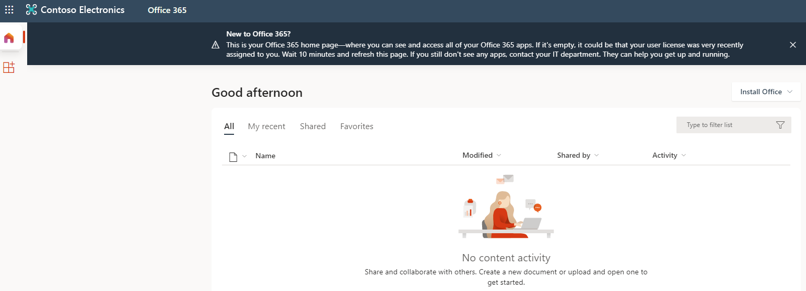
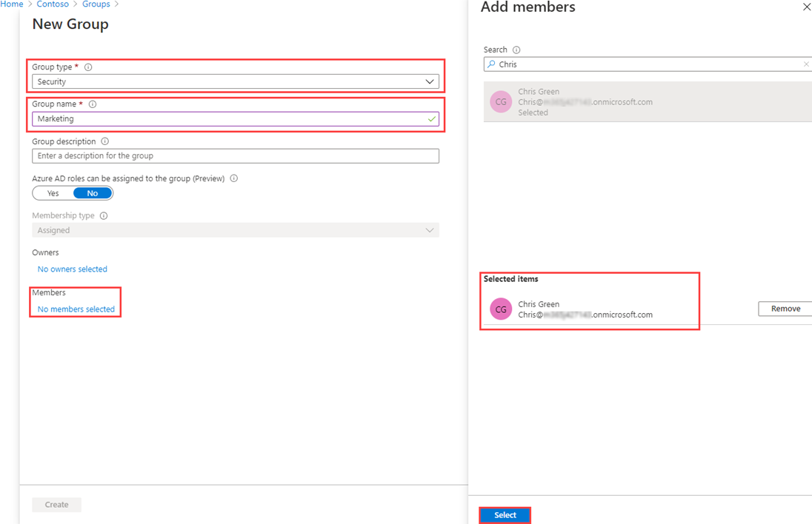
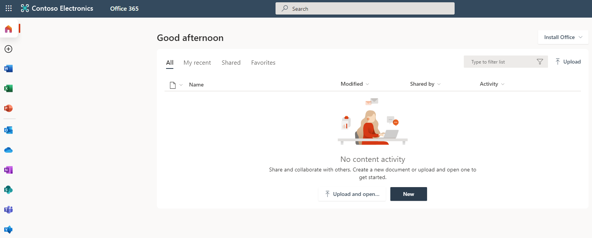
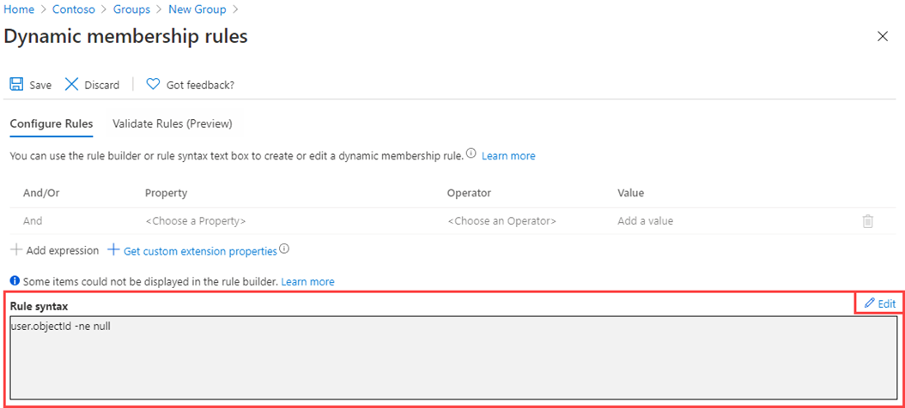

---
lab:
    title: '03 - Assigning licenses using group membership'
    learning path: '01'
    module: 'Module 01 - Implement an identity management solution'
---

# Lab 03: Assigning licenses using group membership

### Login type = Microsoft 365 + E5 tenant log-in

## Lab scenario

Your organization has decided to use security groups in Microsoft Entra ID to manage licenses. You need to configure a new security group and assign a license to that group and verify group member license's have been updated.

#### Estimated time: 25 minutes

### Exercise 1 - Create a security group and add a user

#### Task 1 - Check to see if Delia Dennis has access to Office 365

1. Launch a new InPrivate browser window.
2. Connect to [https://www.office.com](https://www.office.com).
3. Select Sign in and connect as Delia Dennis.

   | **Setting** | **Value** |
   | :--- | :--- |
   | Username | DeliaD@`your domain name.com` |
   | Password| Enter the User password provided for DeliaD |

4. You should connect to the Office.com website, but see a message indicating you don't have a license.

   
    
5. Close the browser window.

#### Task 2 -  Create a security group in Microsoft Entra ID

1. Browse to [https://entra.microsoft.com](https://entra.microsoft.com).

2. In the left navigation, under **Identity**, select **Groups**, then select **All groups**.
3. In the Groups page, on the menu, select **New group**.
4. Create a group using the following information:

   | **Setting**| **Value**|
   | :--- | :--- |
   | Group type| Security|
   | Group name| sg-SC300-O365|
   | Membership type| Assigned|
   | Owners| *Assign your own administrator account as the group owner*|

5. Select the **No members selected** text under Members.
6. Select **Delia Dennis** from the list of users.
7. Select the **Select** button.

   

8. Select the **Create** button.
9. When complete, verify the group named **sg-SC300-O365** is shown in the **All groups** list.

#### Task 3 - Add an Office license to sg-SC300-O365

**Lab Tip** - You have to add and remove licenses via the Microsoft 365 admin center. This is a relatively new change.

1. Open a new tab in your browser.

2. Connect to the Microsoft 365 admin center at http://admin.microsoft.com.

3. Log in as your administrator account if prompted.

4. From the menu on the left, select **Billing** and then select **Licenses**.

5. Select **Office 365 E3** license from the list.

6. Select the **Groups** tab on the licensing screen.

7. Choose the **+ Add license** item.

8. Search for **sg-SC300-O365** group the select it from the list.

8. Once you have added the group, select **Assign**.
 
9. Close the confirmation message.

10. Return to the browser tab with **Microsoft Entra admin center** open.

11. Navigate back to the **All groups** in the left navigation, under **Identity**, select **Groups**

12. In the Users page, select **sg-SC300-O365**.

13. In the left navigation, select **Licenses**.

14. Notice that the Office 365 E3 license has been assigned.

15. You can exit out of the license screen.

#### Taks 4 - Confirm the Office 365 license

1. Launch a new InPrivate browser window.
2. Connect to [https://www.office.com](https://www.office.com).
3. Select Sign in and connect as Delia Dennis.

   | **Setting**| **Value**|
   | :--- | :--- |
   | Username | DeliaD@`your domain name.com`|
   | Password| Enter the password of the Global Admin from the Resources|

4. You should connect to the Office.com website, and see no messages regarding license. All of the Office applications are available on the left.

   
    
5. Close the browser window.

### Exercise 2 - Create a Microsoft 365 group in Microsoft Entra ID

#### Task 1 - Create the group

Part of your duties as an Microsoft Entra administrator is to create different types of groups. You need to create a new Microsoft 365 group for your organization's sales department.

1. Browse to [https://entra.microsoft.com]( https://entra.microsoft.com).

2. In the left navigation, under **Identity**, select **Groups**, then select **All Groups**.

3. In the Groups page, on the menu, select **New group**.

4. Create a group using the following information:

   | **Setting**| **Value**|
   | :--- | :--- |
   | Group type| Microsoft 365|
   | Group name| Northwest Sales|
   | Membership type| Assigned|
   | Owners| *Assign your own administrator account as the group owner*|
   | Members| **Alex Wilber** and **Bianca Pisani**|

   

5. When complete, verify the group named **Northwest sales** is shown in the **All groups** list.

### Exercise 3 - Creating a dynamic group with all users as members

#### Task 1 - Create the dynamic group

As your company grows, manually group management is too time consuming. Since standardizing the directory, you can now take advantage of dynamic groups. You must create a new dynamic group to ensure you're ready for dynamic group creation in production.

1. Sign in to the [https://entra.microsoft.com](https://entra.microsoft.com) with an account that is assigned the Global administrator or User administrator role in the tenant.

2. Select **Identity**.

3. Under **Groups**, select **All groups**, and then select **New group**.

4. On the New Group page, under **Group type**, select **Security**.

5. In the **Group name** box, enter **SC300-myDynamicGroup**.

6. Select the **Membership type** menu and then select **Dynamic User**.

7. Select an **Owner** for the group.

7. Under **Dynamic user members**, select **Add dynamic query**.

8. On the right above the **Rule syntax** box, select **Edit**.

9. In the Edit rule syntax pane, enter the following expression in the **Rule syntax** box:

   ```powershell
   user.objectId -ne null
   ```

   **Warning** - the `user.objectId` is case sensitive.

10. Select **OK**. The rule appears in the Rule syntax box.

   

11. Select **Save**. The new dynamic group will now include B2B guest users as well as member users.

12. On the New group page, select **Create** to create the group.

#### Task 2 - Verify the members have been added

**Note** - The population of Dynamic group membership may take up to 15 minutes.

1. Select on the **Home** `Microsoft Entra admin center`.
2. Launch **Identity**.
3. In the **Groups** menu Select on **All groups**.
4. In the filter box type **SC300** and your newly created group will be listed.
5. Select on **SC300-myDynamicGroup** to open the group.
6. Notice that it shows that it contains 30+ **Direct members*.
7. Select on **Members** in the **Manage** menu.
8. Review the members.

#### Task 3 - Experiment with alternate rules

1. Try making a group with only **Guest** users:

   - (user.objectId -ne null) and (user.userType -eq "Guest")

2. Try make a group with only **Members** of the Microsoft Entra users.

   - (user.objectId -ne null) and (user.userType -eq "Member")

**Lab Tip** - If you get a Failed to Create Group message mentioning an Invalid Operator, confirm the spelling of the operator.  Note I in objectId and the T in userType are capital letters.
