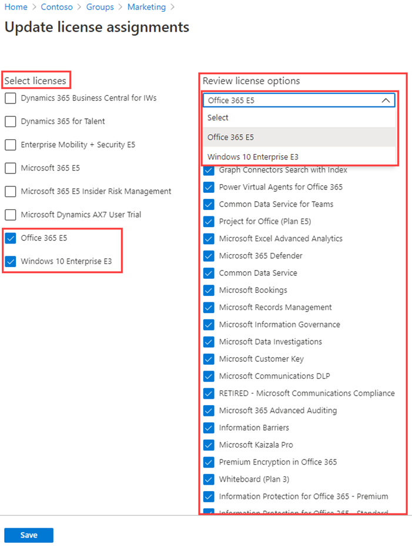

---
lab:
    title: '03 - Assigning licenses using group membership'
    learning path: '01'
    module: 'Module 02 - Create, configure, and manage identities'
---

# Lab 03: Assigning licenses using group membership

## Lab scenario

Your organization has decided to use security groups in Azure AD to manage licenses. You need to configure a new security group and assign a license to that group and verify group member license's have been updated.

#### Estimated time: 10 minutes

## Exercise 1 - Create a security group and add a user

### Task 1 - Check to see if Delia Dennis has access to Office 365

1. Launch a browser window.
2. Connect to [https://www.office.com](https://www.office.com).
3. Clcick Sign in and connect as Delia Dennis.

    | **Setting**| **Value**|
    | :--- | :--- |
    | Username | DeliaD@ <<you azure domain>>|
    | Password| pass@word123|

4. You should connecit to the Office.com website, but see a message indicating you don't have a license.

    
    
5. Close the browser window.

### Task 2 -  Create a security group in Azure Active Directory

1. Browse to [https://portal.azure.com/#blade/Microsoft_AAD_IAM/ActiveDirectoryMenuBlade/Overview]( https://portal.azure.com/#blade/Microsoft_AAD_IAM/ActiveDirectoryMenuBlade/Overview).

2. In the left navigation, under **Manage**, select **Groups**.
3. In the Groups blade, on the menu, select **New group**.
4. Create a group using the following information:

    | **Setting**| **Value**|
    | :--- | :--- |
    | Group type| Security|
    | Group name| sg-SC300-O365|
    | `Membership type| Assigned|
    | Owners| *Assign your own administrator account as the group owner*|

5. Click the **No members selected** text under Members.
6. Select **Delia Dennis** from the list of users.
7. Click the **Select** button.

    

8. Click the **Create** button.
9. When complete, verify the group named **sg-SC300-O365** is shown in the **All groups** list.

## Task 3 - Assign a license to a group

1. In the **All groups** list, select **sg-SC300-O365**.
2. In the Marketing blade, under **Manage**, select **Licenses**.
3. On the menu, select **+ Assignments**.
4. In the update license assignments blade, under **Select licenses**, review the list of available licenses and then select the check box for **Office 365 E3**.

    **Tip** - When multiple licenses are selected, you can use the Review license options menu to select a specific license and view the license option for that license.

    

6. Select **Save**.

### Taks 4 - Confirm the Office 365 license

1. Launch a browser window.
2. Connect to [https://www.office.com](https://www.office.com).
3. Clcick Sign in and connect as Delia Dennis.

    | **Setting**| **Value**|
    | :--- | :--- |
    | Username | DeliaD@ <<you azure domain>>|
    | Password| pass@word123|

4. You should connecit to the Office.com website, but see a message indicating you don't have a license.

    
    
5. Close the browser window.
    
