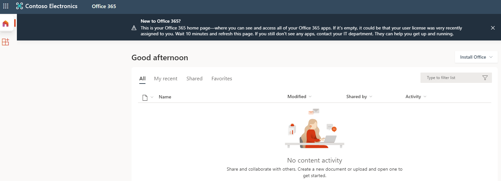
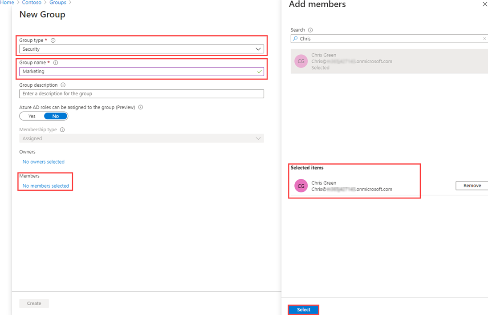
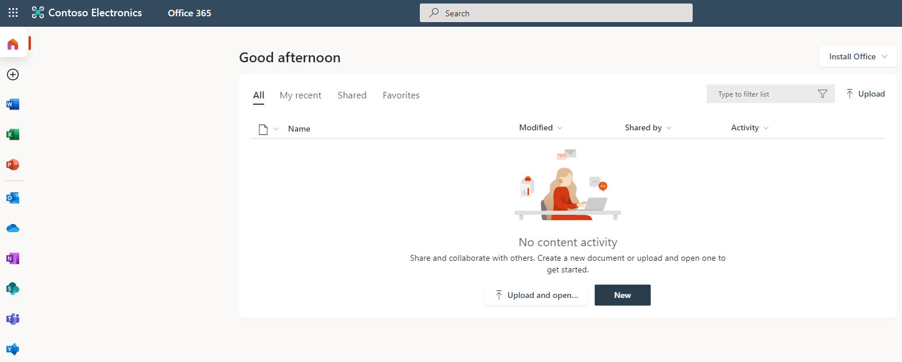
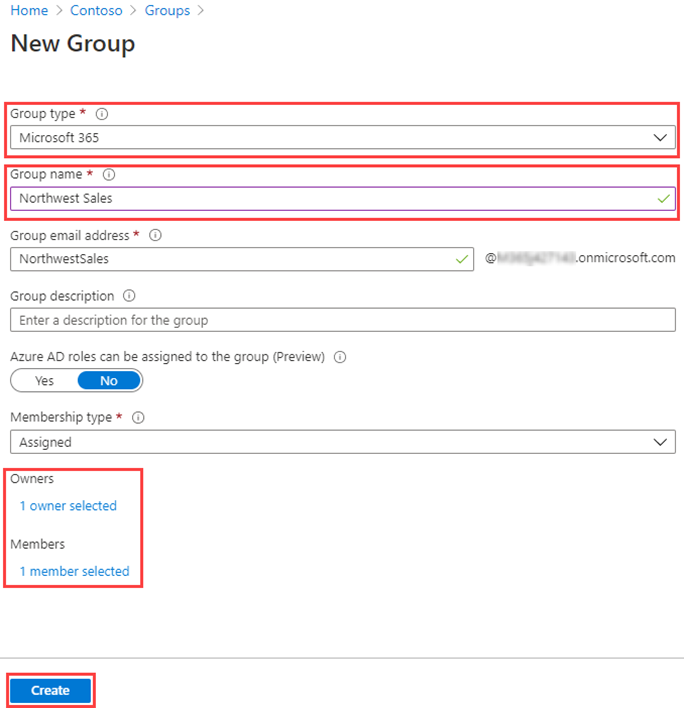
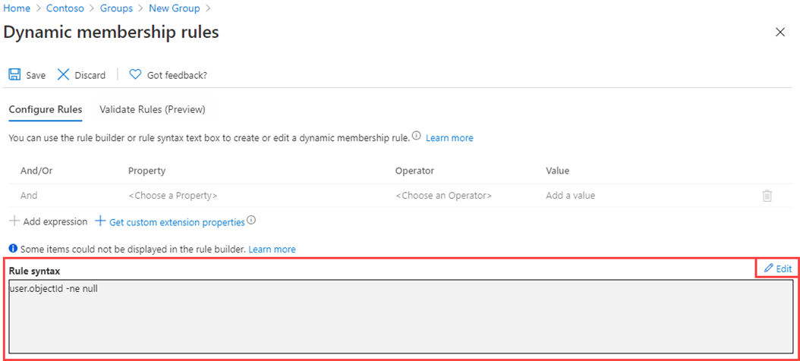

---
lab:
  title: 03 - Assigning licenses using group membership
  learning path: '01'
  module: Module 01 - Implement an identity management solution
  description: Your organization has decided to use security groups in Microsoft Entra ID to manage licenses. You need to configure a new security group and assign a license to that group and verify group member license's have been updated.
  duration: 25 minutes
  level: 300
  islab: true
  primarytopics:
    - Microsoft Entra
    - Microsoft Entra ID
---

# Lab 03: Assigning licenses using group membership

### Login type = Microsoft 365 + E5 tenant log-in

## Lab scenario

Your organization has decided to use security groups in Microsoft Entra ID to manage licenses. You need to configure a new security group and assign a license to that group and verify group member license's have been updated.

#### Estimated time: 25 minutes

### Exercise 1 - Create a security group and add a user

#### Task 1 - Check to see if Delia Dennis has access to Office 365

1. Launch a new InPrivate browser window.

1. Connect to Office at **`https://www.office.com`**.

1. Select Sign in and connect as Delia Dennis.

   | **Setting** | **Value** |
   | :--- | :--- |
   | Username | DeliaD@`your domain name.com` |
   | Password| Enter the User password provided for DeliaD |

1. You should connect to the Office.com website, but see a message indicating you don't have a license.

   
    
1. Close the browser window.

#### Task 2 -  Create a security group in Microsoft Entra ID

1. Browse to **Microsoft Entra admin center** at **`https://entra.microsoft.com`**.

1. In the left navigation, under **Entra ID**, select **Groups**, then select **All groups**.

1. In the Groups page, on the menu, select **New group**.

1. Create a group using the following information:

   | **Setting**| **Value**|
   | :--- | :--- |
   | Group type| **Security** |
   | Group name| **sg-SC300-O365** |
   | Membership type| **Assigned** |
   | Owners| *Assign your own administrator account as the group owner*|

1. Select the **No members selected** text under Members.

1. Select **Delia Dennis** from the list of users.

1. Select the **Select** button.

   

1. Select the **Create** button.

1. When complete, verify the group named **sg-SC300-O365** is shown in the **All groups** list.

#### Task 3 - Add an Office license to sg-SC300-O365

**Lab Tip** - You have to add and remove licenses via the Microsoft 365 admin center. This is a relatively new change.

1. Open a new tab in your browser.

1. Connect to **Microsoft 365 admin center** at **`http://admin.microsoft.com`**.

1. Log in as your administrator account if prompted.

1. From the menu on the left, select **Billing** and then select **Licenses**.

1. Select **Office 365 E3** license from the list.

1. Select the **Groups** tab on the licensing screen.

1. Choose the **+ Assign licenses** item.

1. Search for **sg-SC300-O365** group the select it from the list.

1. Once you have added the group, select **Assign**.
 
1. Close the confirmation message.

1. Return to the browser tab with **Microsoft Entra admin center** open.

1. Navigate back to the **All groups** in the left navigation, under **Entra ID**, select **Groups**.

1. In the Groups page, select **sg-SC300-O365**.

1. In the left navigation, select **Licenses**.

1. Notice that the Office 365 E3 license has been assigned.

1. You can exit out of the license screen.

#### Task 4 - Confirm the Office 365 license

1. Launch a new InPrivate browser window.

1. Connect to Office at **`https://www.office.com`**.

1. Select Sign in and connect as Delia Dennis.

   | **Setting**| **Value**|
   | :--- | :--- |
   | Username | `DeliaD@<your domain name.com>` |
   | Password| Enter the password of the provided password  |

1. You should connect to the Office.com website, and see no messages regarding license. All of the Office applications are available on the left.

   
    
1. Close the browser window.

### Exercise summary

In this exercise, you created a security group, assigned a license to the group, and verified that a member of the group inherited the license. This exercise showed how group-based licensing scales license management beyond per-user assignment.

### Exercise 2 - Create a Microsoft 365 group in Microsoft Entra ID

#### Task 1 - Create the group

Part of your duties as an Microsoft Entra administrator is to create different types of groups. You need to create a new Microsoft 365 group for your organization's sales department.

1. Browse to **Microsoft Entra admin center** at **`https://entra.microsoft.com`**

1. In the left navigation, under **Entra ID**, select **Groups**, then select **All Groups**.

1. In the Groups page, on the menu, select **New group**.

1. Create a group using the following information:

   | **Setting**| **Value**|
   | :--- | :--- |
   | Group type| **Microsoft 365** |
   | Group name| **Northwest Sales** |
   | Membership type| **Assigned** |
   | Owners| *Assign your own administrator account as the group owner*|
   | Members| **Alex Wilber** and **Bianca Pisani**|

   

1. When complete, verify the group named **Northwest sales** is shown in the **All groups** list.

### Exercise summary

In this exercise, you created a Microsoft 365 group with assigned membership and an owner. This exercise showed how Microsoft 365 groups support collaboration scenarios beyond simple access control.

### Exercise 3 - Creating a dynamic group with all users as members

#### Task 1 - Create the dynamic group

As your company grows, manually group management is too time consuming. Since standardizing the directory, you can now take advantage of dynamic groups. You must create a new dynamic group to ensure you're ready for dynamic group creation in production.

1. Sign in to the **Microsoft Entra admin center** at **`https://entra.microsoft.com`**,  with an provided administrator account. You need at least User Administrator role in the tenant.

1. In the left navigation, under **Entra ID**, select **Groups**, then select **All Groups**.

1. On the Groups page, on the menu, select **New group**.

1. On the New Group page, under **Group type**, select **Security**.

1. In the **Group name** box, enter `SC300-myDynamicGroup`.

1. Select the **Membership type** menu and then select **Dynamic User**.

1. Select an **Owner** for the group.

1. Under **Dynamic user members**, select **Add dynamic query**.

1. On the right above the **Rule syntax** box, select **Edit**.

1. In the Edit rule syntax pane, enter the following expression in the **Rule syntax** box:

   ```powershell
   user.objectId -ne null
   ```

   **Warning** - the `user.objectId` is case sensitive.

1. Select **OK**. The rule appears in the Rule syntax box.

   

1. Select **Save**. The new dynamic group will now include B2B guest users as well as member users.

1. On the New group page, select **Create** to create the group.

#### Task 2 - Verify the members have been added

>**Note:** The population of Dynamic group membership may take up to 15 minutes.

1. Select on the **Home** `Microsoft Entra admin center`.

1. In the left navigation menu, under **Entra ID**, select **Groups**.

1. In the **Groups** menu Select on **All groups**.

1. In the filter box type **SC300** and your newly created group will be listed.

1. Select on **SC300-myDynamicGroup** to open the group.

1. Notice that it shows that it contains 30+ **Direct members**.

1. Select on **Members** in the **Manage** menu.

1. Review the members.

#### Task 3 - Experiment with alternate rules

1. Try making a group with only **Guest** users:

   - (user.objectId -ne null) and (user.userType -eq "Guest")

1. Try make a group with only **Members** of the Microsoft Entra users.

   - (user.objectId -ne null) and (user.userType -eq "Member")

**Lab Tip** - If you get a Failed to Create Group message mentioning an Invalid Operator, confirm the spelling of the operator.  Note I in objectId and the T in userType are capital letters.

### Exercise summary

In this exercise, you created a dynamic membership group whose members are evaluated from user attributes, and explored alternate rules for guest and member users. This exercise showed how dynamic groups remove the need to maintain static membership lists.