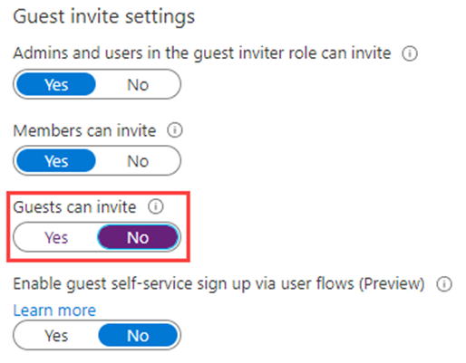

---
lab:
    title: '03 - Configure external collaboration settings'
    module: 'Module 01 - Implement an identity management solution'
---

# Lab 03: Configure external collaboration settings

# Student lab manual

## Lab scenario
You must enable external collaboration settings for your organization for approved guests access.

#### Estimated timing: 5 minutes

### Configure external collaboration settings

1. Sign in to the [https://portal.azure.com](https://portal.azure.com) as a tenant administrator.

1. Select **Azure Active Directory**.

1. Select **External Identities > External collaboration settings**.

1. Under **Guest user access**, review access levels that are available and then select **Guest user access is restricted to properties and memberships of their own directory objects (most restrictive)**.

    **NOTE**
    - Guest users have the same access as members (most inclusive): This option gives guests the same access to Azure AD resources and directory data as member users.
    - Guest users have limited access to properties and memberships of directory objects: (Default) This setting blocks guests from certain directory tasks, like enumerating users, groups, or other directory resources. Guests can see membership of all non-hidden groups.
    - Guest user access is restricted to properties and memberships of their own directory objects (most restrictive): With this setting, guests can access only their own profiles. Guests are not allowed to see other users' profiles, groups, or group memberships.

    

1. Under **Guest invite settings**, under **Guests can invite**, select **No**.

    **NOTE**
    Admins and users in the guest inviter role can invite: To allow admins and users in the "Guest Inviter" role to invite guests, set this policy to Yes.
    Members can invite: To allow non-admin members of your directory to invite guests, set this policy to Yes.
    Guests can invite: To allow guests to invite other guests, set this policy to Yes.
    Enable guest self-service sign up via user flows (Preview): Enables or disables self-service sign up for guests via user flows associated with applications in your directory. When disabled, guests are required to be invited to your directory.
    If Members can invite is set to No and Admins and users in the guest inviter role can invite is set to Yes, users in the Guest Inviter role will still be able to invite guests.

    

1. Under **Email one-time passcode for guests**, use the default setting.

    **NOTE**
    - Automatically enable email one-time passcode for guests in March 2021. (Default) If the email one-time passcode feature is not already enabled for your tenant, it will be automatically turned on in March 2021. No further action is necessary if you want the feature enabled at that time. If you've already enabled or disabled the feature, this option will be unavailable.
    - Enable email one-time passcode for guests effective now. Turns on the email one-time passcode feature for your tenant.
    - Disable email one-time passcode for guests. Turns off the email one-time passcode feature for your tenant and prevents the feature from turning on in March 2021.

1. Under **Collaboration restrictions**, review the available options and accept the default settings.

    **IMPORTANT**
    You can create either an allow list or a deny list. You can't set up both types of lists. By default, whatever domains are not in the allow list are on the deny list, and vice versa.
    You can create only one policy per organization. You can update the policy to include more domains, or you can delete the policy to create a new one.
    The number of domains you can add to an allow list or deny list is limited only by the size of the policy. The maximum size of the entire policy is 25 KB (25,000 characters), which includes the allow list or deny list and any other parameters configured for other features.
    This list works independently from OneDrive for Business and SharePoint Online allow/block lists. If you want to restrict individual file sharing in SharePoint Online, you need to set up an allow or deny list for OneDrive for Business and SharePoint Online.
    The list does not apply to external users who have already redeemed the invitation. The list will be enforced after the list is set up. If a user invitation is in a pending state, and you set a policy that blocks their domain, the user's attempt to redeem the invitation will fail.
    
1. When finished, save your changes.

