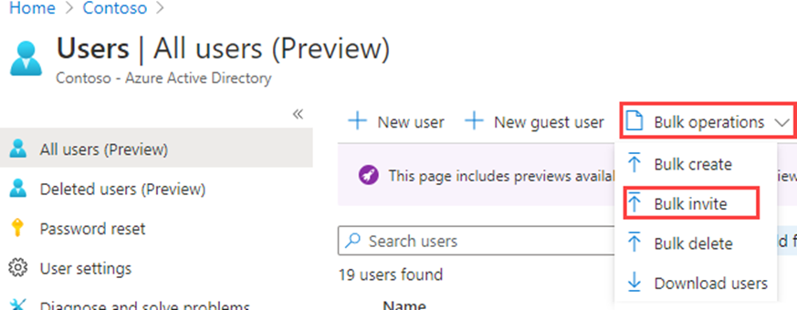
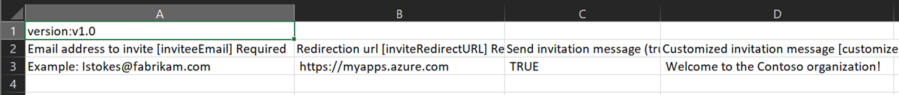
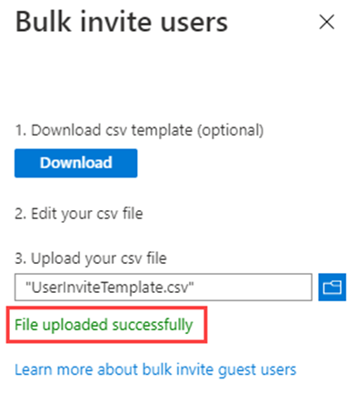
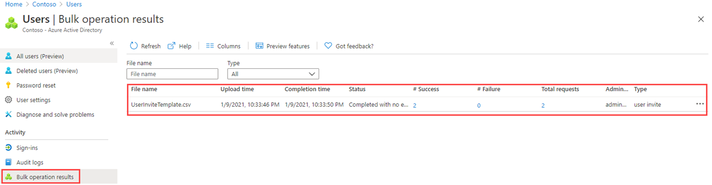

---
lab:
    title: '05 - Add guest users to the directory'
    learning path: '01'
    module: 'Module 01 - Implement an identity management solution'
---

# Lab 05: Add guest users to the directory

### Login type = Microsoft 365 admin

## Lab scenario

Your company works with many vendors and, on occasion, you need to add some vendor accounts to your directory as a guest.

#### Estimated time: 20 minutes

### Exercise 1 - Add guest users to the directory

#### Task - Add the guest user

1. Sign in to the [https://entra.Microsoft.com](https://entra.microsoft.com) as a user who is assigned a limited administrator directory role or the Guest Inviter role, or as Global Administrator.

2. Select **Identity**.

3. Under **Users**, select **All users**.

4. Select **+ New user**.

5. On the New user menu, select **Invite external user** and then add your information as the guest user.

    **NOTE** - Group email addresses are not supported; enter the email address for an individual. Also, some email providers allow users to add a plus symbol (+) and additional text to their email addresses to help with things like inbox filtering. However, Microsoft Entra ID does not currently support plus symbols in email addresses. To avoid delivery issues, omit the plus symbol and any characters following it up to the @ symbol.

6. Enter an email address, such as **sc300externaluser1@sc300email.com**.

7. Select the **Properties** tab.

8. On the Users page, verify your account is listed and, in the **User type** column, verify **Guest** is shown.

9. When complete, select **Review + Invite**, then select **Invite**.


After you send the invitation, the user account is automatically added to the directory as a guest.


### Exercise 2 - Invite guest users in bulk

#### Task 1 - Bulk user invite

A recent partnership has been established with another company. For now, employees of the partner company will be added as guests. You need to ensure you can import multiple guest users at one time.

1. Sign in to the [https://entra.microsoft.com](https://entra.microsoft.com) as your Global Administrator.

2. In the navigation pane, select **Identity**.

3. Under **Users**, select **All users**.

4. On the Users page, on the menu, select **Bulk operations > Bulk invite**.

     

5. In the Bulk invite users pane, select **Download** to a sample CSV template with invitation properties.

6. Using an editor to view the CSV file, review the template.

7. Open the .csv template and add a line for each guest user. Required values are:

    - **Email address to invite** - the user who will receive an invitation
    - **Redirection url** - the URL to which the invited user is forwarded after accepting the invitation.

    

8. Save the file.

9. On the Bulk invite users page, under **Upload your csv file**, browse to the file.

     **Note** - When you select the file, validation of the .csv file starts.

10. After the file contents are validated, you will see **File uploaded successfully**. If there are errors, you must fix them before you can submit the job.

    

11. When your file passes validation, select **Submit** to start the Azure bulk operation that adds the invitations.

12. To view the job status, select **Select here to view the status of each operation**. Or, you can select **Bulk operation results** in the Activity section. For details about each line item within the bulk operation, select the values under the **# Success**, **# Failure**, or **Total Requests** columns. If failures occurred, the reasons for failure will be listed.

    

13. When the job completes, you will see a notification that the bulk operation succeeded.

#### Task 2 - Invite guest users with PowerShell

1. Open PowerShell as an administrator. This can be done by searching for PowerShell in Windows and choosing Run as administrator. 

**Note** - You need to have PowerShell version 7.2 or higher for this lab to function.  When PowerShell opens you will get a version at the top of the screen, if you are running and older version, please update or this portion of the lab will fail.

2. You will need to Install the Microsoft.Graph PowerShell module if you have not used it before.  Run the following two commands and when prompted to confirm press Y:

    ```
    Install-Module Microsoft.Graph
    ```
3. Confirm the Microsoft.Graph module is installed:

    ```
    Get-InstalledModule Microsoft.Graph
    ```
    

4. Next, you will need to login to Azure by running:  

    ```
    Connect-MgGraph -Scopes "User.ReadWrite.All"
    ``` 
    The Edge browser will open and you will be prompted to sign-in.  Use the MOD Administrator account to connect.  Mark the consent box, then accpet the permissions request; then close the browser window.

5. Set the values for the email and redirect for the External user:

    ```
    Import-Module Microsoft.Graph.Identity.SignIns
    
    $params = @{
	    invitedUserEmailAddress = "admin@fabrikam.com"
	    inviteRedirectUrl = "https://myapp.contoso.com"
    }
    ```

6. Sent the MgInvitation command to invite the External user:

    ```
    New-MgInvitation -BodyParameter $params
    ```

7. You can close PowerShell at this point.
    
You now know how to invite users within the Microsoft Entra admin center, Microsoft 365 Admin center, Bulk invitations with a csv file, and inviting users with PowerShell commands.  You can go into the Microsoft Entra admin center, and check All Users to see that ADMIN has been added as an external suer.
