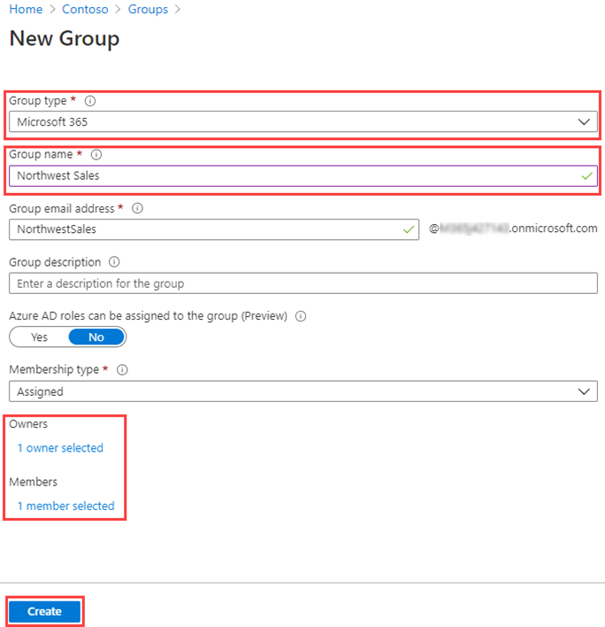

---
lab:
    title: '05 - Adding groups to Azure AD'
    learning path: '01'
    module: 'Module 01 - Implement an identity management solution'
---

# Lab 05: Adding groups to Azure AD

## Lab scenario

Part of your duties as an Azure AD administrator is to create different types of groups. You need to create a new Microsoft 365 group for your organization's sales department.

#### Estimated time: 5 minutes

### Exercise 1 - Create an Microsoft 365 group in Azure Active Directory

#### Task 1 - Create the group

1. Browse to [https://portal.azure.com/#blade/Microsoft_AAD_IAM/ActiveDirectoryMenuBlade/Overview]( https://portal.azure.com/#blade/Microsoft_AAD_IAM/ActiveDirectoryMenuBlade/Overview).

2. In the left navigation, under **Manage**, select **Groups**.

3. In the Groups blade, on the menu, select **New group**.

4. Create a group using the following information:

    | **Setting**| **Value**|
    | :--- | :--- |
    | Group type| Microsoft 365|
    | Group name| Northwest Sales|
    | Membership type| Assigned|
    | Owners| *Assign your own administrator account as the group owner*|
    | Members| **Alex Wilber** and **Bianca Pisani**|

    

5. When complete, verify the group named **Northwest sales** is shown in the **All groups** list.
