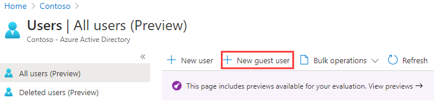

---
lab:
    title: '06 - Add a federated identity provider'
    learning path: '01'
    module: 'Module 01 - Implement an identity management solution'
---

# Lab 06: Add a federated identity provider

## Lab scenario

Your company works with many vendors and, on occasion, you need to add some vendor accounts to your directory as a guest and allow them to use their Google account to sign-in.

#### Estimated time: 5 minutes

### **TODO** Exercise 1 - Add guest users to the directory

#### Task - Add the guest user

1. Sign in to the [https://portal.azure.com](https://portal.azure.com) as a user who is assigned a limited administrator directory role or the Guest Inviter role.

2. Select **Azure Active Directory**.

3. Under **Manage**, select **Users**.

4. Select **New guest user**.

    

5. On the New user page, select **Invite user** and then add your information as the guest user.

    **NOTE** - Group email addresses are not supported; enter the email address for an individual. Also, some email providers allow users to add a plus symbol (+) and additional text to their email addresses to help with things like inbox filtering. However, Azure AD does not currently support plus symbols in email addresses. To avoid delivery issues, omit the plus symbol and any characters following it up to the @ symbol.

6. When complete, select **Invite**.

7. On the Users blade, verify your account is listed and, in the **User type** column, verify **Guest** is shown.

After you send the invitation, the user account is automatically added to the directory as a guest.

