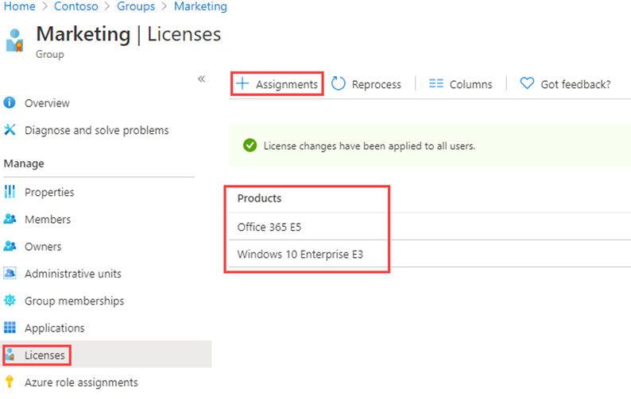

---
lab:
    title: '06 - Change group license assignments'
    learning path: '01'
    module: 'Module 02 - Create, configure, and manage identities'
---

# Lab 06: Change group license assignments

## Lab scenario

Occasionally, you may need to change the license assignment that are used by an Azure AD security group. You must ensure you are familiar with the procedure for changing a group's license assignment.

#### Estimated time: 5 minutes

## Change group license assignments

1. Browse to [https://portal.azure.com/#blade/Microsoft_AAD_IAM/ActiveDirectoryMenuBlade/Overview]( https://portal.azure.com/#blade/Microsoft_AAD_IAM/ActiveDirectoryMenuBlade/Overview).

1. In the left navigation, under **Manage**, select **Groups**.

1. Select one of the available groups. For example, Sales and Marketing.

1. In the left navigation, under **Manage**, select **Licenses**.

1. Review the current assignments and then, on the menu, select **+ Assignments**.

    

1. On the Update license assignments blade, select **Windows 10 Enterprise E3** license, clear the selection of an existing license, add or remove license options, or any combination.

1. When complete, select **Save**.

1. On the group’s Licenses page, review the change.
