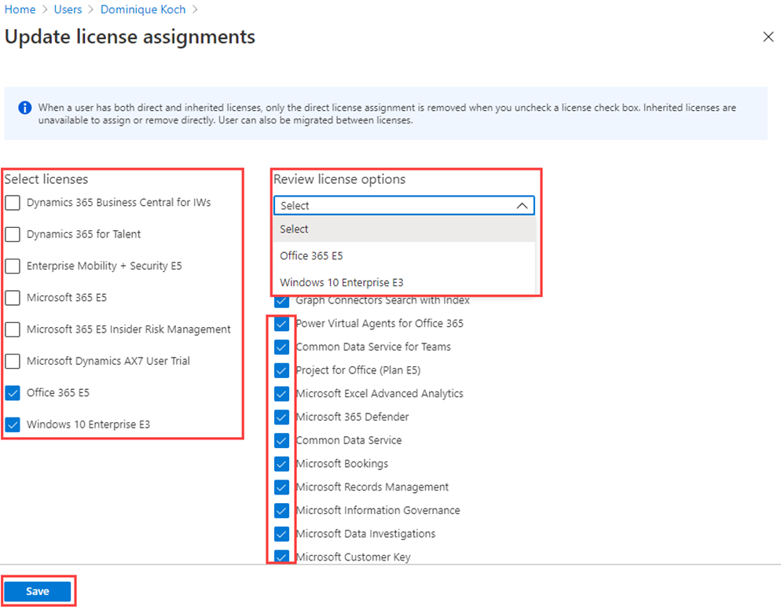

---
lab:
    title: '07 - Change user account license assignments'
    learning path: '01'
    module: 'Module 02 - Create, configure, and manage identities'
---

# Lab 07: Change user account license assignments

## Lab scenario

Some user accounts in your organization will not be provided all available products in their assigned license or will need updates or additions to their license assignment. You need to ensure you are able to update a user account's license assignment in Azure AD.

#### Estimated time: 5 minutes

## Exercise 1 - Add a Windows 10 license to a user account

### Task 1 - Find your unlicensed user in Azure Active Directory

1. Browse to [https://portal.azure.com/#blade/Microsoft_AAD_IAM/ActiveDirectoryMenuBlade/Overview]( https://portal.azure.com/#blade/Microsoft_AAD_IAM/ActiveDirectoryMenuBlade/Overview).

2. In the left navigation, under **Mange**, select **Users**.

3. In the Users blade, enter **Raul** into the search box.

4. Click on **Raul Razo**
5. Review Raul's profile and ensure he has a Usage Location set.

    **Warning** - To assign a license to a user, the user must assigned a usage location.

6. Click the **Licenses** menu item in the left-hand menu.
7. Ensure that Rual has "No license assignments found."

### Task 2 - Update user license assignments

1. Browse to [https://portal.azure.com/#blade/Microsoft_AAD_IAM/ActiveDirectoryMenuBlade/Overview]( https://portal.azure.com/#blade/Microsoft_AAD_IAM/ActiveDirectoryMenuBlade/Overview).

1. In the left navigation, under **Manage**, select **Users**

1. In the Users blade, select **Raul Razo**.

1. In the left navigation, select **Licenses**.

1. Select the **+ Assignments** button. 

1. On the Update license assignments blade, select the check box for a **Windows 10 Enterprise E3** license.

    

1. When complete, select **Save**.
