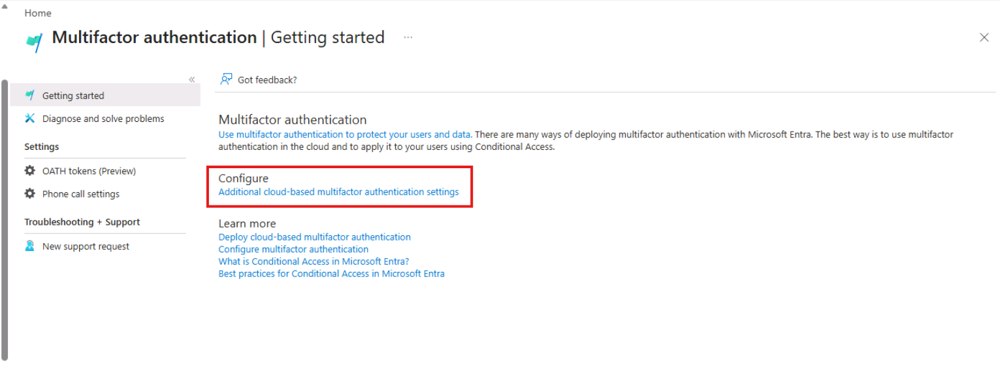
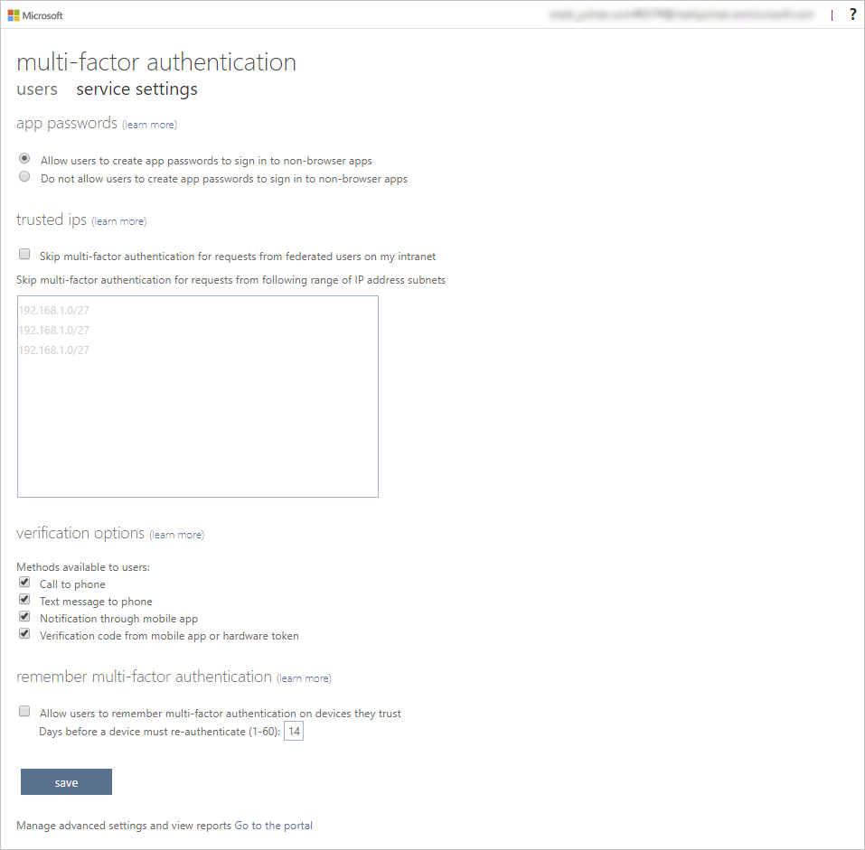
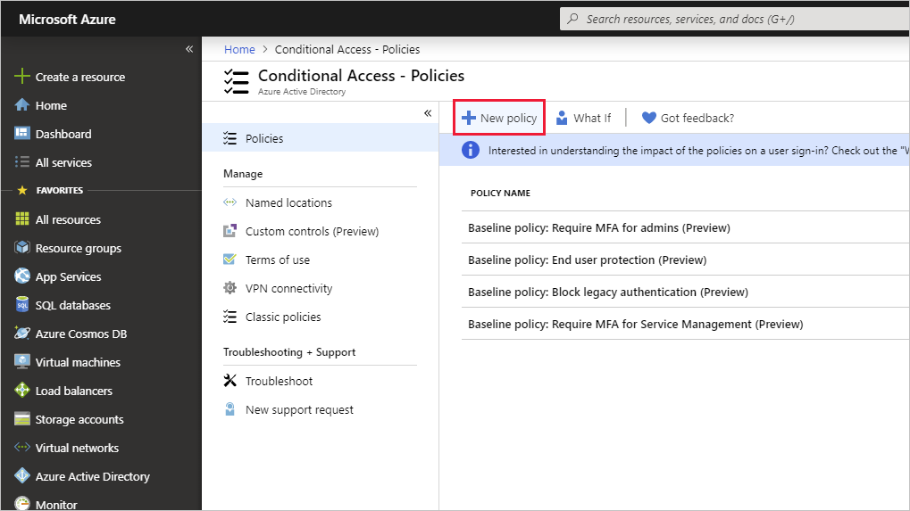
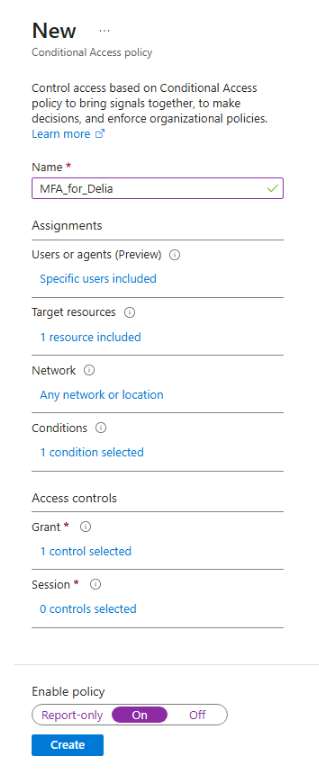
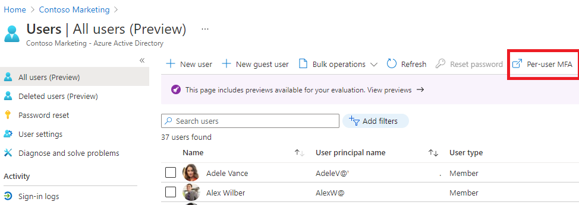
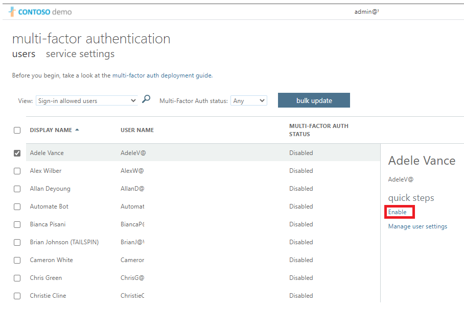

---
lab:
  title: 08 - Enable multi-factor authentication
  learning path: '02'
  module: Module 02 - Implement an Authentication and Access Management Solution
  description: Roll out a multifactor authentication system to your Microsoft Entra tenant. Explore different authentication methods based on your companies security goals.
  duration: 15 minutes
  level: 200
  islab: true
  primarytopics:
    - Microsoft Entra
---

# Lab 08 - Enable multi-factor authentication

### Login type = Microsoft 365 + E5 tenant log-in

## Lab scenario

To improve security in your organization, you've been directed to enable multifactor authentication for Microsoft Entra ID.

#### Estimated time: 15 minutes

**IMPORTANT** - A Microsoft Entra ID Premium license is required for this exercise.

### Exercise 1 - Review and enable Multi-factor Authentication in Azure

#### Task 1 - Review Azure Multi-Factor Authentication options

1. Browse to **Microsoft Entra admin center** at **`https://entra.microsoft.com`** using a Global administrator account.

    > **Note:** You may be prompted to complete Multi-Factor Authentication (MFA) during sign-in. Follow the prompts to configure or verify your authentication method before continuing.

1. Use the search feature and search for **multifactor**.

1. In the search results, select **Multifactor authentication**.

    Alternatively, in the left navigation, under **Entra ID**, select **Multifactor authentication**.

1. On the Getting started page, under **Configure**, select **Additional cloud-based multifactor authentication settings**.

    

1. In the new browser page, you can see the MFA options for Azure users and service settings.

    

    This is where you would select the supported authentication methods, in the screen above, all of them are selected.

    You can also enable or disable app passwords here, which allow users to create unique account passwords for apps that don't support multi-factor authentication. This feature lets the user authenticate with their Microsoft Entra identity using a different password specific to that app.

#### Task 2 - Setup Conditional Access rules for MFA for Delia Dennis

Next let's examine how to set up Conditional Access policy rules that would enforce MFA for guest users accessing specific apps on your network.

1. Switch back to the Microsoft Entra admin center, in the left navigation, under **Entra ID**, select **Conditional Access**.

1. On the menu, Select **+ New policy**.

    

1. In the **Name** box, enter **MFA_for_Delia**.

1. Under **Assignments**, in the **Users or agents (Preview)** section, select **0 users or agents (Preview) selected**.

1. On the **Include** tab, mark **Select users and groups**, then select the **Users and groups** check box.

1. In the **Select users and groups** pane, select **Delia Dennis** account and then select **Select**.

1. In the **Target resources** section, select **No target resources selected**.

1. In the dropdown, make sure **Resources (formerly cloud apps)** is selected.

1. In the **Include** tab, select **Select resources**, then in the **Select specific resources** select **None**.

1. In the **Resources** pane, search for **Office 365**, then select it.

    - **Reminder** - in a previous lab we gave Delia Dennis an Office 365 license and logged into ensure it worked.

1. Under **Network**, select **Not configured**, then set **Configure** to **Yes**.

1. In the **Include** tab, select **Any network or location**.

    > **Note:** You can also configure network locations under **Conditions** > **Locations**. Both options open the same configuration pane.

<!-- 1. Under **Conditions** section, select **0 conditions selected**.

1. At the bottom of the newly opened menu find the **Locations** section, and select **Not configured**, then set **Configure** to **Yes**. 

1. In the **Include** tab, select **Any network or location**. -->

1. Under **Access controls**, in the **Grant** section, select **0 controls selected**.

1. Select the **Require multifactor authentication** check box to enforces MFA.

1. Ensure that **Require all the selected controls** is selected, then select **Select**.

1. Set **Enable policy** to **On**.

1. Select the **Create** button to create the policy.

    

    MFA is now enabled for your selected user and application(s). The next time a guest tries to sign into that app they will be prompted to register for MFA.

#### Task 3 - Test Delia's login

1. Open a new InPrivate Browsing windows.

1. Connect to Office at **`https://www.office.com`**.

1. Select the sign-in option.

1. Enter `DeliaD@<your domain address>`.

1. Enter the password = Enter the Global admin password of the tenant (Note : Refer the 'Lab Resources' tab to retrieve the admin password).

>**Note:** At this point one of two things will happen.  You should get a message that you need to set up Authenticator app and register for MFA.  Follow the prompts to complete using your personal phone.  NOTE - there is a chance that you might get a login failure message with several options on how to proceed.  Select the **Try Again** option in this case.

You can see that because of the Conditional Access rule we created for Delia, MFA is required to launch Office 365 home page.

### Exercise summary

In this exercise, you reviewed Microsoft Entra MFA options and created a Conditional Access policy that requires MFA for a target user. This exercise showed the methods available to protect sign-ins with multifactor authentication.

### Exercise 2 - Configure MFA to be required for login

#### Task 1 - Configure Microsoft Entra Per-User MFA

Finally, let's look at how to configure MFA for user accounts. This is another way to get to the multi-factor auth settings.

1. Switch back to the **Microsoft Entra admin center**.

1. In the left navigation menu, under **Entra ID**, select **Users**, then select **All users**.

1. At the top of the Users pane, select **Per-user MFA**.

   >**Note:** you may have to use the ellipsis (...) to get to the Per-user MFA menu item.

   

1. A new browser tab/window will open with a multi-factor authentication user settings dialog.

   You can enable or disable MFA on a user basis by selecting a user and then using the quick steps on the right side.

   

1. Select **Adele Vance** with a check-mark.

1. Select the **Enable MFA** option under quick steps.

1. Read the notification popup if you get it, then select **Enable**.

1. Select **Close**.

1. Notice that Adele now has **Enabled** as her MFA status.

1. You can select **Service settings** to see the MFA setting screen, seen earlier in the lab.

1. Close the MFA setting tab.

#### Task 2 -- Try logging in as Adele

1. If you want to see another example of MFA login process, you can try to log in a Adele.

### Exercise summary

In this exercise, you enabled per-user MFA for a user and tested the sign-in challenge. This exercise showed how MFA strengthens authentication and protects against credential compromise.
