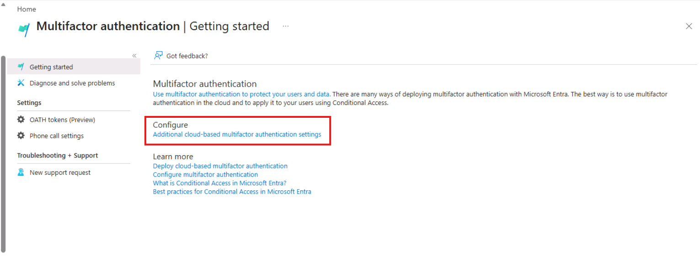
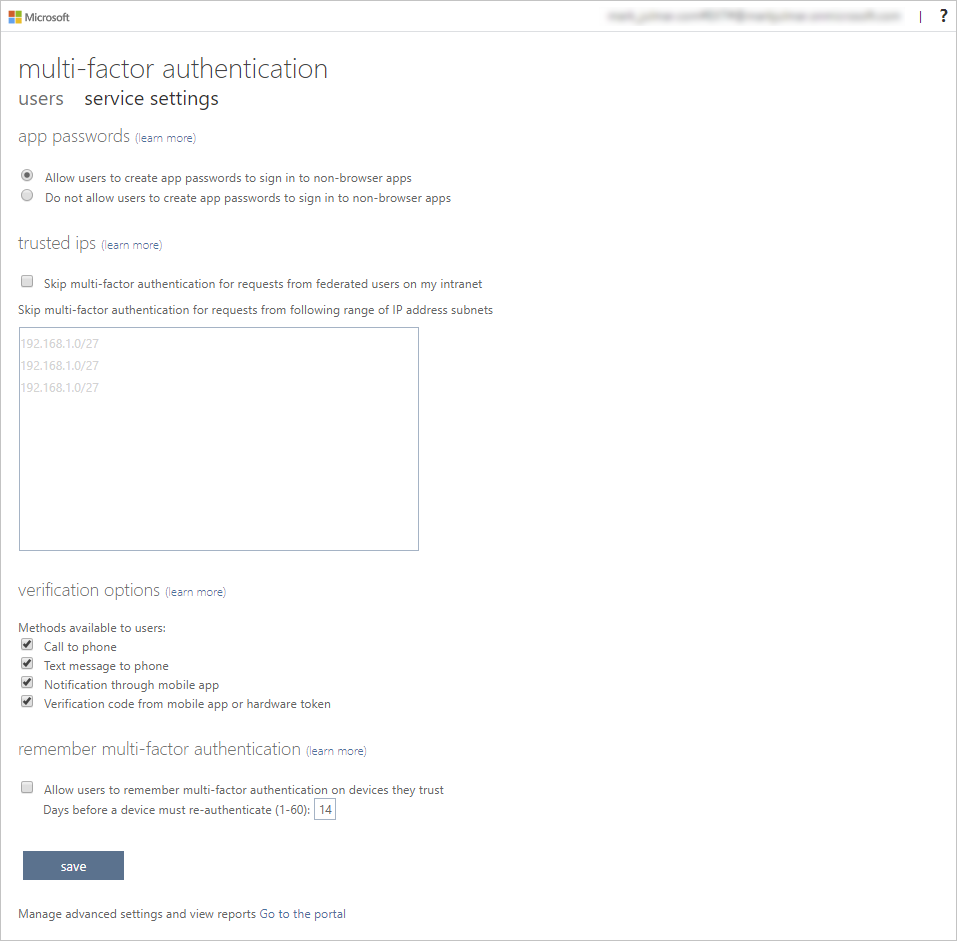
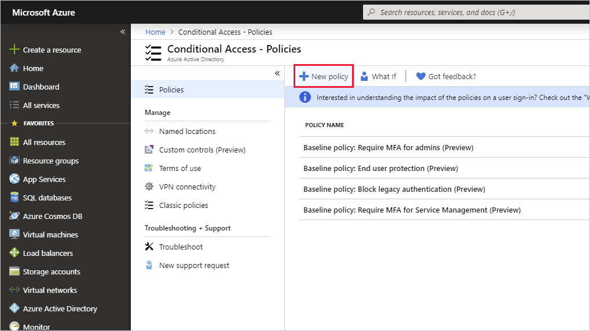
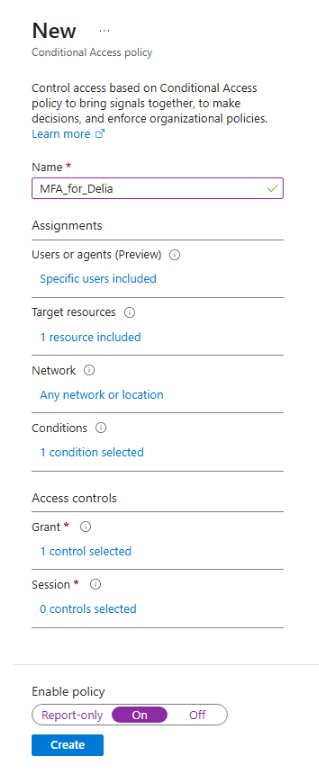
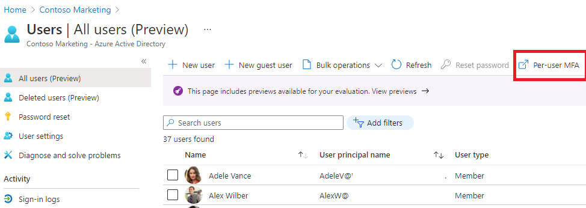
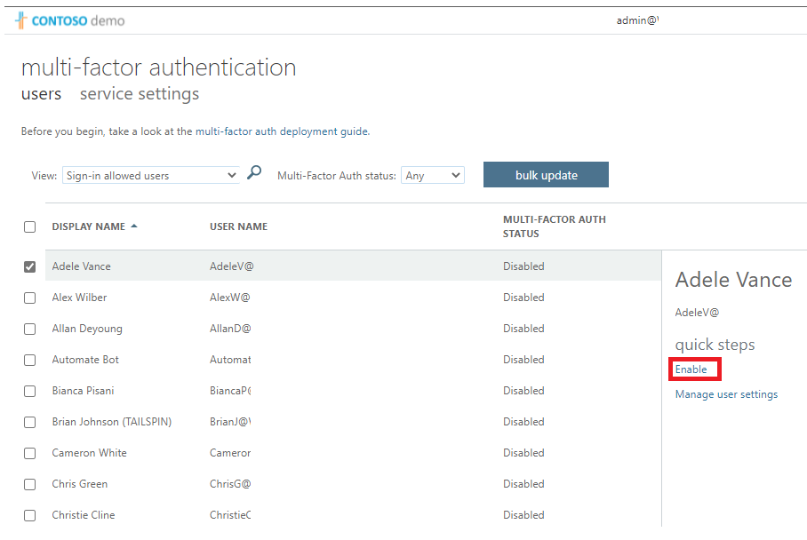

---
lab:
  title: 08 - Enable multi-factor authentication
  learning path: '02'
  module: Module 02 - Implement an Authentication and Access Management Solution
  description: Roll out a multifactor authentication system to your Microsoft Entra tenant. Explore different authentication methods based on your companies security goals.
  duration: 15 minutes
  level: 200
  islab: true
  primarytopics:
    - Microsoft Entra
---

# Lab 08 - Enable multi-factor authentication

### Login type = Microsoft 365 + E5 tenant log-in

## Lab scenario

To improve security in your organization, you've been directed to enable multifactor authentication for Microsoft Entra ID.

#### Estimated time: 15 minutes

> **Important:** Conditional Access requires Microsoft Entra ID P1 or P2. The target user must also be licensed for the application used in the sign-in test.

### Exercise 1 - Review and enable Multi-factor Authentication in Azure

#### Task 1 - Review Azure Multi-Factor Authentication options

1. Browse to **Microsoft Entra admin center** at **`https://entra.microsoft.com`** using a Global administrator account.

    > **Note:** You may be prompted for multifactor authentication (MFA) during sign-in. Use only a lab-provided authentication method. Do not add a personal authentication method to the shared administrator account; stop if no lab-provided method is available.

1. Use the search feature and search for **multifactor**.

1. In the search results, select **Multifactor authentication**.

    Alternatively, in the left navigation, under **Entra ID**, select **Multifactor authentication**.

1. On the Getting started page, under **Configure**, select **Additional cloud-based multifactor authentication settings**.

    

1. In the new browser page, you can see the MFA options for Azure users and service settings.

    

    This classic page contains legacy MFA service settings. Current authentication methods are managed under **Entra ID** > **Authentication methods** > **Policies**.

    You can also enable or disable app passwords here, which allow users to create unique account passwords for apps that don't support multi-factor authentication. This feature lets the user authenticate with their Microsoft Entra identity using a different password specific to that app.

#### Task 2 - Setup Conditional Access rules for MFA for Delia Dennis

Next, examine how to set up a Conditional Access policy that enforces MFA for a member user accessing a specific application.

1. Switch back to the Microsoft Entra admin center, in the left navigation, under **Entra ID**, select **Conditional Access**.

1. On the menu, Select **+ New policy**.

    

1. In the **Name** box, enter **MFA_for_Delia**.

1. Under **Assignments**, in the **Users or agents (Preview)** section, select **0 users or agents (Preview) selected**.

1. On the **Include** tab, mark **Select users and groups**, then select the **Users and groups** check box.

1. In the **Select users and groups** pane, select **Delia Dennis** account and then select **Select**.

1. In the **Target resources** section, select **No target resources selected**.

1. In the dropdown, make sure **Resources (formerly cloud apps)** is selected.

1. In the **Include** tab, select **Select resources**, then in the **Select specific resources** select **None**.

1. In the **Resources** pane, search for **Office 365**, then select it.

    - **Reminder** - in a previous lab we gave Delia Dennis an Office 365 license and logged into ensure it worked.

1. Under **Network**, select **Not configured**, then set **Configure** to **Yes**.

1. In the **Include** tab, select **Any network or location**.

    > **Note:** You can also configure network locations under **Conditions** > **Locations**. Both options open the same configuration pane.

<!-- 1. Under **Conditions** section, select **0 conditions selected**.

1. At the bottom of the newly opened menu find the **Locations** section, and select **Not configured**, then set **Configure** to **Yes**. 

1. In the **Include** tab, select **Any network or location**. -->

1. Under **Access controls**, in the **Grant** section, select **0 controls selected**.

1. Select the **Require multifactor authentication** check box to enforces MFA.

1. Ensure that **Require all the selected controls** is selected, then select **Select**.

1. Set **Enable policy** to **On**.

1. Select the **Create** button to create the policy.

    

    MFA is now required for the selected user and application. The next time Delia signs in to that application, she should be prompted to register for MFA.

#### Task 3 - Test Delia's login

1. Open a new InPrivate browser window.

1. Connect to Office at **`https://www.office.com`**.

1. Select the sign-in option.

1. Enter `DeliaD@<your domain address>`.

1. Enter the password provided for Delia.

> **Note:** Verify that Delia is prompted to set up an authentication method. This prompt proves that the Conditional Access policy requires MFA. Do not register a personal phone or authentication method in the shared lab tenant. If a transient sign-in failure appears, select **Try again** once.

You can see that because of the Conditional Access rule we created for Delia, MFA is required to launch Office 365 home page.

1. Close the InPrivate browser window without completing registration.

### Exercise summary

In this exercise, you reviewed Microsoft Entra MFA options and created a Conditional Access policy that requires MFA for a target user. This exercise showed the methods available to protect sign-ins with multifactor authentication.

### Exercise 2 - Configure MFA to be required for login

#### Task 1 - Configure Microsoft Entra Per-User MFA

Finally, let's look at how to configure MFA for user accounts. This is another way to get to the multi-factor auth settings.

1. Switch back to the **Microsoft Entra admin center**.

1. In the left navigation menu, under **Entra ID**, select **Users**, then select **All users**.

1. At the top of the Users pane, select **Per-user MFA**.

   >**Note:** you may have to use the ellipsis (...) to get to the Per-user MFA menu item.

   

1. A new browser tab/window will open with a multi-factor authentication user settings dialog.

   You can enable or disable MFA on a user basis by selecting a user and then using the quick steps on the right side.

   

1. Select **Adele Vance** with a check-mark.

1. Select the **Enable MFA** option under quick steps.

1. Read the notification popup if you get it, then select **Enable**.

1. Select **Close**.

1. Notice that Adele now has **Enabled** as her MFA status.

1. You can select **Service settings** to see the MFA setting screen, seen earlier in the lab.

1. Close the MFA setting tab.

#### Task 2 - Test Adele's sign-in

1. Open a new InPrivate browser window and go to `https://m365.cloud.microsoft`.

1. Sign in as Adele Vance using the credentials provided for the lab.

1. Verify that Adele is prompted to set up an authentication method. Do not register a personal phone or authentication method.

1. Close the InPrivate browser window without completing registration.

#### Task 3 - Clean up MFA configuration

1. Return to **Users** > **All users** > **Per-user MFA**.

1. Select **Adele Vance**, select **Disable MFA**, confirm the action, and verify that her MFA status is **Disabled**.

1. Return to **Conditional Access** > **Policies**.

1. Select **MFA_for_Delia**, then select **Delete** and confirm.

1. Verify that **MFA_for_Delia** no longer appears in the policy list.

### Exercise summary

In this exercise, you enabled per-user MFA for a user and tested the sign-in challenge. This exercise showed how MFA strengthens authentication and protects against credential compromise.
