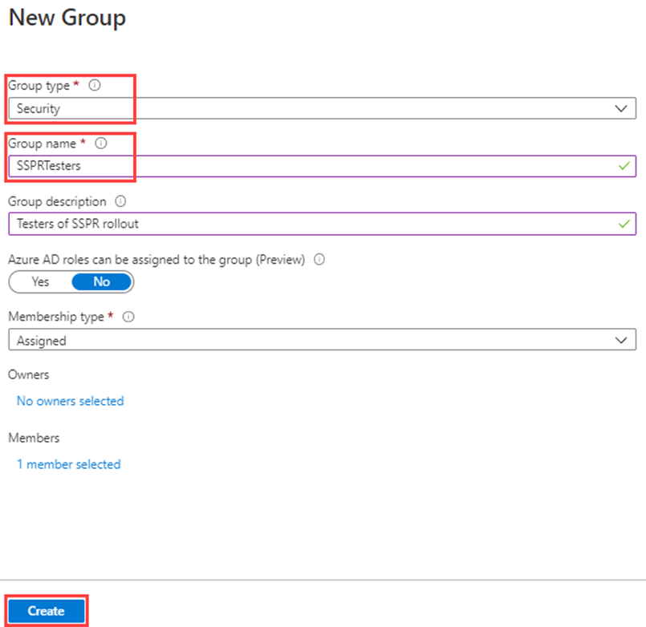
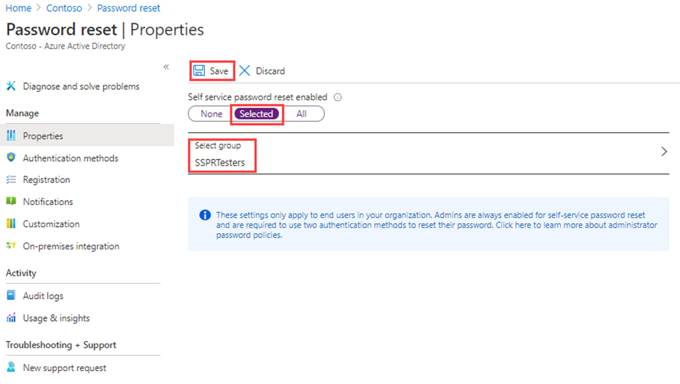

---
lab:
  title: 09 - Enable Microsoft Entra self service password reset
  learning path: '02'
  module: Module 02 - Implement an Authentication and Access Management Solution
  description: The company has decided to empower the employees and enable self-service password reset. You must configure this setting in your organization.
  duration: 15 minutes
  level: 300
  islab: true
  primarytopics:
    - Microsoft Entra
---

# Lab 09 - Configure and deploy self-service password reset

### Login type: Microsoft 365 admin

## Lab scenario

The company has decided to empower the employees and enable self-service password reset. You must configure this setting in your organization.

#### Estimated time: 15 minutes

### Exercise 1 - Create a group with SSPR enabled and add users to it

#### Task 1 - Create a group to assign SSPR to

You want to roll out SSPR to a limited set of users first to make sure your SSPR configuration works as expected. Let's create a security group for the limited rollout and add a user to the group.

1. Browse to **Microsoft Entra admin center** at **`https://entra.microsoft.com`** using a Global administrator account.

1. On the **Microsoft Entra admin center**, in the left navigation, under **Entra ID**, select **Groups**.

1. Open **All groups** menu item, and select **New Group** on the right side window.

1. Create a new group using the following information:

    | **Setting**| **Value**|
    | :--- | :--- |
    | Group type| Security|
    | Group name| `SSPRTesters`|
    | Group description| `Testers of SSPR rollout` |
    | Membership type| Assigned|
    | Members| Alex Wilber |
    | |  Allan Deyoung |
    | | Bianca Pisani |
  
    
1. Select **Create**.

    

#### Task 2 - Enable SSPR for you test group

Enable SSPR for the group.

1. In the left navigation, under **Entra ID**, select **Password reset**.

1. On the **Password reset | Properties** page, under **Self service password reset enabled**, select **Selected**.

1. Under **Select group**, replace the existing **SSPRSecurityGroupUsers** with **SSPRTesters** you just created.

1. On the **Password reset | Properties** page, select **Save**.

    

1. On the **Password reset** page, under **Manage**, select and review the default settings for **Authentication methods**, **Registration**, **Notifications**, and **Customization**.

    >**Note:** it is important to have **phone** selected as one of the authentication methods for the rest of this lab, but you can have other options as well.

#### Task 3 - Register for SSPR with Allan

Now that the SSPR configuration is complete, register a mobile phone number for the user you created.

1. Open a different browser or open an InPrivate or Incognito browser session and then browse to `https://aka.ms/ssprsetup`.

    This is to ensure you are prompted for user authentication.

1. Sign in as `AllanD@<organization-domain-name>.onmicrosoft.com` with the password provided.

    >**Note:** Replace the organization-domain-name with your domain name.

1. If prompted to update your password, enter a new password of your choice. Be sure to record the new password.

1. If prompted to stay signed in, choose Yes.

1. In the **More information required** dialog box, select **Next**.

1. On the Keep your account secure page, select **Next** to use the Authenticator app.

1. Follow the on screen instructions to set up your account in Authenticator by scanning the QR-code.

1. Complete the process by selecting **Done** when you successfully registered.

    >**Note:** at this point you have both registered for SSPR and MFA in a single step.

1. Close the browser. You do not need to complete the sign in process.

#### Task 4 - Test SSPR

Now let's test whether the user can reset their password.

1. Open an InPrivate or Incognito browser session and then browse to the **Microsoft Azure** portal at `https://portal.azure.com`.

    This is to ensure you well be prompted for user authentication.

1. Enter `AlexW@<organization-domain-name>.onmicrosoft.com` and then select **Next**.

    >**Note:** Replace the organization-domain-name with your domain name.

1. On the Enter password page, select **Forgot my password**.

1. On the Get back into your account page, complete the requested information and then select **Next**.

1. Follow the on-screen instructions to get the verification code from Microsoft Authenticator app.

1. Enter your verification code and then select **Next**.

1. In the choose a new password step, enter and then confirm your new password.

1. When complete, select **Finish**.

1. Sign in as **AllanD** with the new password you created.

1. Enter your verification code and then verify you can complete the sign in process.

1. When finished, close your browser.

#### Task 5 - What happens if you try a user not in SSPRTesters group?

1. As a test, open a new InPrivate browser window and try to log into the Azure Portal as GradyA, and select **Forgot my password** option.

### Exercise summary

In this exercise, you created a group, enabled self-service password reset for its members, and validated the reset flow. This exercise showed how SSPR reduces help-desk load while preserving security.
