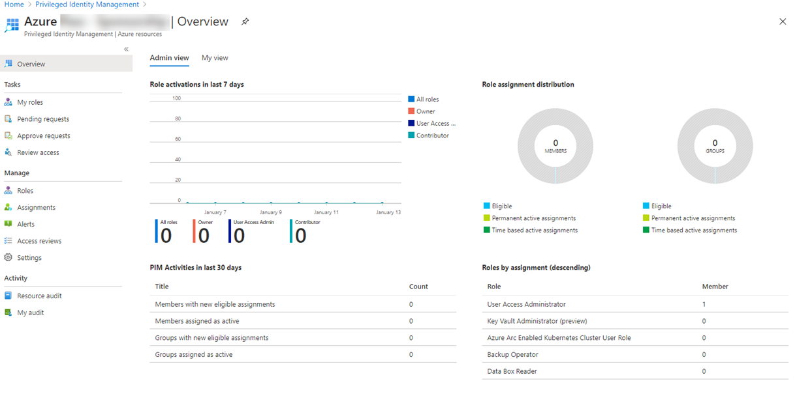

---
lab:
  title: 11 - Assign Azure resource roles in Privileged Identity Management
  learning path: '02'
  module: Module 02 - Implement an authentication and access management solution
  description: Assign privileged access to Azure Resources using Privileged Identity Management (PIM).
  duration: 10 minutes
  level: 300
  islab: true
  primarytopics:
    - Azure
    - Microsoft Entra
---

# Lab 11 - Assign Azure resource roles in Privileged Identity Management

### Login type: Azure Resource login

## Lab scenario

Microsoft Entra Privileged Identity Management (PIM) can manage the built-in Azure resource roles, as well as custom roles, including (but not limited to):

- Owner
- User Access Administrator
- Contributor
- Security Admin
- Security Manager

You need to make a user eligible for an Azure resource role.

#### Estimated time: 10 minutes

### Exercise 1 - PIM with Azure resources

#### Task 1 - Assign Azure resource roles

1. Sign in to **Microsoft Entra admin center** at **`https://entra.microsoft.com`** using a Global Administrator account.

    > **Note:** You may be prompted to complete Multi-Factor Authentication (MFA) during sign-in. Follow the prompts to configure or verify your authentication method before continuing.

1. Search for and then select **Microsoft Entra Privileged Identity Management**.

1. In the Privileged Identity Management page, in the left navigation, select **Azure resources**.

1. In the **Subscriptions** dropdown, choose the subscription used for this lab, then select **Manage resources**.

1. In the Azure resources – Discovery page, select your subscription.

1. In the **Overview** page, review the information.

   

1. In the left navigation menu, under **Manage**, select **Roles** to see the list of roles for Azure resources.

1. On the top menu, select + **Add assignments**.

1. In the Add assignments page, select the **Select role** menu and then select **API Management Service Contributor**.

1. Under **Select member(s),** select **No member selected**.

1. In **Select a member or group**, search for the administrator account provided for this lab, then select **Select**.

1. Select **Next**.

1. On the **Settings** tab, under **Assignment type**, select **Eligible**.

   - **Eligible** assignments require the member of the role to perform an action to use the role. Actions might include performing a multi-factor authentication (MFA) check, providing a business justification, or requesting approval from designated approvers.

   - **Active** assignments do not require the member to perform any action to use the role. Members assigned as active have the privileges always assigned to the role.

1. Specify an assignment duration by changing the start and end dates and times.

1. When finished, select **Assign**.

1. After the new role assignment is created, a status notification is displayed.

#### Task 2 - Update or remove an existing resource role assignment

1. Open **Microsoft Entra Privileged Identity Management**.

1. Select **Azure resources**.

1. Select the subscription you want to manage to open its overview page.

1. Under **Manage**, select **Assignments**.

1. On the **Eligible assignments** tab, in the Action column, review the available options.

1. Select **Remove**.

1. In the **Remove** dialog box, review the information and then select **Yes**.

### Exercise summary

In this exercise, you assigned and removed an eligible Azure resource role through Privileged Identity Management. This exercise showed how eligible assignments reduce standing privilege on Azure resources.
