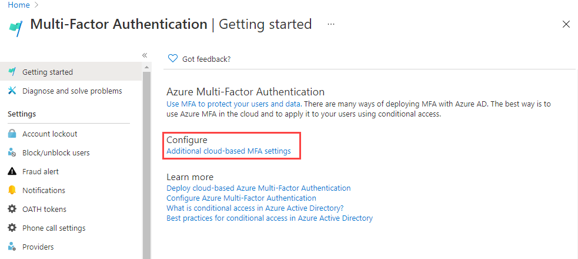
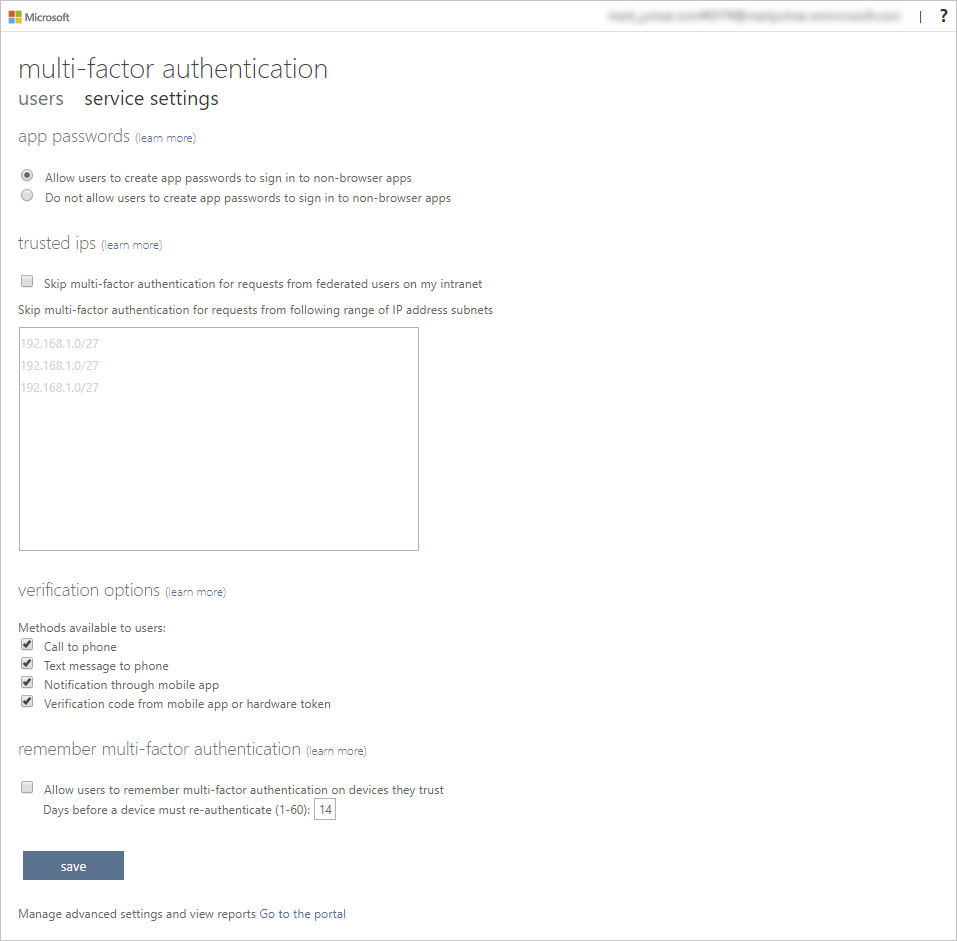
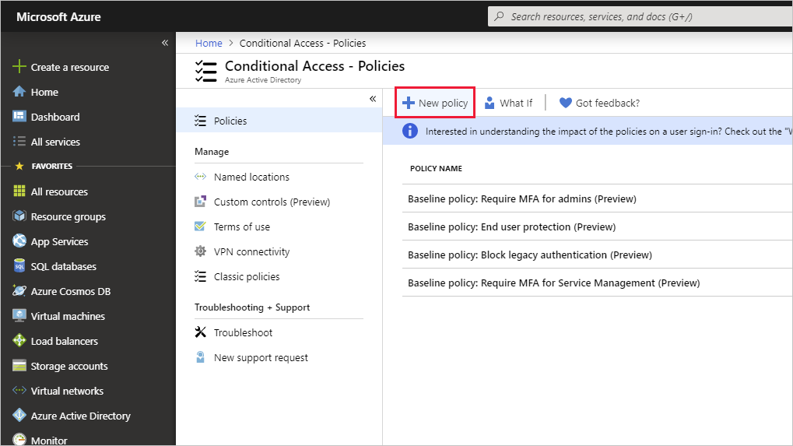
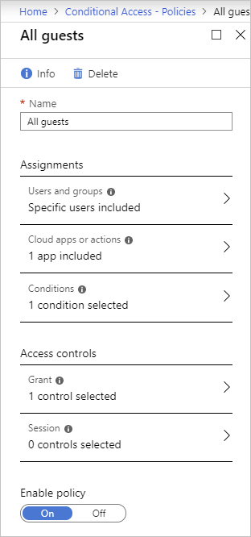
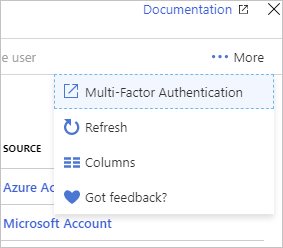
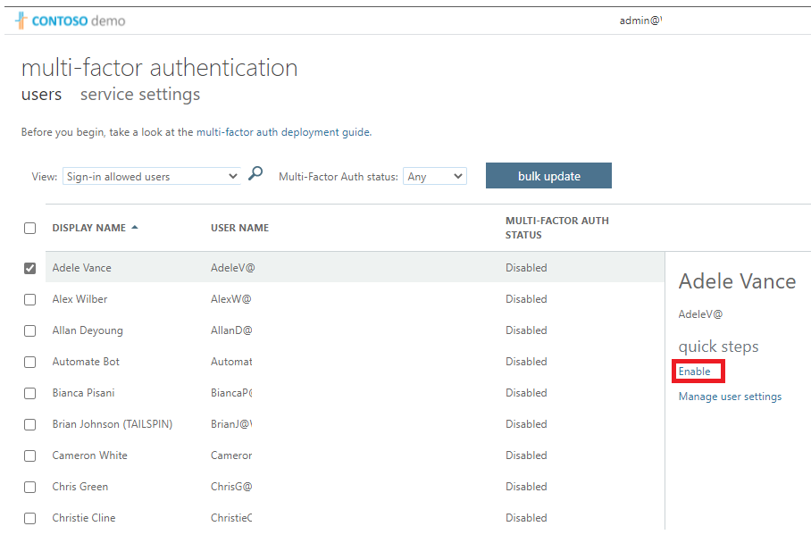

---
lab:
    title: '12 - Enable Azure AD multi-factor authentication'
    learning path: '02'
    module: 'Module 01 - Plan and implement Azure multifactor authentication'
---

# Lab 12 - Enable Azure AD multi-factor authentication

## Lab scenario

To improve security in your organization, you've been directed to enable multi-factor authentication for Azure Active Directory.

#### Estimated time: 15 minutes

**IMPORTANT** - An Azure AD Premium license is need for this exercise.

## Exercise 1 - Review and enable Multifactor Authentication in Azure

### Task 1 - Review Azure Multi-Factor Authentication options

1. Browse to the [https://portal.azure.com](https://portal.azure.com) and sign in using a Global administrator account for the directory.

2. Use the search feature and search for **multi-factor**.

3. In the search results, select **Multi-Factor Authentication**.

4. On the Getting started page, under **Configure**, select **Additional cloud-based MFA settings**.

    

5. In the new browser page, you can see the MFA options for Azure users and service settings.

    

    This is where you would select the supported authentication methods, in the screen above, all of them are selected.

    You can also enable or disable app passwords here, which allow users to create unique account passwords for apps that don't support multi-factor authentication. This feature lets the user authenticate with their Azure AD identity using a different password specific to that app.

### Task 2 - Setup conditional access rules for MFA for Delia Dennis

Next let's examine how to set up Conditional Access policy rules that would enforce MFA for guest users accessing specific apps on your network.

1. Switch back to the Azure portal and select **Azure Active Directory** > **Security** > **Conditional access**.

2. On the menu, click **New policy**. From the drop down select **Creat new policy**.

    

3. Name your policy, for example **MFA_for_Delia**.

4. Select **Users and group** under Assignments.

    - Select **0 users and groups selected**  
    - On the right side screen, select **Select users and groups** check box to configure.
    - Check **Users and groups** (available users will be populated to the right)
    - Choose **Delia Dennis** from the list of users then choose **Select** button.

5. Select **Cloud apps or actions**.

    - In the dropdown, make sure **Cloud apps** is selected.
    - Under Include, mark **All cloud apps** and note the warning the pops up about possibly locking yourself out. 
    - Now under Include, change your choice to **Select apps** item.
    - In the newly opened dialog, choose **Office 365**.
        - **Reminder** - in a previous lab we gave Delia Dennis an Office 365 license and logged into ensure it worked.
    - Choose **Select**.

6. Review the Conditions section.

    - Select **Locations** and then configure it for **Any location**.

7. Under **Access Controls** select **Grant** and verify **Grant access** is selected.

8. Select the **Require multi-factor authentication** check box to enforces MFA.

9. Ensure that **Require all the slected controls** is selected.

10. Select **Select**.

11. Set **Enable policy** to **On**.

12. Hit **Create** to create the policy.

    

    MFA is now enabled for your selected user and application(s). The next time a guest tries to sign into that app they will be prompted to register for MFA.

### Task 3 - Test Delia's login

1. Open a new InPrivate Browsing windows.
2. Connect to https://www.office.com.
3. Click the sign-in option.
4. Enter **DeliaD@** `<<your domain address>>`.
5. Enter the password = **pass@word123**.
6. At this point one of two things will happen.  You should get a message that you need to set up Authenticator app and register for MFA.  Follow the prompts to complete using your personal phone.  NOTE - there is a chance that you might get a login failure message with several options on how to proceed.  Click the **Try Again** option in this case.

You can see that because of the Conditional Access rule we created for Delia, MFA is reguired to launch Office 365 home page.

## Exercise 2 - Configure MFA to be required for login

### Task 1 - Configure Azure AD Per-User MFA

Finally, let's look at how to configure MFA for user accounts. This is another way to get to the multi-factor auth settings.

1. Switch back to the Azure Active Directory dashboard in the Azure portal.

2. Select **Users**.

3. At the top of the Users pane, select **Per-user MFA**.

    

4. A new browser tab/window will open with a multi-factor authentication user settings dialog.

    You can enable or disable MFA on a user basis by selecting a user and then using the quick steps on the right side.

    

5. Select **Adele Vance** with a check-mark.
6. Select the **Enable** option under quick steps.
7. Read the notification popup if you get it, then select **enable multi-factor auth** button.
8. Select **Close**.
9. Notice that Adele now has **Enabled** as her MFA status.
10. You can select **service settings** to see the MFA setting screen, seen earlier in the lab.
11. Close the MFA setting tab.

### Task 2 -- Try logging in as Adele

1. If you want to see another example of MFA login process, you can try to log in a Adele.
