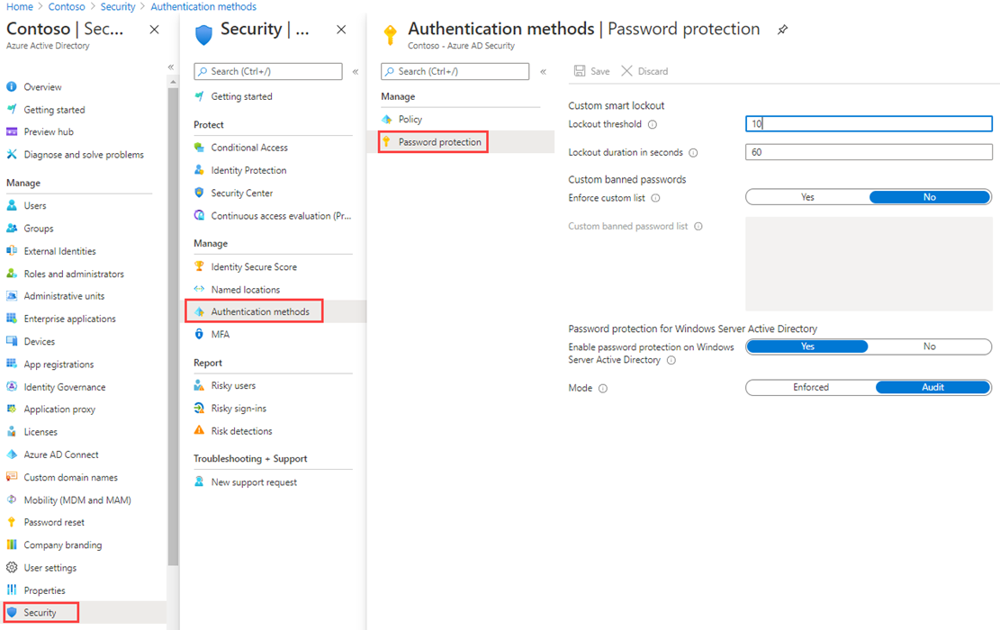

---
lab:
  title: 12 - Manage Microsoft Entra smart lockout values
  learning path: '02'
  module: Module 02 - Implement an Authentication and Access Management Solution
  description: Based on your organizational requirements, you can customize the Microsoft Entra smart lockout values. Customization of the smart lockout settings, with values specific to your organization, requires Microsoft Entra ID Premium P1 or higher licenses for your users.
  duration: 5 minutes
  level: 100
  islab: true
  primarytopics:
    - Microsoft Entra
    - Microsoft Entra ID
---

# Lab 12 - Manage Microsoft Entra smart lockout values

### Login type: Microsoft 365 admin

## Lab scenario

You must configure the additional password protection settings for your organization.

#### Estimated time: 5 minutes

### Exercise 1 - Manage Microsoft Entra smart lockout values

#### Task - Add Smart Lockouts

Based on your organizational requirements, you can customize the Microsoft Entra smart lockout values. Customization of the smart lockout settings, with values specific to your organization, requires Microsoft Entra ID Premium P1 or higher licenses for your users.

1. Browse to **Microsoft Entra admin center** at **`https://entra.microsoft.com`** using a Global administrator account.

1. In the left navigation, under **Entra ID**, select **Authentication methods**.

1. Then select **Password protection**.

    

1. In the Password protection settings, in the **Lockout duration in seconds** box, set the value to **120**.

1. Next to **Mode**, select **Enforced**.

1. Select **Save**.

    >**Note:** When the smart lockout threshold is triggered, you will get the following message while the account is locked:
    - Your account is temporarily locked to prevent unauthorized use. Try again later, and if you still have trouble, contact your admin.

1. This can be tested by choosing a user in your Microsoft Entra tenant, navigate in a private browser to <login.microsoftonline.com> and enter an incorrect password until the account gets notification that it is locked out.

### Exercise summary

In this exercise, you reviewed and adjusted Microsoft Entra smart lockout thresholds. This exercise showed how to balance protection against brute-force attempts with user productivity.
