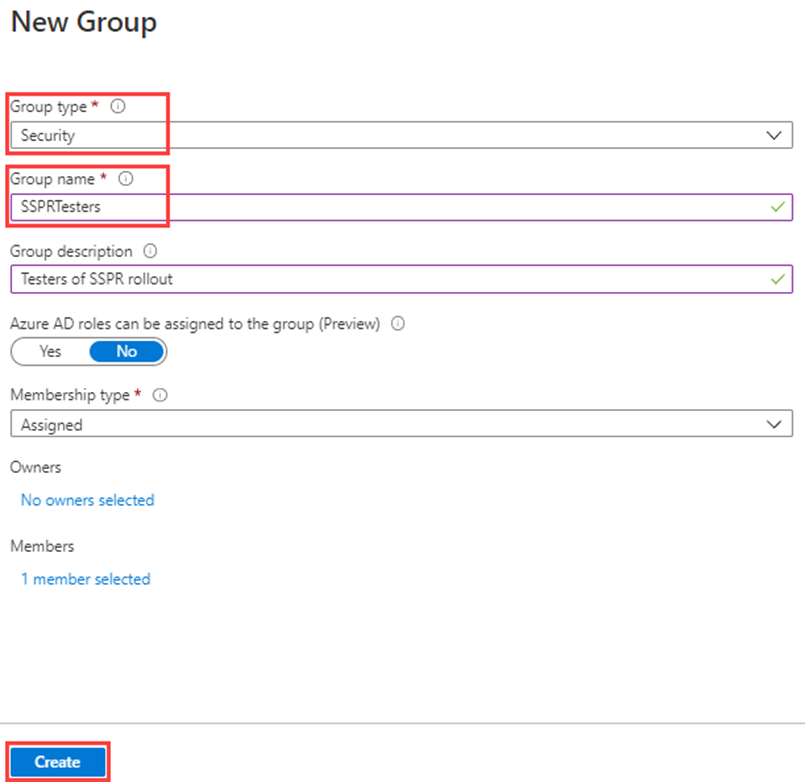
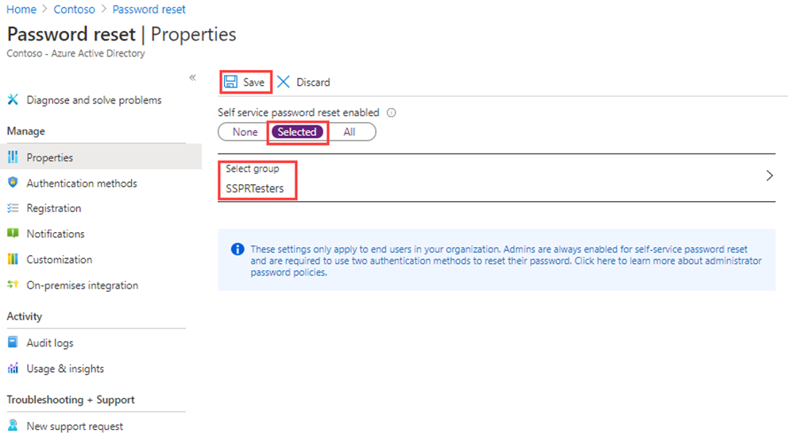
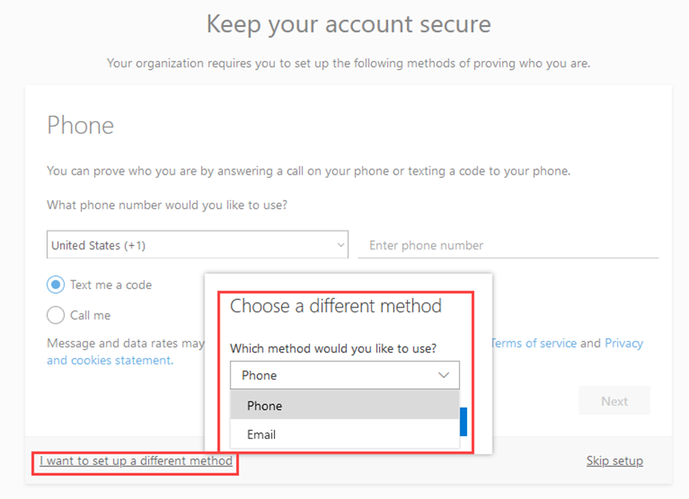
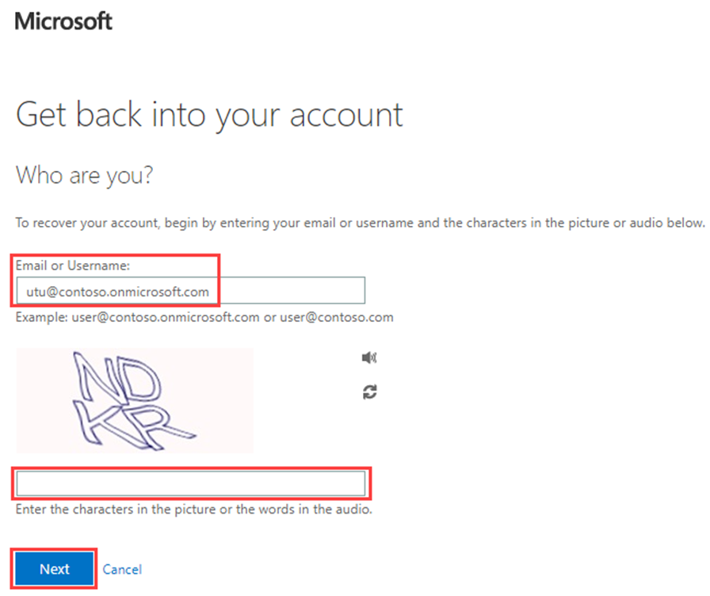
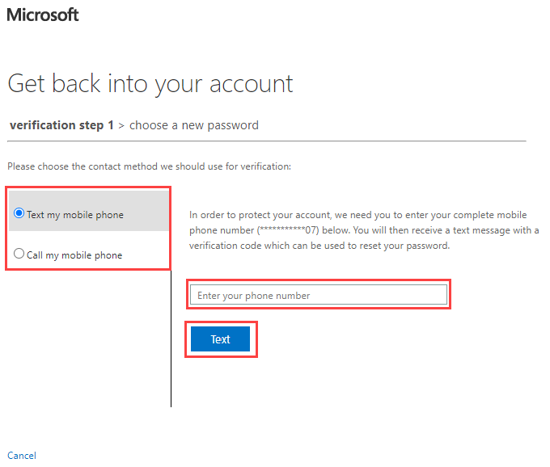

---
lab:
    title: '13 - Enable Azure AD self service password reset'
    learning path: '02'
    module: 'Module 02 - Manage user authentication'
---

# Lab 13 - Configure and deploy self-service password reset
## Lab scenario

The company has decided to empower the employees and enable self-service password reset. You must configure this setting in your organization.

#### Estimated time: 15 minutes

## Exercise 1 - Create a group with SSPR enabled and add users to it

### Task 1 - Create a group to assign SSPR to

You want to roll out SSPR to a limited set of users first to make sure your SSPR configuration works as expected. Let's create a security group for the limited rollout and add a user to the group.

1. On the Azure Active Directory blade, under **Manage**, select **+ New Group**.

2. Create a new group using the following information:

    | **Setting**| **Value**|
    | :--- | :--- |
    | Group type| Security|
    | Group name| SSPRTesters|
    | Group description| Testers of SSPR rollout|
    | Membership type| Assigned|
    | Members| Alex Wilber |
    | |  Allan Deyoung |
    | | Bianca Pisani |
  
    
3. Select **Create**.

    

### Task 2 - Enable SSPR for you test group

Enable SSPR for the group.

1. Browse back to the Azure Active Directory blade.

2. Under **Manage**, select **Password reset**.

3. On the Password reset blade Properties page, under **Self service password reset enabled**, select **Selected**.

4. Select **Select group**.

5. In the Default password reset policy pane, select the **SSPRTesters** group.

6. On the Password reset blade Properties page, select **Save**.

    

7. Under **Manage**, select and review the default values for the **Authentication methods**, **Registration**, **Notifications**, and **Customization** settings.

    **Note** it is important to have **phone** selected as one of the authentication methods for the rest of this lab, but you can have other options as well.

### Taks 3 - Register for SSPR with Alex

Now that the SSPR configuration is complete, register a mobile phone number for the user you created.

1. Open a different browser or open an InPrivate or Incognito browser session and then browse to [https://aka.ms/ssprsetup](https://aka.ms/ssprsetup).

    This is to ensure you well be prompted for user authentication.

2. Sign in as **AlexW@** `<<organization-domain-name>>` with the password = password provided to you.

    **Note** - Replace the organization-domain-name with your domain name.

3. If prompted to update your password, enter a new password of your choice. Be sure to record the new password.

4. In the **More information required** dialog box, select **Next**.

5. On the Keep your account secure page, user the **Phone** option.

    

    **Note** - In this lab, you will use the **Phone** option. Enter your mobile phone details.

6. Enter your personal cell phone number into the phone number field.
7. Select **Text me a code**.
8. Select **Next**.

9. When you receive the code on your mobile phone, enter the code in the text box and then select **Next**.

10. After your phone has been registered, select **Next** and then select **Done**.

11. Close the browser. You do not need to complete the sign in process.

### Task 4 - Test SSPR

Now let's test whether the user can reset their password.

1. Open a different browser or open an InPrivate or Incognito browser session and then browse to [https://portal.azure.com](https://portal.azure.com).

    This is to ensure you well be prompted for user authentication.

2. Enter **AlexW@** `<<organization-domain-name>>` and then select **Next**.

    **Note** - Replace the organization-domain-name with your domain name.

3. On the Enter password page, select **Forgot my password**.

4. On the Get back into your account page, complete the requested information and then select **Next**.

    

5. In the **verification step 1** task, select **Text my mobile phone**, enter your phone number and then select **Text**.

    

6. Enter your verification code and then select **Next**.

7. In the choose a new password step, enter and then confirm your new password.  Recommended password = **Pass@w.rd1234**.

8. When complete, select **Finish**.

9. Sign in as **AlexW** with the new password you created.

10. When finished, close your browser.

### Task 5 - What happens if you try reset a password for a user that is not in SSPRTesters group?

1. As a test, open a new InPrivate browser window and try to log into the Azure Portal as GradyA, and select **Forgot my password** option.

2. Note the message provided.
