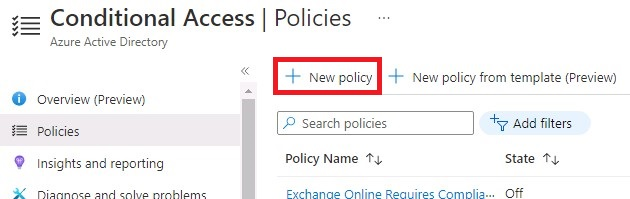
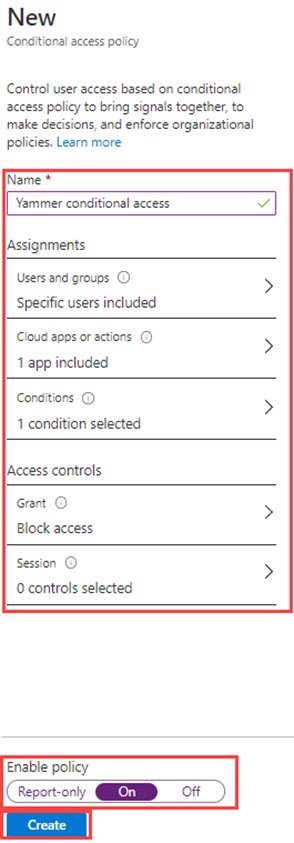
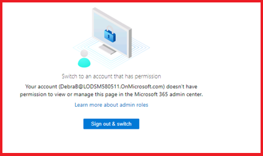
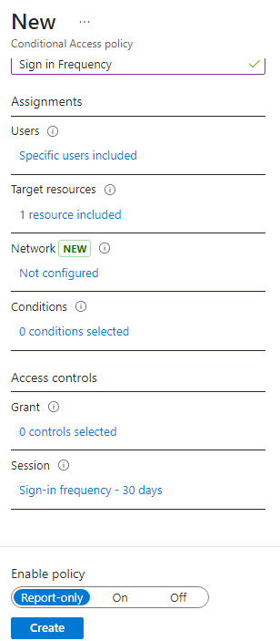

---
lab:
    title: '13 - Implement and test a conditional access policy'
    learning path: '02'
    module: 'Module 02 - Implement an Authentication and Access Management Solution'
---

# Lab 13 - Implement and test a conditional access policy

### You will perform this lab with the tenant login - admind@LODM#####.onmicrosoft.com

## Lab scenario

Your organization needs to be able to limit user access to its internal applications. You must deploy an Microsoft Entra conditional access policy.

**Note** - For Conditional Access Policies, you can turn off Security Defaults, the key points to remember are from the training.  Additional information on Security defaults can be found at this link: <https://docs.microsoft.com/en-us/azure/active-directory/fundamentals/concept-fundamentals-security-defaults>

#### Estimated time: 20 minutes

### Exercise 1 - Set a conditional access policy to block DebraB from accessing Sway

#### Task 1 -- Confirm DebraB has access to Sway

1. Launch a new InPrivate browser window.
2. Connect to [https://www.office.com](https://www.office.com) 
3. When prompted, log in as DebraB:

  | Setting | Value |
  | :--- | :--- |
  | Username | **DebraB@** `<<your lab domain>>.onmicrosoft.com` |
  | Password | Enter the admin password of the tenant(Refer the Lab Resources tab to retrieve the tenant's admin password). |
    
4. Bypass the welcome and introduction screens.

5. Open the **Apps** page, then then select on the **Sway** icon to see that it loads correctly.

6. Log out of Office and close your browser session.

#### Task 2 -  Create a conditional access policy

Microsoft Entra conditional access is an advanced feature of Microsoft Entra ID that allows you to specify detailed policies that control who can access your resources. Using Conditional Access, you can protect your applications by limiting users' access based on things like groups, device type, location, and role.

1. Browse to [https://entra.microsoft.com](https://entra.microsoft.com) and sign in using a Global administrator account for the directory.

2. Open the portal menu and then select **Microsoft Entra ID**.

3. On the menu, under **Identity**, select **Protection**.

4. On the Security page, in the left navigation, select **Conditional access**.

5. On the **Overview (Preview)**, click **+ Create new policy**.

   

6. In the **Name** box, enter **Block Sway for DebraB**.

   **Note** - Using this naming to help you quickly recognize the policy and its function.

7. Under **Assignments**, select **0 users and groups selected**.

8. On the Include tab, select **Select users and groups**, and then mark **Users and groups** check box.

9. In the Select pane, select **DebraB** account and then select **Select**.

10. In the **Target resources**, select **No target resource selected**.

11. Verify **Cloud apps** is selected and then select **Select apps**, then select **None** in the select section.

12. In the Select pane, search for **Sway** and select **Sway** and then select **Select**.

13. Under **Access controls**, within the **Grant** section, select **0 controls selected**.

14. In the Grant pane, select **Block access** and then select **Select**.

   **Note** - This policy is being configure for the exercise only and is being used to quickly demonstrate a conditional access policy.

15. Under **Enable policy**, select **On**, and then select **Create**.

   

#### Task 3 - Test the conditional access policy

You should test your conditional access policies to ensure they working as expected.

1. Open a new 'InPrivate' browser tab and then browse to [https://sway.office.com](https://sway.office.com).
    - When prompted, log in as DebraB:

   | Setting | Value |
   | :--- | :--- |
   | Username | **DebraB@** `<<your lab domain>>.onmicrosoft.com` |
   | Password | Enter the admin password of the tenant(Refer the Lab Resources tab to retrieve the tenant's admin password). |
     
2. Verify you are prevented from accessing Microsoft Sway.

   

3. If you are signed in, close the tab, wait 1 minute, and then retry.
    
   **Note** - If you are auto-logged into Sway as DebraB, then you will need to manually log out.  Your credentials / access were cached.  Once you log out and sign-in, your Sway session should deny access.

4. Close the tab and return to the Conditional Access page.

5. Select the **Block Sway for DebraB** policy.

6. Under **Enable policy**, select **Off** and then select **Save**.

### Exercise 2 - Test conditional access policies with "What if"

#### Task - Use What if to test conditional access policies

1. Open the Microsoft Entra admin center menu and then select **Microsoft Entra ID**.

1. On the menu, under **Identity**, select **Protection**.

1. On the Security page, in the left navigation, select **Conditional access**.

1. In the navigation pane, select **Policies**.

1. Select **What If**.

1. Under **User or Workload identity**, select **No user or service principal selected**.

1. Choose **DebraB** as the user.

1. Under **Cloud apps, actions, or authentication context**, select **Sway**. 

1. Select **What if**. You will be provided with a report at the bottom of the tile for **Policies that will apply** and **Policies that will not apply**.

This allows you to test the policies and their affectiveness before enabling the policies.

### Exercise 3 - Configure sign in frequency controls using a conditional access policy

#### Task - Use the Microsoft Entra admin center to configure conditional access

As part of your company's larger security configuration, you must test a conditional access policy that can be used to control sign in frequency

1. Browse to [https://entra.microsoft.com](https://entra.microsoft.com) and sign in using a Global administrator account for the directory.

2. Open the portal menu and then select **Microsoft Entra ID**.

3. On the menu, under **Identity**, select **Protection**.

4. On the Protection menu, in the left navigation, select **Conditional access**.

5. On the top menu, select **+ New policy** from the drop-down select **Create a new policy**.

   

6. In the **Name** box, enter **Sign in frequency**.

7. Under **Assignments**, select **0 users and groups selected**.

8. On the Include tab, mark **Select users and groups**, then select the **Users and groups** check box.

9. In the Select pane, select your **Grady Archie** account and then select **Select**.

10. Select **Cloud apps or actions**.

11. Verify **Cloud apps** is selected and then select **Select apps**.

12. In the Select pane, select **Office 365** and then select **Select**.

13. Under **Access controls**, select **Session**.

14. In the Session pane, select **Sign-in frequency**.

15. In the value box, enter **30**.

16. Select the units menu, select **Days**, and then select **Select**.

17. Under **Enable policy**, select **Report-only**, and then select **Create**.

   

   **NOTE** - Report-only mode is a new Conditional Access policy state that allows administrators to evaluate the impact of Conditional Access policies before enabling them in their environment. With the release of report-only mode:
    
- Conditional Access policies can be enabled in report-only mode.
- During sign-in, policies in report-only mode are evaluated but not enforced.
- Results are logged in the Conditional Access and Report-only tabs of the Sign-in log details.
- Customers with an Azure Monitor subscription can monitor the impact of their Conditional Access policies using the Conditional Access insights workbook.
