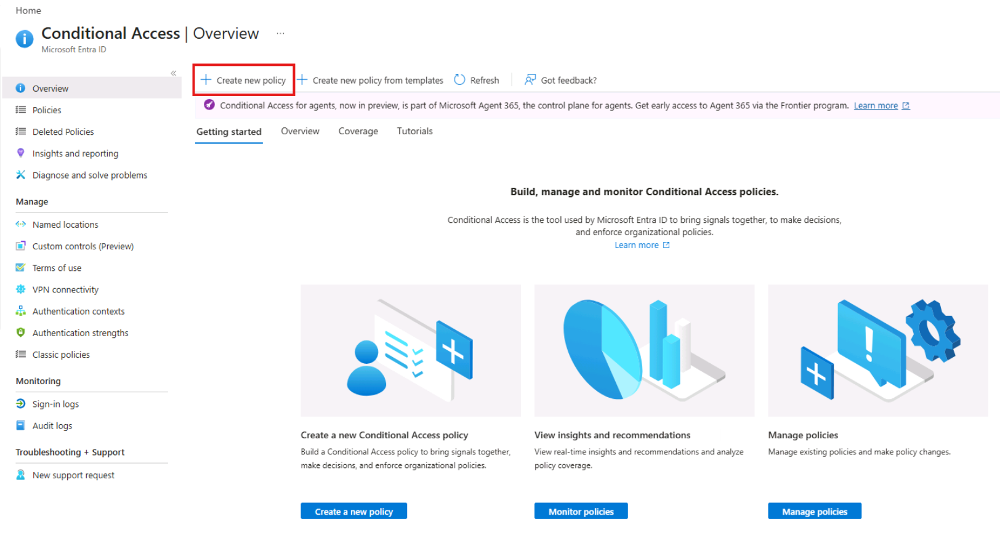
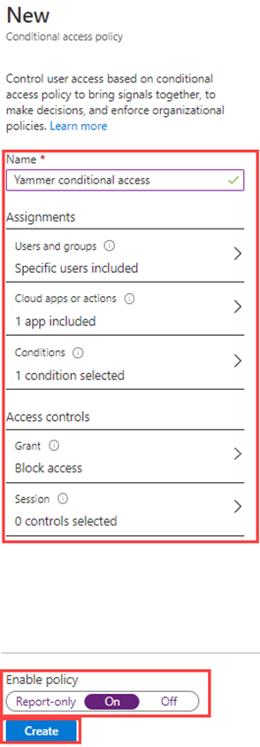
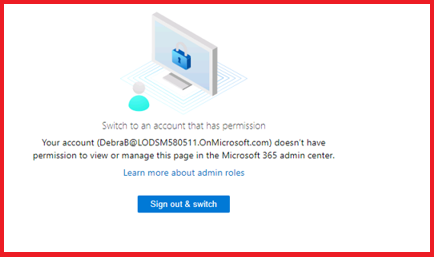
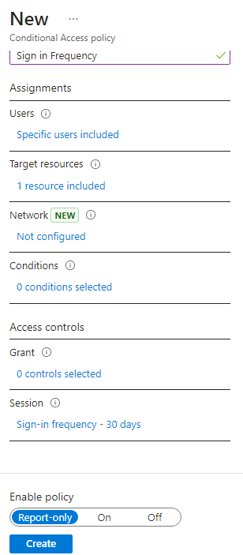

---
lab:
  title: 13 - Implement and test a conditional access policy
  learning path: '02'
  module: Module 02 - Implement an Authentication and Access Management Solution
  description: Your organization needs to be able to limit user access to its internal applications. You must deploy an Microsoft Entra conditional access policy.
  duration: 20 minutes
  level: 300
  islab: true
  primarytopics:
    - Microsoft Entra
---

# Lab 13 - Implement and test a conditional access policy

### Login type = Microsoft 365 admin

## Lab scenario

Your organization needs to be able to limit user access to its internal applications. You must deploy an Microsoft Entra conditional access policy.

**Note** - For Conditional Access Policies, you can turn off Security Defaults, the key points to remember are from the training.  Additional information on Security defaults can be found at this link: <https://docs.microsoft.com/en-us/azure/active-directory/fundamentals/concept-fundamentals-security-defaults>

#### Estimated time: 20 minutes

### Exercise 1 - Set a conditional access policy to block DebraB from accessing Sway

#### Task 1 - Confirm DebraB has access to Sway

1. Launch a new InPrivate browser window.

1. Connect to to Office at **`https://www.office.com`**.

1. When prompted, log in as DebraB:

  | Setting | Value |
  | :--- | :--- |
  | Username | `DebraB@<your lab domain>.onmicrosoft.com` |
  | Password | Enter the provided password |
    
1. Bypass the welcome and introduction screens.

1. Open the **Apps** page, then then select on the **Sway** icon to see that it loads correctly.

1. Log out of Office and close your browser session.

#### Task 2 -  Create a conditional access policy

Microsoft Entra conditional access is an advanced feature of Microsoft Entra ID that allows you to specify detailed policies that control who can access your resources. Using Conditional Access, you can protect your applications by limiting users' access based on things like groups, device type, location, and role.

1. Sign in to **Microsoft Entra admin center** at **`https://entra.microsoft.com`** using a Global Administrator account.

    > **Note:** You may be prompted to complete Multi-Factor Authentication (MFA) during sign-in. Follow the prompts to configure or verify your authentication method before continuing.

1. In the left navigation, under **Entra ID**, select **Conditional access**.

1. On the **Overview**, select **+ Create new policy**.

   

1. In the **Name** box, enter **Block Sway for DebraB**.

    >**Note:** Using this naming to help you quickly recognize the policy and its function.

1. Under **Assignments**, select **0 users or agents(Preview) selected**.

1. On the Include tab, select **Select users and groups**, and then mark **Users and groups** check box.

1. In the **Select users and groups** pane, select **DebraB** account and then select **Select**.

1. In the **Target resources**, select **No target resource selected**.

1. Verify **Resources (formerly cloud apps)** is selected and then select **Select resources**, then in the **Select specific resources** select **None**.

1. In the **Resources** pane, search for **Sway** and select **Sway** and then select **Select**.

1. Under **Access controls**, within the **Grant** section, select **0 controls selected**.

1. In the **Grant** pane, select **Block access** and then select **Select**.

     >**Note:** This policy is being configure for the exercise only and is being used to quickly demonstrate a conditional access policy.

1. Under **Enable policy**, select **On**, and then select **Create**.

   

#### Task 3 - Test the conditional access policy

You should test your conditional access policies to ensure they working as expected.

1. Open a new **InPrivate** browser tab, then go to **Microsoft Sway** at `https://sway.cloud.microsoft`.

   When prompted, sign in as **DebraB**:

   | Setting | Value |
   | :--- | :--- |
   | Username | `DebraB@<your lab domain>.onmicrosoft.com` |
   | Password | Enter the provided password |
     
1. Verify you are prevented from accessing Microsoft Sway.

   

1. If you are signed in, close the tab, wait 1 minute, and then retry.
    
    >**Note:** If you are auto-logged into Sway as DebraB, then you will need to manually log out.  Your credentials / access were cached.  Once you log out and sign-in, your Sway session should deny access.

1. Close the tab and return to **Conditional Access**.

1. In the left navigation, select **Policies** to view the list of Conditional Access policies.

1. Select the **Block Sway for DebraB** policy.

1. Under **Enable policy**, select **Off** and then select **Save**.

### Exercise summary

In this exercise, you created a Conditional Access policy that blocks a user from a specific cloud app and validated the block. This exercise showed how policies enforce app-level access decisions.

### Exercise 2 - Test conditional access policies with "What if"

#### Task - Use What if to test conditional access policies

1. Open the **Microsoft Entra admin center**.

1. In the left navigation, under **Entra ID**, select **Conditional access**.

1. In the navigation pane, select **Policies**.

1. Select **What if** from the top menu.

1. On the **What if** page, under **Identity**, verify **Select identity type** is set to **Users**.

1. Under **User**, select **Edit user**, then select **DebraB**.

1. Under **Target resource**, verify **Select target type** is set to **Cloud apps**.

1. Under **Cloud apps**, select **+ Select cloud app**, then select **Sway**.

1. Under **Sign-in conditions**, select **Device platform**, then select **Windows**.

1. Select **Client app**, then select **Browser**.

1. Select **What if**. Review the results at the bottom of the page under **Policies that will apply** and **Policies that will not apply**.

This report allows you to test the effectiveness of Conditional Access policies before enabling them.

### Exercise summary

In this exercise, you used the What If tool to model how a Conditional Access policy would apply to a sign-in. This exercise showed how to validate policy impact before enabling it for users.

### Exercise 3 - Configure sign in frequency controls using a conditional access policy

#### Task - Use the Microsoft Entra admin center to configure conditional access

As part of your company's larger security configuration, you must test a conditional access policy that can be used to control sign in frequency

1. Open the **Microsoft Entra admin center**.

1. In the left navigation, under **Entra ID**, select **Conditional access**.

1. On the **Overview**, select **+ Create new policy**.

   

1. In the **Name** box, enter **Sign in frequency**.

1. Under **Assignments**, select **0 users or agents(Preview) selected**.

1. On the **Include** tab, mark **Select users and groups**, then select the **Users and groups** check box.

1. In the **Select users and groups** pane, select **Grady Archie** account and then select **Select**.

1. Select **Target Resources - No target resources selected**.

1. Within the **Include** make sure **Select resources** is selected, then in the **Select specific resources** select **None**.

1. In the **Resources** pane, search for **Office 365**, then select it.

1. Under **Access controls**, in the **Session** section, select **0 controls selected**.

1. In the **Session** pane, select **Sign-in frequency**.

1. In the value box, enter **30**.

1. Select the units dropdown, then select **Days**.

1. Select **Select**.

1. Under **Enable policy**, select **Report-only**, and then select **Create**.

   

   >**Note:** Report-only mode is a new Conditional Access policy state that allows administrators to evaluate the impact of Conditional Access policies before enabling them in their environment. With the release of report-only mode:
    
- Conditional Access policies can be enabled in report-only mode.
- During sign-in, policies in report-only mode are evaluated but not enforced.
- Results are logged in the Conditional Access and Report-only tabs of the Sign-in log details.
- Customers with an Azure Monitor subscription can monitor the impact of their Conditional Access policies using the Conditional Access insights workbook.

### Exercise summary

In this exercise, you configured session controls to require users to reauthenticate at a defined frequency, in report-only mode. This exercise showed how session controls reduce risk for long-lived sessions.
