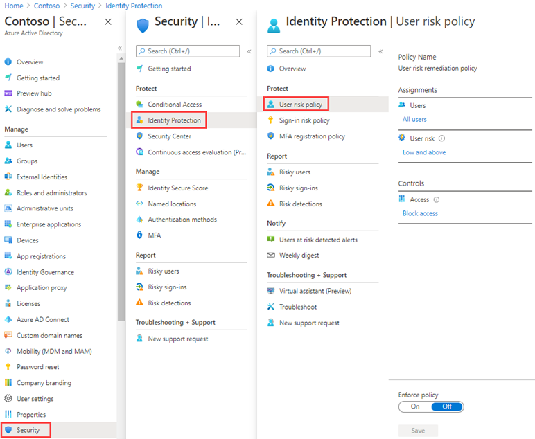

---
lab:
  title: 14 - Enable sign in and user risk policies
  learning path: '02'
  module: Module 02 - Implement an Authentication and Access Management Solution
  description: As an additional layer of security, you need to enable and configure your Microsoft Entra organization's sign in and user risk policies.
  duration: 10 minutes
  level: 200
  islab: true
  primarytopics:
    - Microsoft Entra
---

# Lab 14 - Enable sign in and user risk policies

### Login type = Microsoft 365 admin

## Lab scenario

As an additional layer of security, you need to enable and configure your Microsoft Entra organization's sign in and user risk policies.

#### Estimated time: 10 minutes

### Exercise 1 - Enable User risk policy

#### Task 1 - Configure the policy

1. Sign in to **Microsoft Entra admin center** at **`https://entra.microsoft.com`** using a Global administrator account.

1. In the left navigation menu, expand the **ID Protection**, select **Dashboard**.

1. On the **Identity protection | Dashboard**, in the left navigation under the **Protect**, select **User risk policy**.

    

1. Under **Assignments**, select **All users** and review the available options.

1. You can select from **All users** or **Select individuals and groups** if limiting your rollout.

1. Additionally, you can choose to exclude users from the policy.

1. Under **User risk**, select **Low and above**.

1. In the User risk pane, select **High** and then select **Done**.

1. Under **Controls** > **Access**, select **Block access**.

1. In the Access pane, review the available options.

    **Tip** - Microsoft's recommendation is to Allow access and Require password change.

1. Select the **Require password change** check box and then select **Done**.

1. Under **Policy enforcement**, select **Enabled** and then select **Save**.

#### Task 2 - Enable Sign-in risk policy

1. On the **Identity protection** page, in the left navigation menu under the **Protect**, select **Sign-in risk policy**.

1. As with the User risk policy, the Sign-in risk policy can be assigned to users and groups and allows you to exclude users from the policy.

1. Under **Sign-in risk**, select **Low and above**.

1. In the **Sign-in risk** pane, select **High** and then select **Done**.

1. Under **Controls** > **Access**, select **Block access**.

1. Select the **Require multi-factor authentication** check box and then select **Done**.

1. Under **Policy enforcement**, select **Enabled** and then select **Save**.

### Exercise summary

In this exercise, you enabled a user risk policy in Microsoft Entra ID Protection. This exercise showed how risk-based policies automatically respond to compromised identities.
