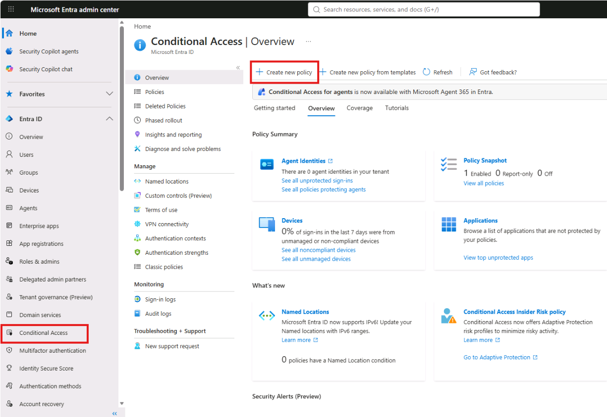

---
lab:
  title: Lab 14 - Configure User Risk and Sign-in Risk Conditional Access Policies
  learning path: '02'
  module: Module 02 - Implement an Authentication and Access Management Solution
  description: As an additional layer of security, you need to configure your Microsoft Entra organization's user risk and sign-in risk policies by using Conditional Access.
  duration: 10 minutes
  level: 200
  islab: true
  primarytopics:
    - Microsoft Entra
---

# Lab 14 - Configure User Risk and Sign-in Risk Conditional Access Policies

### Login type: Microsoft 365 admin

## Lab scenario

As an additional layer of security, you need to configure risk-based Conditional Access policies that respond to user risk and sign-in risk detections in Microsoft Entra.

#### Estimated time: 10 minutes

### Exercise 1 - Configure User Risk and Sign-in Risk Policies

#### Task 1 - Create a User Risk Conditional Access policy

1. Sign in to **Microsoft Entra admin center** at **`https://entra.microsoft.com`** using a Global Administrator account.

    > **Note:** You may be prompted to complete Multi-Factor Authentication (MFA) during sign-in. Follow the prompts to configure or verify your authentication method before continuing.

1. In the left navigation menu, under **Entra ID**, select **Conditional Access**, then select **+ Create new policy**.

    

1. Name the policy **`User Risk Remediation`**.

1. Under **Users or Agents** select **0 users or agents selected** then, on the **Include** tab, select **All users**.

1. On the **Exclude** tab, select **Users and groups** and exclude **MOD Administrator**.

1. Under **Target resources** select **No target resources selected**, then select **All resources (formerly 'All cloud apps')**.

1. Under **Conditions** select **0 conditions selected** and then, under **User risk**, select **Not configured**.

1. Under **User risk**, set **Configure** to **Yes**, select **High**, and then select **Done**.

1. Under **Access controls** > **Grant**, select **Grant access**.

1. In the **Grant** pane, select **Require risk remediation**.

1. Verify **Require selected controls** is selected, and then select **Select**.

1. Under **Enable policy**, select **On**, and then select **Create**.

You have created a User Risk Conditional Access policy. The policy helps protect user accounts by requiring risk remediation when a high-risk user is detected.

#### Task 2 - Create a Sign-in Risk Conditional Access policy

1. In the Microsoft Entra admin center, in the left navigation menu, under **Entra ID**, select **Conditional Access**.

1. Select **+ Create new policy**, in the **Name** box, enter **Sign-in Risk Policy**.

1. Under **Users or Agents** select **0 users or agents selected** then, on the **Include** tab, select **All users**.

1. On the **Exclude** tab, select **Users and groups** and exclude **MOD Administrator**.

1. Under **Target resources** select **No target resources selected**, then select **All resources (formerly 'All cloud apps')**.

1. Under **Conditions** select **0 conditions selected** and then, under **Sign-in risk**, select **Not configured**.

1. In the **Sign-in risk** pane, set **Configure** to **Yes**, select **High**, and then select **Done**.

1. Under **Access controls** > **Grant**, select **Grant access**.

1. In the **Grant** pane, select **Require multifactor authentication**, and then select **Select**.

1. Under **Enable policy**, select **On**, and then select **Create**.

You have created a Sign-in Risk Conditional Access policy that requires multifactor authentication when a high-risk sign-in is detected.

### Exercise summary

In this exercise, you created risk-based Conditional Access policies in Microsoft Entra. You configured a User Risk policy that requires risk remediation for high-risk users and a Sign-in Risk policy that requires multifactor authentication for high-risk sign-ins. These policies help protect your organization by automatically responding to identity-based risks.