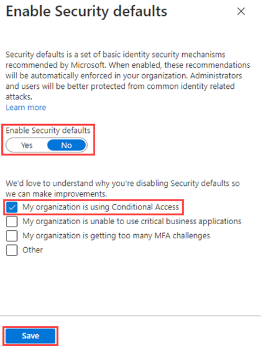

---
lab:
    title: '14 - Enable Azure AD multi-factor authentication'
    learning path: '02'
    module: 'Module 03 -Plan, implement, and administer conditional access'
---

# Lab 14 - Working with security defaults - OPTIONAL

## Lab scenario

You must configure the Azure Active Directory security default settings in your organization.
    **This is a completely optional lab!!**  You can turn on / off Security Defaults, just to find out where the menu option is.  But the key points to remember are from the training.  Note that if you turn on Security Defaults, and do not disable it, later labs involving Conditional Access will not work.

#### Estimated time: 5 minutes

## Enabling security defaults

To enable security defaults in your directory:

1. Browse to [https://portal.azure.com](https://portal.azure.com) and sign in using a Global administrator account for the directory.

1. Select the **Show portal menu** hamburger icon and then select **Azure Active Directory**.

    

1. In the left navigation, in the Manage section, select **Properties**.

1. At the bottom of the Properties blade, select **Manage Security defaults**.

1. Set the **Enable security defaults** toggle to **Yes**.

1. This may already be enabled.

1. Select **Save**.

### Disabling security defaults

Organizations that choose to implement Conditional Access policies that replace security defaults must disable security defaults.

To disable security defaults in your directory:

1. Browse to the [https://portal.azure.com](https://portal.azure.com/) and sign in using a Global administrator account for the directory.

1. Select the **Show portal menu** hamburger icon and then select **Azure Active Directory**.

1. At the bottom of the Properties blade, select **Manage Security defaults**.

1. Set the **Enable security defaults** toggle to **No**.

    

1. Select **Save**.
