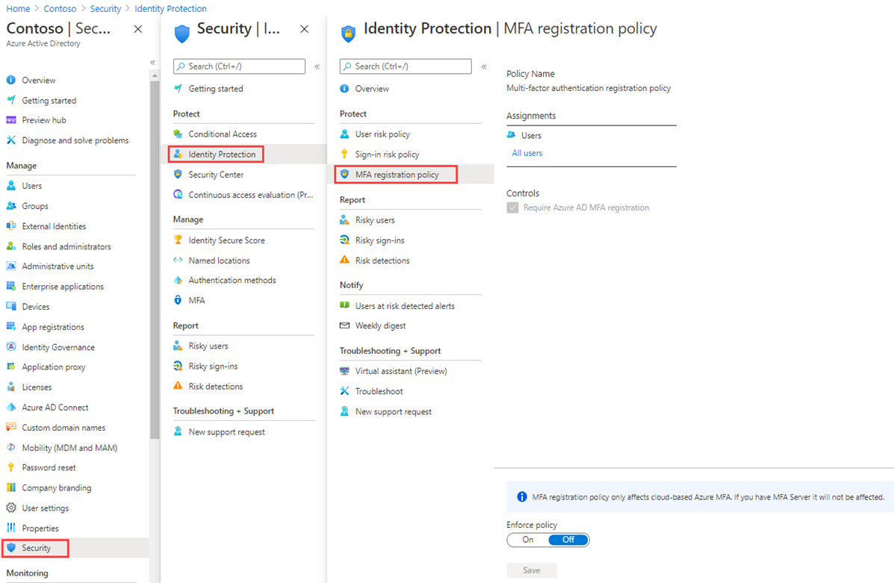

---
lab:
  title: 15 - Configure an Multifactor authentication registration policy
  learning path: '02'
  module: Module 02 - Implement an Authentication and Access Management Solution
  description: Create, configure, and deploy a multifactor authentication registry policy, then track the adoption with built-in reporting.
  duration: 10 minutes
  level: 300
  islab: true
  primarytopics:
    - Microsoft Entra
---

# Lab 15 - Configure an Multifactor authentication registration policy

### Login type = Microsoft 365 admin

## Lab scenario

Multifactor authentication provides a means to verify who you are using more than just a username and password. It provides a second layer of security to user sign-ins. For users to be able to respond to MFA prompts, they must first register for Microsoft Entra Multifactor Authentication. You must configure your Microsoft Entra organization's MFA registration policy to be assigned to all users.

#### Estimated time: 10 minutes

### Exercise 1 - Set up MFA registration policy

#### Task 1 - Policy configuration

1. Sign in to **Microsoft Entra admin center** at **`https://entra.microsoft.com`** using a Global Administrator account.

    > **Note:** You may be prompted to complete Multi-Factor Authentication (MFA) during sign-in. Follow the prompts to configure or verify your authentication method before continuing.

1. In the left navigation menu, under **Entra ID**, select **Identity Secure Score**.

1. On the **Security | Identity Secure Score**, in the left navigation menu under the **Protect**, select **Identity protection**.

1. On the **Identity protection | Dashboard**, in the left navigation menu under the **Protect**, select **Multifactor authentication registration policy**.

    

1. Under **Assignments**

1. Under **Assignments**, select **All users** and review the available options.

1. You can select from **All users** or **Select individuals and groups** if limiting your rollout.

1. Additionally, you can choose to exclude users from the policy.

1. Under **Controls**, notice that the **Require Microsoft Entra ID multifactor authentication registration** is selected and cannot be changed.

#### Task 2 - Configure Microsoft Entra Identity Protection policy for MFA registration

**Note**: Microsoft Entra Identity Protection requires Microsoft Entra ID Premium P2 to be activated. 

1. On the **Microsoft Entra admin center**, in the left navigation menu, expand the **ID Protection**, select **Dashboard**.

1. On the **Identity protection | Dashboard**, in the left navigation menu under the **Protect**, select **Multifactor authentication registration policy**.

1. Under **Assignments**, select **All users** under Users, and select a user to enforce MFA.

1. Find the field **Policy enforcement** in the dialog.  Set the value to **Enabled**.

1. Select **Save**.

   

This will require the user to complete the MFA registration the next time they attempt to login.

1. From a private browser, navigate to `https://login.microsoftonline.com`. Enter a user name and password from the tenant.  Note the additional security information requirements that the user is asked to enter.

### Exercise summary

In this exercise, you configured the Microsoft Entra ID Protection MFA registration policy. This exercise showed how to ensure users register for MFA before risky activity occurs.
