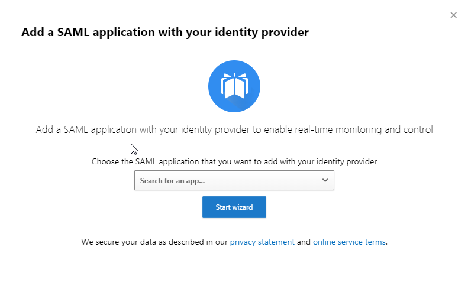

---
lab:
    title: '18 - Defender for Cloud Apps Access and File Policies'
    learning path: '03'
    module: 'Module 03 - Implement Access Management for Apps'
---

# 18 - Defender for Cloud Apps Access and Session Policies

## Lab scenario

Microsoft Defender for Cloud Apps  allows us to create additional Conditional Access policies specific to the cloud apps that we are monitoring.  Creating these policies can be done from within the Control menu within the Microsoft Defender for Cloud Apps  portal.

#### Estimated time: 20 minutes

### Exercise 1 - Create a Defender for Cloud Apps Access policy

#### Task 1 - Access Microsoft Defender for Cloud Apps

Registering your application establishes a trust relationship between your app and the Microsoft identity platform. The trust is unidirectional: Your app trusts the Microsoft identity platform—not the other way around.

1. Sign in to [https://security.microsoft.com](https://security.microsoft.com) using a Global Administrator account.

1. On the left menu, scroll to the bottom and select **More resources**.

1. In the **More resources** window, locate and select **Open** under **Microsoft Defender for Cloud Apps**.  This will take you to the **Microsoft Defender for Cloud Apps** portal within the Microsoft 365 account.

#### Task 2 - Create Conditional Access App Control

1. In the **Microsoft Defender for Cloud Apps** portal menu, select the drop-down arrow for **Discover** and select **Discovered Apps**.

1. Select **Social network** under **Browse a category**.

1. In the list of apps discovered, find and select an app with a low risk score, such as **Pinterest**.

1. A page for that app will open to provide more information on the app and the **Cloud app score**.  On the top right of the page, select the **Actions** drop-down arrow and select **Add to Conditional Access App Control** under **Deploy app**.

1. Another window will open for you to **Add a SAML application with your identity provider**.  

    

    **Note**: Having Conditional Access app control is a requirement to setting up Access policies in **Microsoft Defender for Cloud Apps**.

1. This task requires a **SAML** application provider to be created within your tenant.  Review the list of applications and note that Azure AD is not in the list, but you can select **Manage app with Azure AD**.

1. Select **Manage app with Azure AD**. **Note**: the **Azure AD Gallery** and a tile will open for **Workplace for Facebook**.

1. Select **Create**.  This will allow users to connect their LinkedIn profile into their Azure AD user account.

1. This creates a single sign-on connection for **Facebook** utilizing **Azure AD**.  After the application is added, a new window will open with the **Application ID** and **Object ID**.  These will be needed for completing single sign on setup.

1. Explore the options in this window before moving to the next task.

#### Task 3 - Create a File policy

1. In the **Microsoft Defender for Cloud Apps** portal menu, select the drop-down arrow for **Control** and select **Policies**.

1. Locate **+ Create Policy** and select the drop-down arrow, and select **File policy**.
 
1. Unlike a **Conditional Access policy** within Azure AD, **Microsoft Defender for Cloud Apps** policies provide templates that you can utilize to create your policy and provide several pre-configured filters.  For this exercise, we will select the File shared with personal email addresses template.   

1. When asked to confirm that this will overwrite all current values, select apply template. 

1. The template completes the required fields, but you have the option to change these as needed for your company policy.  For example, you may want this policy to be a medium or high severity instead of the default low.  Change the policy severity to Medium for this exercise 

1. Scrolling down on the Create file policy tile, you will find additional configurable drop-down selections and check-boxes to customize your policy. 

1. The next step is to configure the files to apply the policy to within OneDrive for Business and SharePoint.  This can be all files, selected folders, or all files excluding selected folders.  

1. After selecting the scope of the files, we now select Apply to owners to determine the files that are in scope based on the owners of the files.  This includes all file owners within scope, a user group, or an excluded group.  If you have a Sales group created in your Azure AD, select that group for this exercise.  If not, select all file owners. 

1. The next option is the Inspection method. Since the File policy is a Threat protection policy, we can configure Inspection method to utilize an existing **Data Loss Prevention** policy and also Data Classification Services that are configured within **Microsoft 365**.  DLP is out of scope for this exam, so we will choose None for this exercise. 

1. The next section to configure is the Alerts.  These alerts are typical for policy templates.  You have the ability here to set an alert limit, identify an email or text message receiver of the alert, and utilize a pre-created Power Automate workflow.  Select the send alert as email and enter your email address for this exercise. 

1. The next two sections are the Governance actions.  The first is for **OneDrive for Business**.  We will leave these unselected for this exercise. 

1. Governance actions **SharePoint** are the same as **OneDrive for Business**.  Again, leave these as the defaults. 

1. The final action is to create the policy.  There is a note in the portal that clarifies that this policy is only scanning online files and folders, nothing external per Microsoft privacy standards. 
