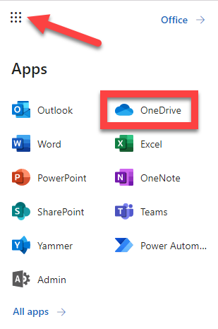

---
lab:
    title: '18 - Defender for Cloud Apps Access Policies'
    learning path: '03'
    module: 'Module 03 - Implement Access Management for Apps'
---

# 18 - Defender for Cloud Apps Access and Session Policies

## Lab scenario

Microsoft Defender for Cloud Apps  allows us to create additional Conditional Access policies specific to the cloud apps that we are monitoring.  Creating these policies can be done from within the Control menu within the Microsoft Defender for Cloud Apps  portal.

#### Estimated time: 20 minutes

### Exercise 1 - Create a Defender for Cloud Apps Access policy

#### Task 1 - Configure Azure AD to work with Defender for Cloud Apps

1. Navigate to [portal.azure.com](portal.azure.com) and go to Azure Active Directory.

1. Under **Manage**, select **Security**.

1. Under **Protect**, select **Conditional Access**.

1. Select **+ New policy** drop-down and select **Create new policy**.

1. Enter a policy name, such as **Defender for Cloud Apps control**.

1. Under **Users or workload identities**, select **users or workload identities selected**, select **Select users and groups** and **Users and groups**.

1. Select the admin user account for the lab tenant and select **Select**.

1. Under **Cloud apps or actions**, select **No cloud apps, actions, or authentication contexts selected**.

1. Select **Select apps**, select **Microsoft Cloud App Security**, **Office 365 Exchange Online**, and **Office 365**, and select **Select**. 

1. Under **Access controls**, select **Session** and **controls selected**.

1. Select the **Use Conditional Access App Control** box, leave the default of **Monitor only**, and select **Select**.

1. Under **Enable policy**, select **On**, and select **Create**.

#### Task 2 - Access Microsoft Defender for Cloud Apps and create Conditional Access App Control

Registering your application establishes a trust relationship between your app and the Microsoft identity platform. The trust is unidirectional: Your app trusts the Microsoft identity platform—not the other way around.

1. Sign in to [https://security.microsoft.com](https://security.microsoft.com) using a Global Administrator account.

1. On the left menu, scroll to the bottom and select **More resources**.

1. In the **More resources** window, locate and select **Open** under **Microsoft Defender for Cloud Apps**.  This will take you to the **Microsoft Defender for Cloud Apps** portal within the Microsoft 365 account.

1. In the **Microsoft Defender for Cloud Apps** portal menu, select the drop-down arrow for **Control** and select **Policies**.

1. Select **+ Create policy**. Select **Access policy**.

1. Enter a name for the policy, such as **Block access from devices that are unmanaged**.

1. Leave the **Category** as **Access control**.

1. Under **Activities matching all of the following**, select the drop-down for **Intune compliant, Hybrid Azure AD joined** and unselect **Hybrid Azure AD joined**.

1. Select the drop-down for **Select apps**.  Select **Microsoft OneDrive for Business**.

1. Leave **Actions** as **Test**.

1. Under **Alerts**, leave **Create an alert...** checked and select **Sent alert as email**.

1. Enter the lab admin email address and select **Enter** on your keyboard.

1. Select **Create** to create the access policy.

1. Navigate to <login.microsoftonline.com> on another browser tab and select **OneDrive** from the app selection on the top right of the page.

    

1. In **Microsoft Defender for Cloud Apps**, select **Alerts** on the menu.  This brings you to the dashboard of alerts from policies, both built-in and custom. 

1. In the **Filters**, select **OneDrive for Business** under **App: Select apps**, and the policy that you created under **Policy: Select policy**. Alerts for this policy will be visible here.

1. Navigate to **Outlook** from <login.microsoftonline.com> to view the **Inbox** for an alert. You should see tht **Access to Microsoft Exchange Online is monitored** when selected. This is based on a Conditional Access policy that is in place from the lab provider.

   **Note** -  There may be a delay for this policy to take affect and provide an alert.
