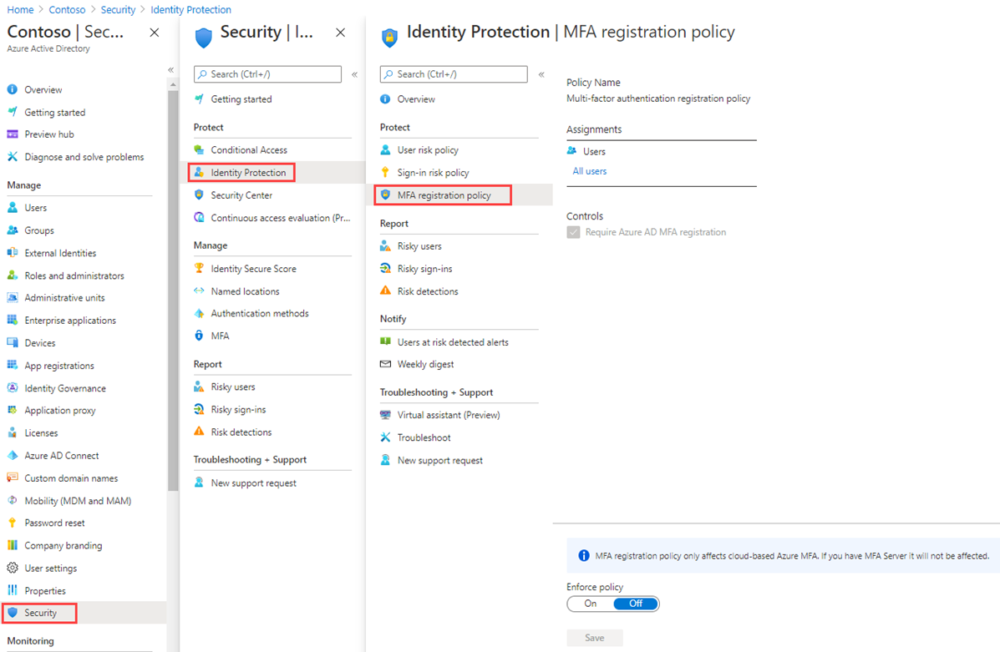

---
lab:
    title: '19 - Configure an Azure AD multi-factor authentication registration policy'
    learning path: '02'
    module: 'Module 04 -Manage Azure AD identity protection'
---

# Lab 19 - Configure an Azure AD multi-factor authentication registration policy

## Lab scenario

Azure AD multi-factor authentication provides a means to verify who you are using more than just a username and password. It provides a second layer of security to user sign-ins. For users to be able to respond to MFA prompts, they must first register for Azure AD Multi-Factor Authentication. You must configure your Azure AD organization's MFA registration policy to be assigned to all users.

#### Estimated time: 5 minutes

## Policy configuration

1. Sign in to the [https://portal.azure.com]( https://portal.azure.com) using a Global administrator account.

1. Open the portal menu and then select **Azure Active Directory**.

1. On the Azure Active Directory blade, under **Manage**, select **Security**.

1. On the Security blade, in the left navigation, select **Identity protection**.

1. In the Identity protection blade, in the left navigation, select **MFA registration policy**.

    

1. Under **Assignments**

1. Under **Assignments**, select **All users** and review the available options.

**Note** You can select from **All users** or **Select individuals and groups** if limiting your rollout. Additionally, you can choose to exclude users from the policy.

1. Under **Controls**, notice that the **Require Azure AD MFA registration** is selected and cannot be changed.

1. Under **Enforce Policy**, select **On** and then select **Save**.
