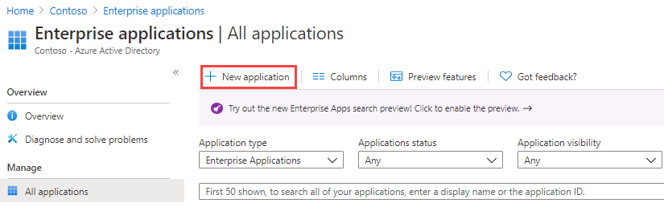
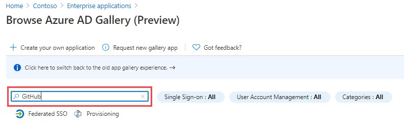
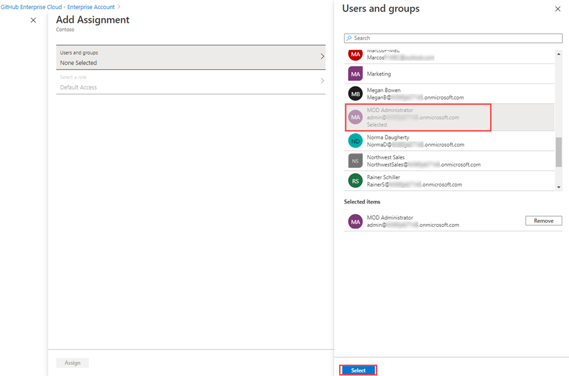

---
lab:
    title: '20 - Implement access management for apps'
    learning path: '03'
    module: 'Module 03 - Implement Access Management for Apps'
---

# Lab 20 - Implement access management for apps

## Lab scenario

Your organization requires that only specific users or groups have access to enterprise applications. You must assign a user to a specific application.

#### Estimated time: 5 minutes

### Exercise 1 - Configure and Enterprise App

#### Task 1 - Add an app to your Azure AD tenant

1. Sign in to the [https://portal.azure.com](https://portal.azure.com) using a Global administrator account.

2. Open the portal menu and then select **Azure Active Directory**.

3. On the Azure Active Directory blade, under **Manage**, select **Enterprise applications**.

4. In the Enterprise applications pane, select **+ New application**.

    

5. In the Browse Azure AD Gallery (Preview) blade, in the **Search application** box, enter **GitHub**.

    

6. In the results, select **GitHub Enterprise Cloud – Enterprise Account**.

7. In the **GitHub Enterprise Cloud – Enterprise Account**, review the settings and then select **Create**.

8. Once created, you will be redirected to the GitHub Enterprise Cloud – Enterprise Account blade.

#### Task 2 - Assign users to an app

1. On the GitHub Enterprise Cloud – Enterprise Account blade, on the Overview page, under **Getting Started**, select **1. Assign users and groups**.

2. Alternatively, in the left navigation, under **Manage**, you can select **Users and groups**.

3. On the Users and groups page, on the menu, select **+Add user/group**.

4. On the Add Assignment blade, select **Users and groups**.

5. In the Users and groups pane, select your administrator account and then select **Select**.

    

6. Select **Assign**.
