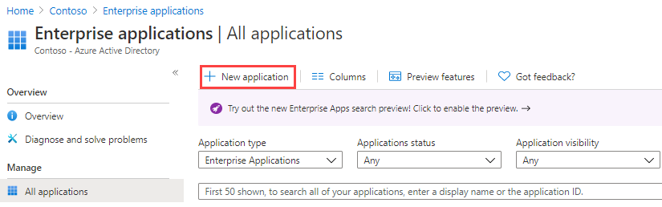
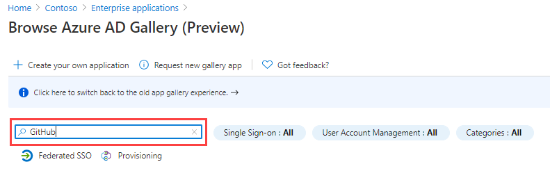
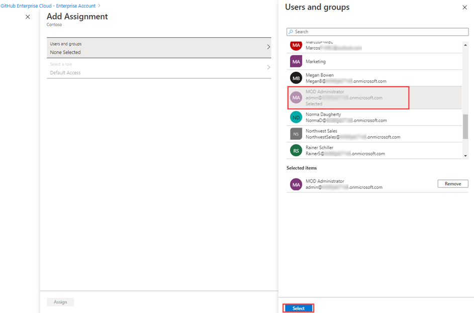

---
lab:
  title: 20 - Implement access management for apps
  learning path: '03'
  module: Module 03 - Implement Access Management for Apps
  description: Your organization requires that only specific users or groups have access to enterprise applications. You must assign a user to a specific application.
  duration: 5 minutes
  level: 100
  islab: true
---

# Lab 20 - Implement access management for apps

### Login type = Microsoft 365 admin

## Lab scenario

Your organization requires that only specific users or groups have access to enterprise applications. You must assign a user to a specific application.

#### Estimated time: 5 minutes

### Exercise 1 - Configure an Enterprise App

#### Task 1 - Add an app to your Microsoft Entra tenant

1. Sign in to **Microsoft Entra admin center** at **`https://entra.microsoft.com`** as your Global Administrator.

    > **Note:** You may be prompted to complete Multi-Factor Authentication (MFA) during sign-in. Follow the prompts to configure or verify your authentication method before continuing.

1. In the left navigation menu, under **Entra ID**, select **Enterprise apps**.

1. On the **Enterprise applications** page, select **+ New application**.

    

1. On the **Browse Microsoft Entra Gallery** page, in the **Search application** box, enter **GitHub**.

    

1. In the results, select **GitHub Enterprise Cloud – Enterprise Account**.

1. In the **GitHub Enterprise Cloud – Enterprise Account**, review the settings and then select **Create**.

1. Once created, you will be redirected to the GitHub Enterprise Cloud – Enterprise Account page.

#### Task 2 - Assign users to an app

1. On the GitHub Enterprise Cloud – Enterprise Account page, on the Overview page, under **Getting Started**, select **1. Assign users and groups**.

1. Alternatively, in the left navigation, under **Manage**, you can select **Users and groups**.

1. On the Users and groups page, on the menu, select **+ Add user/group**.

1. On the Add Assignment page, select **None selected** in the **Users and groups** section.

1. In the Users and groups pane, select **Adele Vance** and your **MOD administrator** account.

1. Select **Select**.

    

1. Select **Assign**.

### Exercise summary

In this exercise, you configured user assignment and access controls for an enterprise application. This exercise showed how to govern who can use a federated application.
