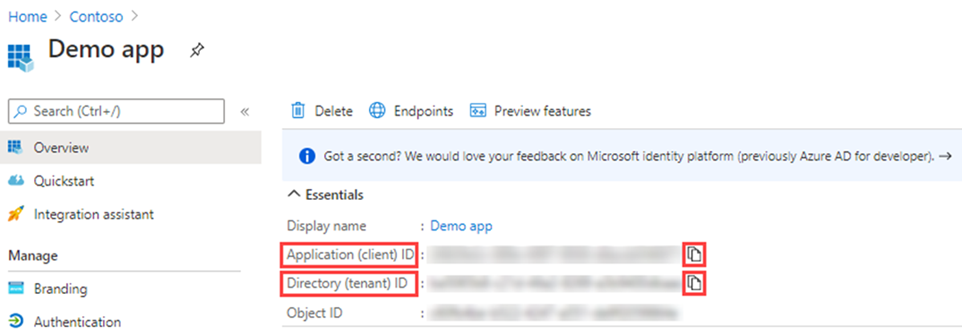
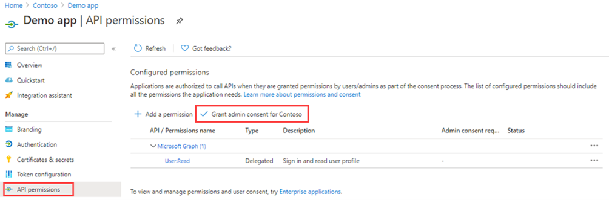
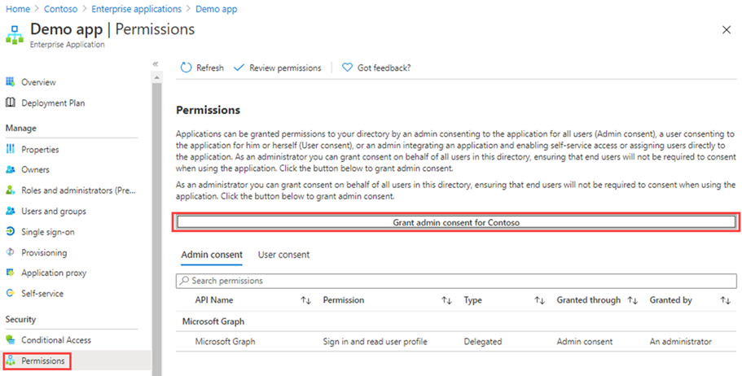

---
lab:
    title: '21 - Grant tenant-wide admin consent to an application'
    learning path: '03'
    module: 'Module 03 - Implement Access Management for Apps'
---

# Lab 21: Grant tenant-wide admin consent to an application

## Lab scenario

For applications your organization has developed or for those that are registered directly in your Microsoft Entra tenant, you can grant tenant-wide admin consent from App registrations in the Azure portal.

#### Estimated time: 15 minutes

### Exercise 1 - Admin Consent

#### Task 1 - Grant admin consent in App registrations

   **Warning** - Granting tenant-wide admin consent to an application will grant the app and the app's publisher access to your organization's data. Carefully review the permissions the application is requesting before granting consent.

The Global Administrator role is required in order to provide admin consent for application permissions to the Microsoft Graph API.

1. In a previous exercise, you created an app named Demo app. If necessary, in Microsoft Entra admin center, browse to **Identity**, **Applications**, then select **App registrations**, and then select **Demo app**.

2. On the **Demo app** page, locate and copy and save each **Application (client) ID** and **Directory (tenant) ID** values so that you can use them later.

    **Note** - **Demo app** is created in the previous labs. Please complete these labs before this lab.

    

3. In the left navigation, under **Manage**, select **API permissions**.

4. Under **Configured permissions**, select **Grant admin consent**.

    

5. Review the dialogue box, and then select **Yes.**

   **Warning** - Granting tenant-wide admin consent through App registrations will revoke any permissions that had previously been granted tenant-wide. Permissions previously granted by users on their own behalf will not be affected.

#### Task 2 - Grant admin consent in Enterprise apps

You can grant tenant-wide admin consent through Enterprise applications if the application has already been provisioned in your tenant.

1. In Microsoft Entra admin center, browse to **Identity > Applications > Enterprise applications > Demo app.**

2. On the **Demo app** page, in the left navigation, under **Security,** select **Permissions.**

3. Under **Permissions,** select **Grant admin consent.**

    

   **Warning** - Granting tenant-wide admin consent through App registrations will revoke any permissions that had previously been granted tenant-wide. Permissions previously granted by users on their own behalf will not be affected.

4. When prompted, sign in using your Global Administrator account.

5. In the **Permissions requested** dialog box, review the information and then select **Accept**.
