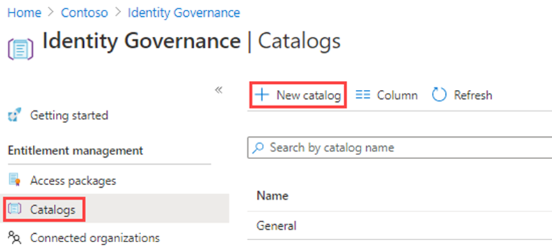
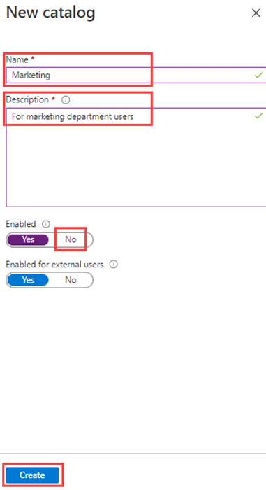
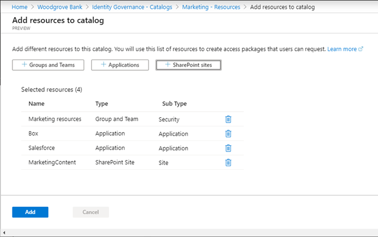
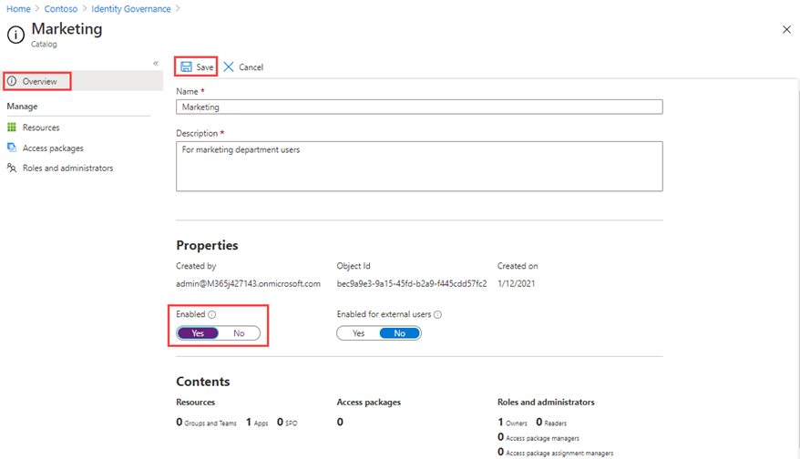

---
lab:
    title: '22 - Create and manage a catalog of resources in Azure AD entitlement management'
    learning path: '04'
    module: 'Module 04 - Plan and Implement and Identity Governance Strategy'
---

# Lab 22: Create and manage a catalog of resources in Azure AD entitlement management

## Lab scenario

A catalog is a container of resources and access packages. You create a catalog when you want to group related resources and access packages. Whoever creates the catalog becomes the first catalog owner. A catalog owner can add additional catalog owners. You must create and configure a catalog in your organization.

#### Estimated time: 15 minutes

### Exercise 1 - Building out resources in Entitlement Management

#### Task 1 - Create a catalog

1. Sign in to [https://portal.azure.com](https://portal.azure.com) using a Global Administrator account.

    **Important** - To use and configure Azure AD terms of use, you must have:
    - Azure AD Premium P1, P2, EMS E3, or EMS E5 subscription.
    - If you don't have one of these subscriptions, you can get Azure AD Premium or enable Azure AD Premium trial.
    - One of the following administrator accounts for the directory you want to configure:
        - Global Administrator
        - Security Administrator
        - Conditional Access Administrator

2. Open **Azure Active Directory** and the select **Identity Governance**.

3. In the left menu, under **Entitlement management**, select **Catalogs**.

4. On the top menu, select **+New Catalog**.

    

5. In the New catalog pane, in the **Name** box, enter **Marketing**.

6. In the **Description** box, enter **For marketing department users**. Users will see this information in an access package's details.

7. **Enabled for external users** allows users in selected external directories to be able to request access packages in this catalog. No changes will be made to this setting.

8. Under **Enabled, select No**.

9. You may choose to enable the catalog for immediate use or disable if you intend to stage it or keep it unavailable until you intend to use it. For this exercise, the catalog does not need to be enabled.

    

10. Select Create.

#### Task 2 - Add resources to a catalog

To include resources in an access package, the resources must exist in a catalog. The types of resources you can add are groups, applications, and SharePoint Online sites. The groups can be cloud-created Microsoft 365 Groups or cloud-created Azure AD security groups. The applications can be Azure AD enterprise applications, including both SaaS applications and your own applications federated to Azure AD. The sites can be SharePoint Online sites or SharePoint Online site collections.

1. On the Identity Governance page, if necessary, select **Catalogs**.

2. In the **Catalogs** list, select **Marketing**.

3. In the left navigation, under **Manage**, select **Resources**.

4. On the menu, select + **Add resources**.

5. In the Add resources to catalog page, review the available options.  Add the following items:

   | Resource Type | Value |
   | :------------- | :---------- |
   |  **Groups and Teams** | Retail |
   |  **Applications** | Box |
   |  **Applications** | Salesforce |
   |  **SharePoint sites** | Brand SharePoint <<<pick from your list of available SharePoint sites |

6. You may not have any resources in Groups and Teams, Applications, or SharePoint sites. Select any resource category and then select a resource from that category.

7. For this exercise, it is okay to choose any resource you may have available.

    

8. When finished, Select **Add**. These resources can now be included in access packages within the catalog.

#### Task 3 - Add additional catalog owners

The user that created a catalog becomes the first catalog owner. To delegate management of a catalog, you add users to the catalog owner role. This helps share the catalog management responsibilities.

1. If necessary, in the Azure portal, browse to **Azure Active Directory** > **Identity Governance > Catalogs** and then select **Marketing**.

2. In the Marketing catalog page, in the left navigation menu, select Roles and administrators.

    

3. On the top menu, review the available roles and then select **+ Add catalog owner**.

4. In the Select members pane, select your **Adele Vance** and then select **Select**.

5. Review the newly added role in the Roles and administrators list.

#### Task 4 - Edit a catalog

You can edit the name and description for a catalog. Users see this information in an access package's details.

1. In the Marketing page, in the left navigation, select **Overview**.

2. On the top menu, select **Edit**.

3. Review the setting and, under **Properties** > **Enabled**, select **Yes**.

    

4. Select **Save**.

#### Task 5 - Create Access reviews for guest users

1. Access reviews can manage the access lifecycle.  Azure AD Identity Governance provides an overview dashboard showing the status of access reviews. Select **Access reviews** in the **Identity Governance** menu.

1. Under the Access review menu, you can select Access reviews to configure an access review for guest users.  You will select + New access review to create your guest user access review.  The tile will open to configure the access review for guest users.

1. Select **Teams + Groups** for **Select what to review**.

1. Under **Select review scope**, select **All Microsoft 365 groups with guest users**

1. Under **Select user scope**, select **Guest users only**.

1. Select **Next: Reviews**.

1. The next tile is where you configure who reviews and approves access, how often access will be reviewed, and when access will expire.

1. Under **Select reviewers**, select **Group owners** as these reviewers. **Note**: Guest users should not be allowed to review their own access as a good identity governance practice.

1. Enter a **Duration (in days)**, default is 3, choose a **Review recurrence** and **Start date** for the review.

1. Select **Next: Settings** and configure the settings for how the review will take place and what happens when the guest user responds or does not respond.  A good practice is to select **Auto apply results to resource** and select **Remove access** for **If reviewers don't respond**. 

1. Select **Next: Review + create**, and select **Create** to create the new **Access review**.

#### Task 6 - Delete a catalog

You can delete a catalog, but only if it does not have any access packages.

1. In the Marketing catalog’s Overview page, on the top menu, select Delete.

2. In the Delete dialog box, review the information and then select **No**.

    **Note** - we are keeping the catalog for use in the next lab.
