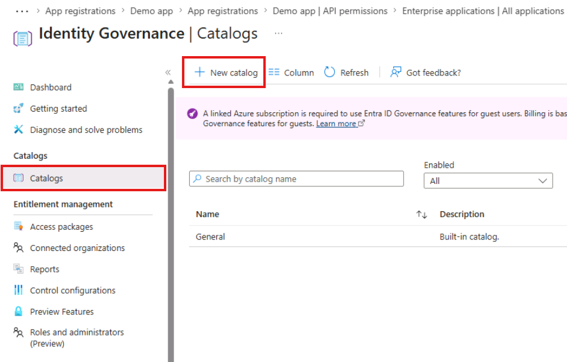
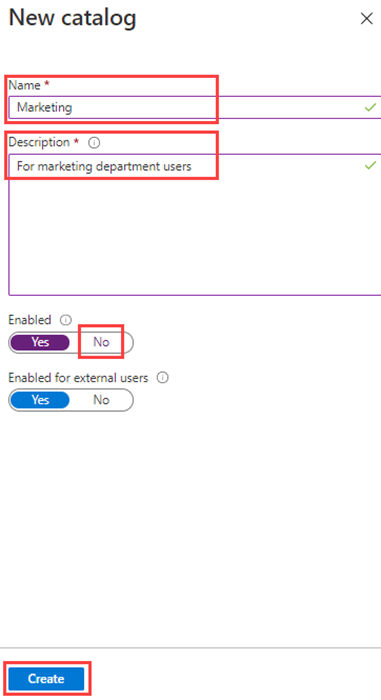
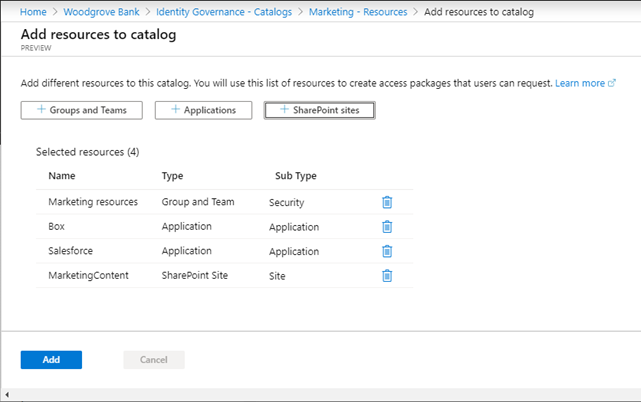
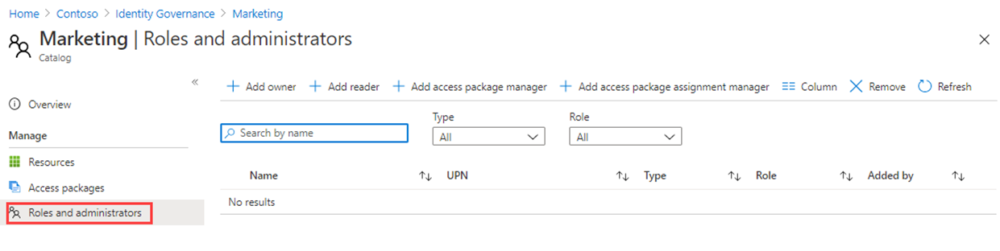
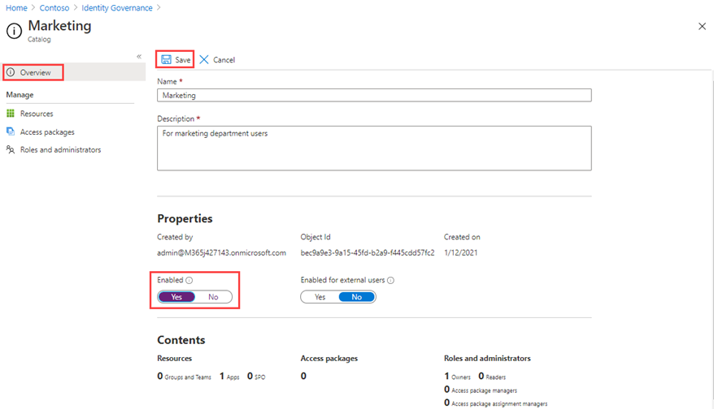

---
lab:
  title: 22 - Create and manage a catalog of resources in Microsoft Entra entitlement management
  learning path: '04'
  module: Module 04 - Plan and Implement and Identity Governance Strategy
  description: Create and deploy an entitlement package using Microsoft Entra Entitlement Management. Then work as a user to request, and use the entitlement.
  duration: 15 minutes
  level: 300
  islab: true
  primarytopics:
    - Microsoft Entra
---

# Lab 22: Create and manage a catalog of resources in Microsoft Entra entitlement management

### Login type: Microsoft 365 admin

## Lab scenario

A catalog is a container of resources and access packages. You create a catalog when you want to group related resources and access packages. Whoever creates the catalog becomes the first catalog owner. A catalog owner can add additional catalog owners. You must create and configure a catalog in your organization.

#### Estimated time: 15 minutes

### Exercise 1 - Building out resources in Entitlement Management

#### Task 1 - Create a catalog

1. Sign in to **Microsoft Entra admin center** at **`https://entra.microsoft.com`** as your Global Administrator.

    > **Note:** You may be prompted to complete Multi-Factor Authentication (MFA) during sign-in. Follow the prompts to configure or verify your authentication method before continuing.

    **Important** - To use and configure Microsoft Entra ID terms of use, you must have:
    - Microsoft Entra ID Premium P1, P2, EMS E3, or EMS E5 subscription.
    - If you don't have one of these subscriptions, you can get Microsoft Entra ID Premium trial.
    - One of the following administrator accounts for the directory you want to configure:
        - Global Administrator
        - Security Administrator
        - Conditional Access Administrator

1. In the left navigation menu, expand the **ID Governance**, select **Entitlement management**.

1. On the **Identity Governance | Getting Started** page, in the left navigation, under **Catalogs** select **Catalogs**.

1. On the top menu, select **+ New Catalog**.

    

1. In the New catalog pane, in the **Name** box, enter **Marketing**.

1. In the **Description** box, enter **For marketing department users**. Users will see this information in an access package's details.

1. Under **Enabled**, select **Yes**.

    - **Enabled for external users** select **No**.  This setting allows users in selected external directories to be able to request access packages in this catalog. No changes will be made to this setting.

1. You may choose to enable the catalog for immediate use or disable if you intend to stage it or keep it unavailable until you intend to use it. For this exercise, the catalog does not need to be enabled.

   

1. Select **Create**.

#### Task 2 - Add resources to a catalog

To include resources in an access package, the resources must exist in a catalog. The types of resources you can add are groups, applications, and SharePoint Online sites. The groups can be cloud-created Microsoft 365 Groups or cloud-created Microsoft Entra security groups. The applications can be Microsoft Entra enterprise applications, including both SaaS applications and your own applications federated to Microsoft Entra ID. The sites can be SharePoint Online sites or SharePoint Online site collections.

1. On the **Identity Governance** page, if necessary, select **Catalogs**.

1. In the **Catalogs** list, select **Marketing**.

1. In the left navigation, under **Manage**, select **Resources**.

1. On the menu, select **+ Add resources**.

1. In the Add resources to catalog page, review the available options.  Add the following items:

   | Resource Type | Value |
   | :------------- | :---------- |
   |  **Groups and Teams** | **Retail** |
   |  **Applications** | **Box** |
   |  **Applications** | **Salesforce** |
   |  **SharePoint sites** | **Brand** - pick this SharePoint from your list of available sites |

1. You may not have any resources in Groups and Teams, Applications, or SharePoint sites. Select any resource category and then select a resource from that category.

1. For this exercise, it is okay to choose any resource you may have available.

    

1. When finished, Select **Add**. These resources can now be included in access packages within the catalog.

#### Task 3 - Add additional catalog owners

The user that created a catalog becomes the first catalog owner. To delegate management of a catalog, you add users to the catalog owner role. This helps share the catalog management responsibilities.

1. If necessary, in the Microsoft Entra admin center, expand the **ID Governance**, select **Entitlement management**, select **Catalogs** and then select **Marketing**.

1. In the Marketing catalog page, in the left navigation menu, select **Roles and administrators**.

    

1. On the top menu, review the available roles and then select **+ Add catalog owner**.

1. In the Select members pane, select your **Adele Vance** and then select **Select**.

1. Review the newly added role in the Roles and administrators list.

#### Task 4 - Edit a catalog

You can edit the name and description for a catalog. Users see this information in an access package's details.

1. In the Marketing page, in the left navigation, select **Overview**.

1. On the top menu, select **Edit**.

1. Review the setting and, under **Properties** > **Enabled**, select **Yes**.

    

1. Select **Save**.

#### Task 5 – Create access reviews for guest users

Microsoft Entra Identity Governance provides access reviews to help manage and control the access lifecycle for guest users.

1. In the **Microsoft Entra admin center**, expand the **ID Governance**, select **Access reviews**.

1. On the **Identity Governance | Access reviews** page, select **+ New access review**.

1. On the **Create an access review** page, in the **Resource review** box, select **Select**.

1. On the **New access review** page, under the **Select what to review**, open the **Select review** dropdown and select **Teams + Groups**.

1. Under the **Review scope**, select **All Microsoft 365 groups with guest users**.

1. Under the **Scope**, select **Guest users only**.

1. Select **Next: Reviews**.

1. In the **Reviews**, configure who reviews and approves access and when access is reviewed and expires.

1. Under the **Select reviewers** section, select **Group owner(s)** as the reviewers.  
   > Guest users should not be allowed to review their own access, which is a recommended identity governance practice.

1. Under **Duration (in days)**, leave the default value of **3**, then select the **Review recurrence** and **Start date** for the review.

1. On the **Settings** tab, configure the review behavior.  
   - Enable **Auto apply results to resource**.  
   - For **If reviewers don’t respond**, select **Remove access**.

1. Select **Review + create**, then select **Create** to create the new access review.

#### Task 6 - Delete a catalog

You can delete a catalog, but only if it does not have any access packages.

1. In the Marketing catalog’s Overview page, on the top menu, select Delete.

1. In the Delete dialog box, review the information and then select **No**.

    >**Note:** we are keeping the catalog for use in the next lab.

### Exercise summary

In this exercise, you created a catalog and managed resources in Microsoft Entra Entitlement Management. This exercise showed how catalogs group resources for delegated, package-based access management.
