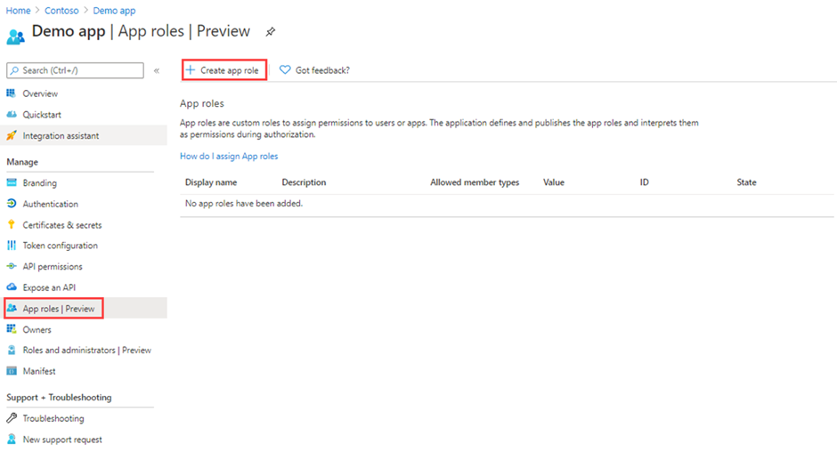

---
lab:
    title: '24 - Add app roles to your app and receive them in the token'
    learning path: '03'
    module: 'Module 03 - Implement app registrations'
---

# Lab 24: Add app roles to your app and receive them in the token

## Lab scenario

Role-based access control (RBAC) is a popular mechanism to enforce authorization in applications. When using RBAC, an administrator grants permissions to roles, and not to individual users or groups. The administrator can then assign roles to different users and groups to control who has access to what content and functionality. You plan to implement RBAC roles and need to verify you understand how to perform the procedure.

#### Estimated time: 10 minutes

## Declare app roles using the App roles UI

>[!IMPORTANT]
>The app roles portal UI feature is in public preview. This preview is provided without a service-level agreement and isn't recommended for production workloads. Certain features might be unsupported or have constrained capabilities.

To create an app role by using the Azure portal's user interface:

1. Sign in to [https://portal.azure.com](https://portal.azure.com) using a Global Administrator account.

1. Open the portal menu and then select **Azure Active Directory**.

1. On the **Azure Active Directory** blade, under **Manage,** select **App registrations**.

1. Select **App roles | Preview**, and then select **Create app role**.

    

1. In the **Create app role** pane, in the **Display name** box, enter **Survey Writer**.

1. Under **Allow member types**, select **User/Groups**.

1. In the **Value** box, enter **Survey.Create**.

1. In the **Description** box, enter **Writers can create surveys**.

1. Notice that the description is a mandatory field.

1. Verify the **Do you want to enable this app role** is selected and then select **Apply.**

## Assign users and groups to roles

Once you've added app roles in your application, you can assign users and groups to the roles. Assign users and groups to roles through the portal's UI or programmatically using [https://docs.microsoft.com/graph/api/user-post-approleassignments](https://docs.microsoft.com/graph/api/user-post-approleassignments). When the users assigned to the various app roles sign in to the application, their tokens will have their assigned roles in the roles claim.

To assign users and groups to roles by using the Azure portal:

1. Sign in to [https:portal.azure.com] (https:portal.azure.com).

1. In Azure Active Directory, in the navigation menu on the left, select **Enterprise applications.**

1. In the **All applications** list, select **Demo app**.

1. This app was created in an earlier exercise.

1. Under **Manage**, select **Users and groups.**

1. On the menu, select **+ Add user/group.**

1. On the **Add Assignment** blade, select **Users and groups**.

1. A list of users and security groups is displayed. You can search for a certain user or group, as well as select multiple users and groups that appear in the list.

1. After you have selected users and groups, select **Select**.

1. When using the **Select a role** assignment, all the roles that you've defined for the application are displayed.

1. Choose a role and then select **Select**.

1. Select **Assign** to finish the assignment of users and groups to the app.

1. Confirm that the users and groups you added appear in the **Users and groups** list.
