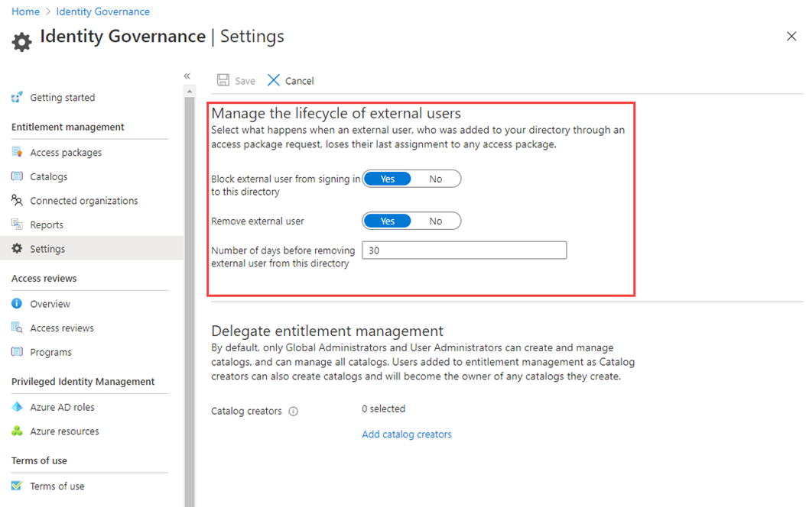

---
lab:
    title: '24 - Manage the lifecycle of external users in Azure AD Identity Governance settings'
    learning path: '04'
    module: 'Module 04 - Plan and Implement and Identity Governance Strategy'
---

# Lab 24: Manage the lifecycle of external users in Azure AD Identity Governance settings  

# RobertS -- No fix needed (other than removing this note), this lab worked as defined.

## Lab scenario

You can select what happens when an external user, who was invited to your directory through an access package request being approved, no longer has any access package assignments. This can happen if the user relinquishes all their access package assignments, or their last access package assignment expires. By default, when an external user no longer has any access package assignments, they are blocked from signing in to your directory. After 30 days, their guest user account is removed from your directory.

#### Estimated time: 5 minutes

### Exercise 1 - Azure AD Identity Governance settings

#### Task 1 - Manage the lifecycle of external users in Azure AD Identity Governance settings

1. Sign in to the [https://portal.azure.com](https://portal.azure.com) as a Global administrator.

2. An account with Global administrator or User administrator is required to complete these tasks.

3. Open Azure Active Directory and the select **Identity Governance**.

4. In the left navigation menu, under **Entitlement management**, select **Settings**.

5. On the top menu, select **Edit**.

    

6. In the **Manage the lifecycle of external users** section, review the different settings for external users.

7. When an external user loses their last assignment to any access packages, if you want to block them from signing in to this directory, set the **Block external user from signing in to this directory** to **Yes**.

8. If a user is blocked from signing in to the directory, the user will be unable to re-request the access package or request additional access in this directory. Do not configure blocking them from signing in if they will subsequently need to request access to other access packages.

9. Once an external user loses their last assignment to any access packages, if you want to remove their guest user account in this directory, set **Remove external** user to **Yes**.

    **Note** - Entitlement management only removes accounts that were invited through entitlement management. Also, note that a user will be blocked from signing in and removed from this directory even if that user was added to resources in this directory that were not access package assignments. If the guest was present in this directory prior to receiving access package assignments, they will remain. However, if the guest was invited through an access package assignment, and after being invited was also assigned to a OneDrive for Business or SharePoint Online site, they will still be removed.

10. If you want to remove the guest user account in this directory, you can set the number of days before it is removed. If you want to remove the guest user account as soon as they lose their last assignment to any access packages, set **Number of days before removing external user from this directory** to **0**.

11. If you’ve made any changes, select **Save**.
