---
lab:
    title: '26 - Add terms of use and acceptance reporting'
    learning path: '04'
    module: 'Module 01 - Plan and implement entitlement management'
---

# Lab 26: Add terms of use and acceptance reporting 

## Lab scenario

Azure AD terms of use policies provide a simple method that organizations can use to present information to end users. This presentation ensures users see relevant disclaimers for legal or compliance requirements. This article describes how to get started with terms of use (ToU) policies.

You must create and enforce a ToU policy for your organization.

#### Estimated time: 20 minutes

## Add terms of use

Once you have finalized your terms of use document, use the following procedure to add it.

1. Sign in to [https://portal.azure.com](https://portal.azure.com) using a Global Administrator account.

1. Open **Azure Active Directory** and the select **Identity Governance**.

1. In the left navigation menu, under **Terms of use**, select **Terms of use**.

1. On the Terms of use page, on the top menu, select **+ New terms**

    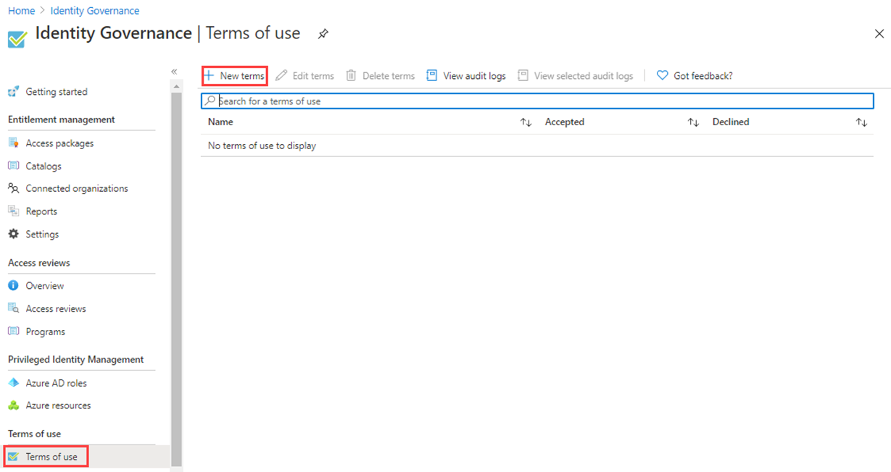

1. In the **Name** box, enter **Testing terms of use**.

1. This is the terms of use that will be used in the Azure portal.

1. In the **Display name** box, enter **Contoso Terms of Use**.

1. This is the title that users see when they sign in.

1. Select the **Terms of use document box**, browse to your finalized terms of use PDF and select it.

1. For this exercise you can choose any PDF you may have or, using Microsoft Word, create a simple terms of use doc and then print to PDF.

1. Select the language for your terms of use document.

1. The language option allows you to upload multiple terms of use, each with a different language. The version of the terms of use that an end user will see will be based on their browser preferences.

1. To require end users to view the terms of use prior to accepting them, set **Require users to expand the terms of use** to **On**.

1. To require end users to accept your terms of use on every device they are accessing from, set **Require users to consent on every device** to **On**. Users may be required to install additional applications if this option is enabled.

    >[!Warning]  
    >Consent on every device will require users to register each device with Azure AD prior to getting access.

1. If you want to expire terms of use consents on a schedule, set **Expire consents** to **On**. When set to On, two additional schedule settings are displayed.

    

1. Use the **Expire starting on** and **Frequency** settings to specify the schedule for terms of use expirations. The following table shows the result for a couple of example settings:

    | Expire starting on | Frequency | Result |
    |---|---|---|
    | Today's date | Monthly | Starting today, users must accept the terms of use and then reaccept every month.|
    | Date in the future | Monthly | Starting today, users must accept the terms of use. When the future date occurs, consents will expire and then users must reaccept every month. |

    For example, if you set the expire starting on date to **Jan 1** and frequency to **Monthly**, here is how expirations might occur for two users:

    | User | First accept date | First expire date | Second expire date | Third expire date |
    |---|---|---|---|---|
    | Alice | Jan 1 | Feb 1 | Mar 1 | Apr 1|
    | Bob | Jan 15 | Feb 1 | Mar 1| Apr 1 |

1. Use the **Duration before re-acceptance requires (days)** setting to specify the number of days before the user must reaccept the terms of use. This allows users to follow their own schedule. For example, if you set the duration to **30** days, here is how expirations might occur for two users:

    | User | First accept date | First expire date | Second expire date | Third expire date |
    |---|---|---|---|---|
    | Alice | Jan 1 | Jan 31 | Mar 2 | Apr 1|
    | Bob | Jan 15 | Feb 14 | Mar 16| Apr 15

    >[!Note]  
    >It is possible to use the Expire consents and Duration before re-acceptance requires (days) settings together, but typically you use one or the other.

1. Under **Conditional Access**, select **Custom policy**.

    | Template | Description |
    |---|---|
    | **Access to cloud apps for all guests** | A Conditional Access policy will be created for all guests and all cloud apps. This policy impacts the Azure portal. Once this is created, you might be required to sign-out and sign-in. | 
    |**Access to cloud apps for all users** | A Conditional Access policy will be created for all users and all cloud apps. This policy impacts the Azure portal. Once this is created, you will be required to sign-out and sign-in. |
    | **Custom policy** | Select the users, groups, and apps that this terms of use will be applied to. |
    | **Create Conditional Access policy later** | This terms of use will appear in the grant control list when creating a Conditional Access policy. |

    >[!IMPORTANT]  
    >Conditional Access policy controls (including terms of use) do not support enforcement on service accounts. We recommend excluding all service accounts from the Conditional Access policy.

    Custom Conditional Access policies enable granular terms of use, down to a specific cloud application or group of users. For more information, see [https://docs.microsoft.com/en-us/azure/active-directory/conditional-access/require-tou](https://docs.microsoft.com/en-us/azure/active-directory/conditional-access/require-tou).

1. When complete, select **Create**.

    

1. When the terms of use is created, you will automatically be redirected to the Conditional access policy page. On the page, in the **Name** box, enter **Enforce ToU**.

1. Under **Assignments**, select **Users and groups**.

1. On the include tab, select **Users and groups** check box.

1. In the Select pane, select an account you would like to use to test the terms of use policy.

1. If you choose your administrator account, like all conditional access policies, be sure you have another account with enough permissions to change the conditional access policy. This is to ensure your administrator account will not be locked out should the conditional access policy result in an undesirable outcome.

1. Select **Cloud apps or actions.**

1. Select **All cloud apps**.

1. Under **Access controls**, select **Grant**.

1. In the Grant pane, select **Testing terms of use** and then select **Select**.

1. Under **Enable policy**, select **On**.

1. When complete, select **Create**.

    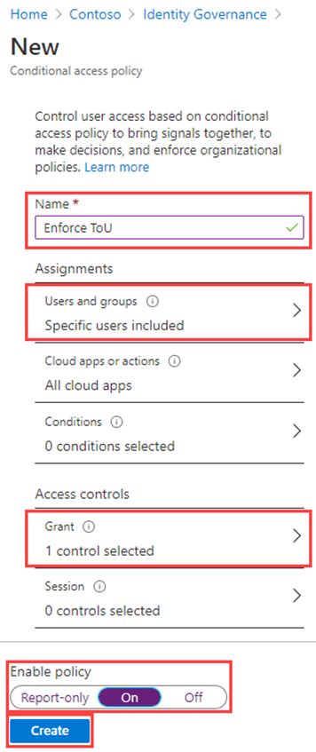

1. If you chose to use your own account, you can refresh your browser. You will be prompted to sign in again. When you sign in, you will be required to accept the terms of use.

## View report of who has accepted and declined

The Terms of use blade shows a count of the users who have accepted and declined. These counts and who accepted/declined are stored for the life of the terms of use.

1. In Microsoft Azure, in **Identity Governance > Terms of use**, locate your terms of use.

1. For a terms of use, select the numbers under **Accepted** or **Declined** to view the current state for users.

    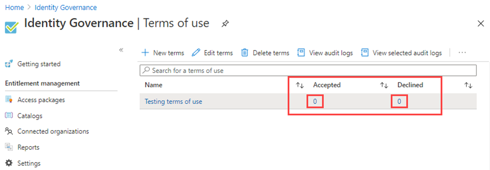

1. In this exercise you may not have any accepted or declined terms of use. In the following example, the **Accepted** value was selected. You can see the reported user information for those that have accepted the terms of use.

    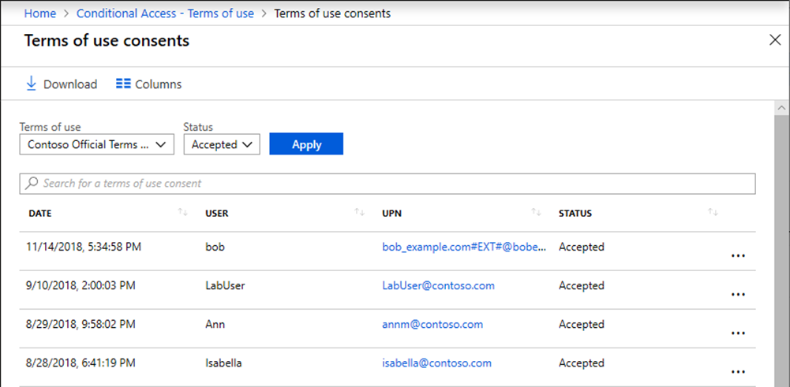

1. To view the history for an individual user, select the ellipsis to the right of the user name and then **View History**.

    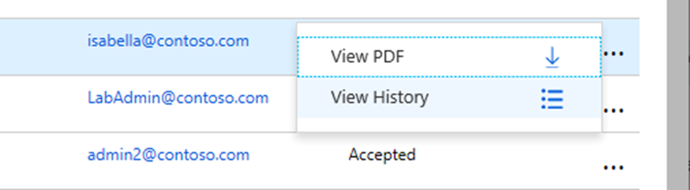

1. In the view history pane, you see a history of all the accepts, declines, and expirations.

    

## What terms of use looks like for users

1. Once a terms of use is created and enforced, users who are in scope will see the terms of use page.

    

1. Users can view the terms of use and, if necessary, use buttons to zoom in and out.

    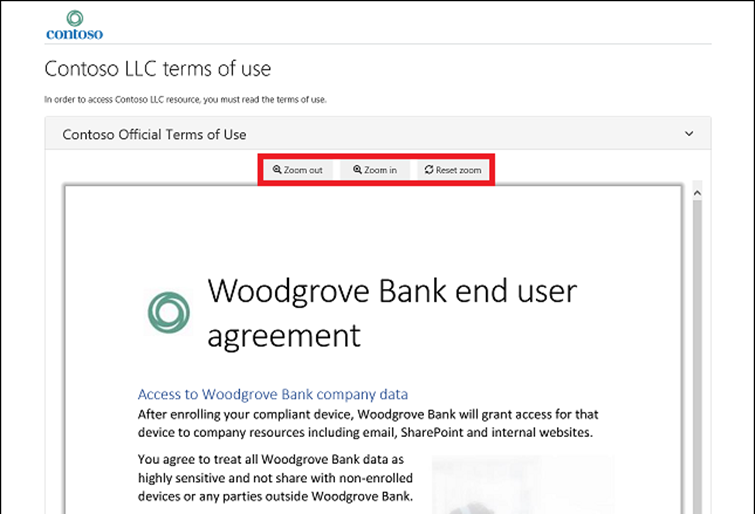

1. On mobile devices, the terms of use will be displayed similar to the following example.

    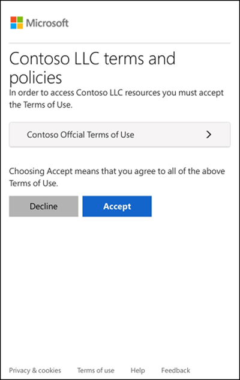

### How users can review their terms of use

Users can review and see the terms of use that they have accepted by using the following procedure.

1. Browse to [https://myapps.microsoft.com](https://myapps.microsoft.com/) and then sign in using your user account.

1. On the Overview page, select VIEW SETTINGS AND PRIVACY.

    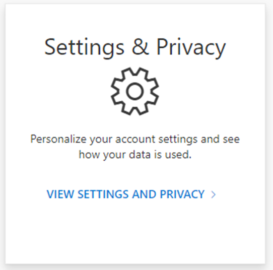

1. On the Settings & Privacy page, select the **Privacy** tab.

    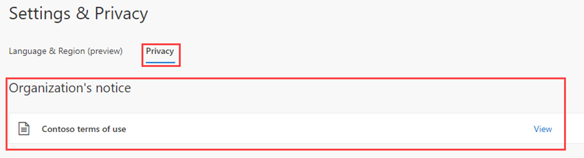

1. Under **Organization’s notice**, you can review the terms of use you have accepted.

## Edit terms of use details

You can edit some details of terms of use, but you can't modify an existing document. The following procedure describes how to edit the details.

1. Sign in to the [https://portal.azure.com](https://portal.azure.com) as a Global administrator.

1. Open Azure Active Directory and the select **Identity Governance**.

1. In the left navigation menu, under **Terms of use**, select **Terms of use**.

1. Select the terms of use you want to edit.

1. On the top menu, select **Edit terms**.

1. In the Edit terms of use pane, you can change the following:

    - **Name** – this is the internal name of the ToU that is not shared with end users
  
    - **Display name** – this is the name that end users can see when viewing the ToU

    - **Require users to expand the terms of use** – Setting this to **On** will force the end use to expand the terms of use document before accepting it.

    - U**pdate an existing terms of use** document.

    - You can add a language to an existing ToU If there are other settings you would like to change, such as require users to consent on every device, expire consents, duration before reacceptance, or Conditional Access policy, you must create a new terms of use.

    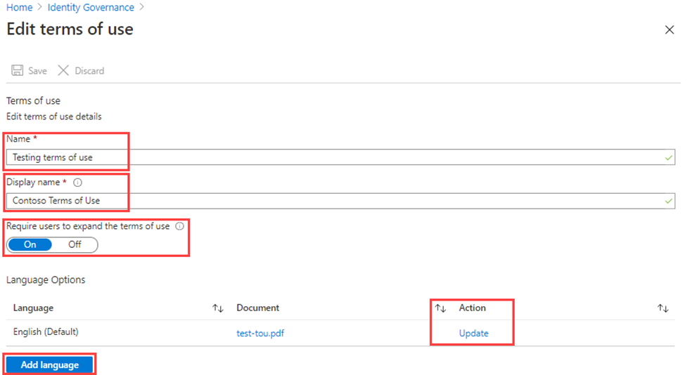

1. Once you are done, select **Save** to save your changes.

## Update an existing terms of use document

You may, on occasion, be required to update the terms of use document.

1. Select the terms of use you want to edit.

1. Select **Edit terms**.

1. In the **Language Options** table, identify the terms of use language you want to update and then, in the **Action** column, select **Update**.

    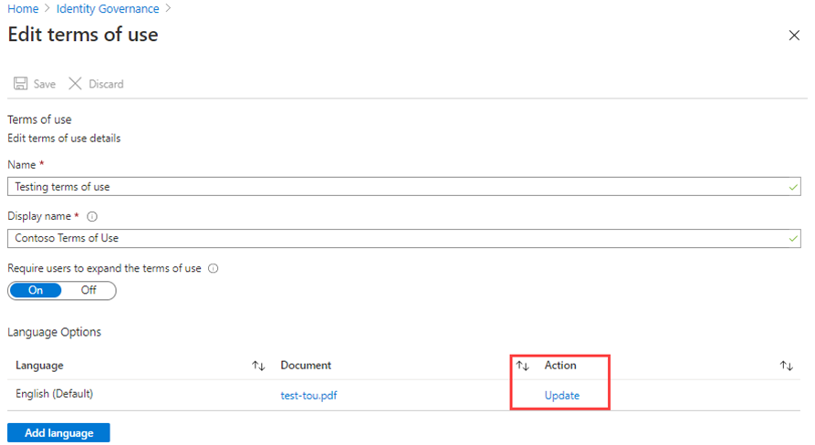

1. In the Update terms of use version pane, you can upload a new version of your terms of use document.

1. Additionally, you can use the **Require reaccept** toggle button if you want to require your users to accept this new version the next time they sign in. If you do not require your users to re-accept, their previous consent will stay current and only new users who have not consented before or whose consent expires will see the new version.

    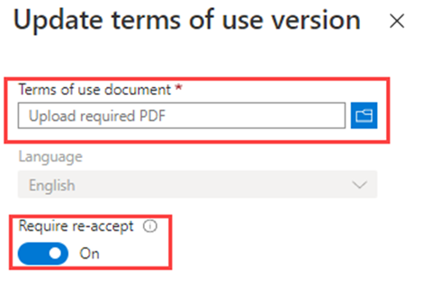

1. Once you have uploaded your new pdf and decided on re-accept, select **Add**.

1. You will now see the most recent version under the Document column.
