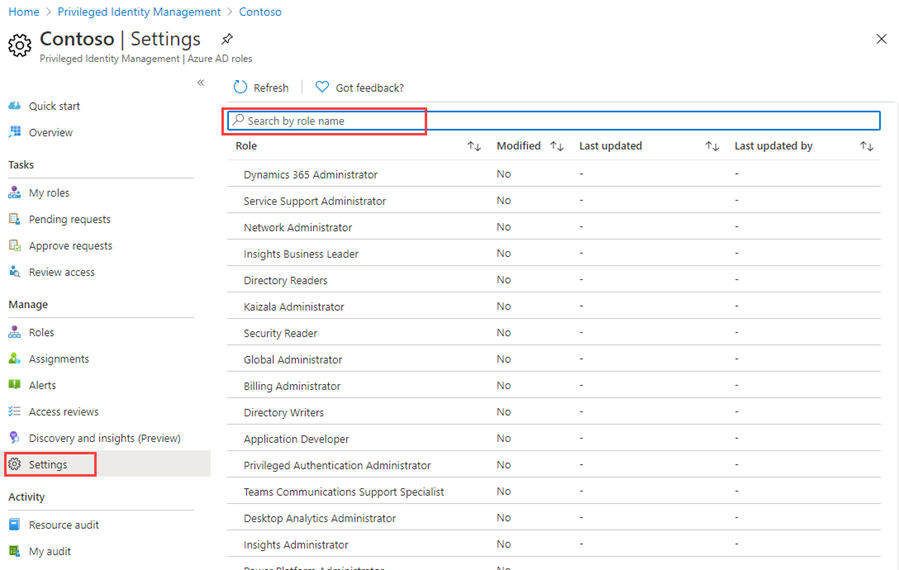
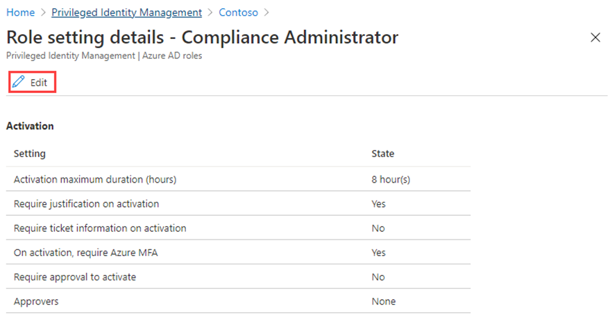
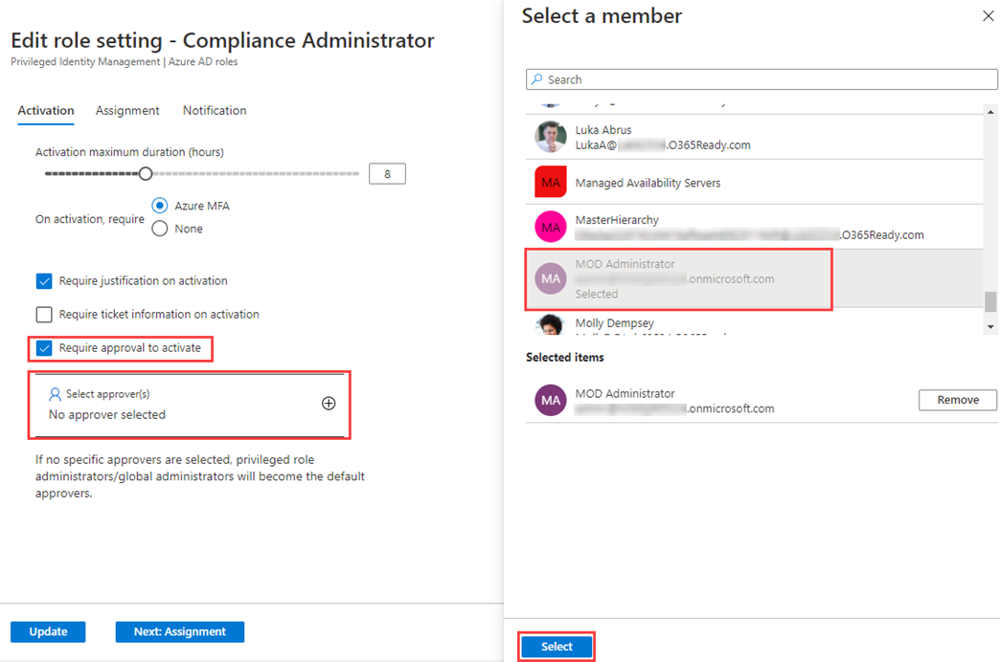
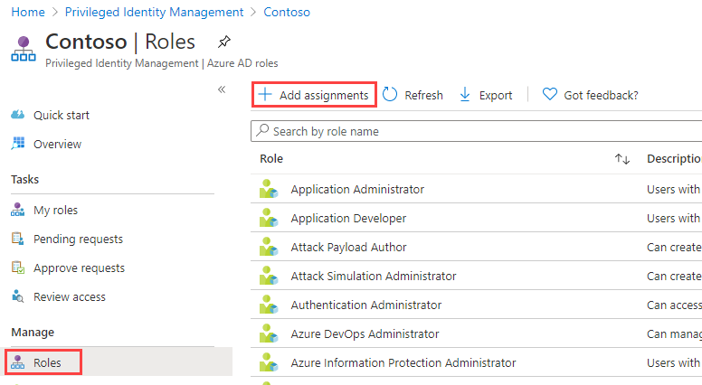
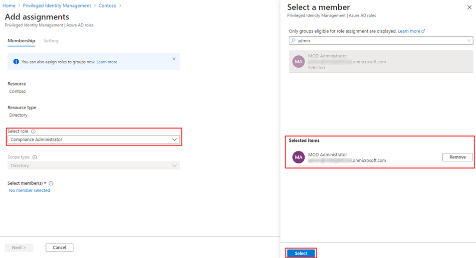
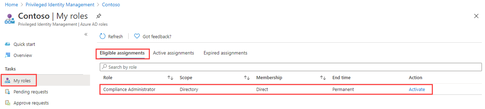
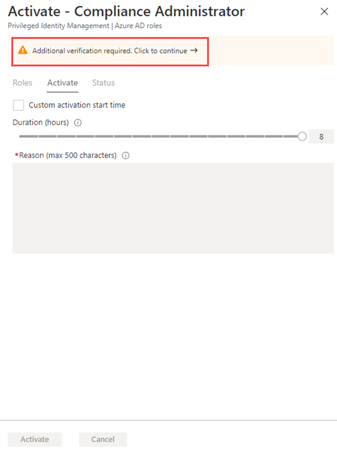
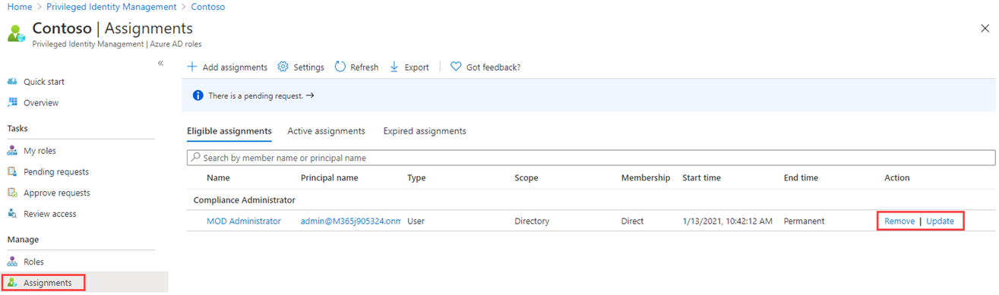

---
lab:
  title: 26 - Configure Privileged Identity Management for Microsoft Entra roles
  learning path: '04'
  module: Module 04 - Plan and Implement and Identity Governance Strategy
  description: When you need to assume an Microsoft Entra role, you can request activation by opening My roles in Privileged Identity Management.
  duration: 30 minutes
  level: 300
  islab: true
  primarytopics:
    - Microsoft Entra
---

# Lab 26: Configure Privileged Identity Management for Microsoft Entra roles

### Login type = Microsoft 365 admin

## Lab scenario

A Privileged role administrator can customize Privileged Identity Management (PIM) in their Microsoft Entra organization, including changing the experience for a user who is activating an eligible role assignment. You must become familiar with configuring PIM.

#### Estimated time: 30 minutes

NOTE - There have been on-going changes to requiring MFA in lab environments.  When you switch between users to complete this lab, you may be prompted to set up MFA.

### Exercise 1 - Configure Microsoft Entra role settings

#### Task 1 - Open role settings

Follow these steps to open the settings for an Microsoft Entra role.

1. Sign in to **Microsoft Entra admin center** at **`https://entra.microsoft.com`** as your Global Administrator.

    > **Note:** You may be prompted to complete Multi-Factor Authentication (MFA) during sign-in. Follow the prompts to configure or verify your authentication method before continuing.

1. In the left navigation menu, expand the **ID Governance**, select **Privileged Identity Management**.

1. On the **Privileged Identity Management** page, in the left navigation, select **Microsoft Entra roles**.

1. On the Quick start page, in the left navigation, select **Settings**.

    

1. Review the list of roles and then, in the **Search by role name**, enter **compliance**.

1. In the results, select **Compliance Administrator**.

1. Review the role setting details information.

#### Task 2 - Require approval to activate

If setting multiple approvers, approval completes as soon as one of them approves or denies. You cannot require approval from at least two users. To require approval to activate a role, follow these steps.

1. In the Role setting details page, on the top menu, select **Edit**.

    

1. In the Edit role setting – Compliance Administrator page, select the **Require approval to activate** check box.

1. Select **Select approvers**.

1. In the Select a member pane, select your administrator account and then select **Select**.

    

1. Once you have configured the role settings, select **Update** to save your changes.

### Exercise summary

In this exercise, you configured role activation settings, including approval requirements, for a Microsoft Entra role. This exercise showed how PIM policies can be tailored on a per-role basis.

### Exercise 2 - Use PIM to assign Microsoft Entra roles

#### Task 1 - Assign a role

With Microsoft Entra ID, a Global administrator can make permanent Microsoft Entra admin role assignments. These role assignments can be created using the Microsoft Entra admin center, the Azure portal, or using PowerShell commands.

The Privileged Identity Management (PIM) service also allows Privileged role administrators to make permanent admin role assignments. Additionally, Privileged role administrators can make users eligible for Microsoft Entra admin roles. An eligible administrator can activate the role when they need it, and then their permissions expire once they're done.

Follow these steps to make a user eligible for an Microsoft Entra admin role.

1. Sign in to **Microsoft Entra admin center** at **`https://entra.microsoft.com`** as your Global Administrator.

1. In the left navigation menu, expand the **ID Governance**, select **Privileged Identity Management**.

1. On the **Privileged Identity Management** page, in the left navigation, select **Microsoft Entra roles**.

1. On the Quick start page, in the left navigation, select **Roles**.

1. On the top menu, select **+ Add assignments**.

    

1. In the **Add assignments** page, on the **Membership** tab, review the settings.

1. Under **Select role**, open the dropdown and select **Compliance Administrator**.

1. Use the **Search role by name** box to locate the role if needed.

1. You can use the **Search role by name** filter to help located a role.

1. Under **Select member(s),** select **No members selected**.

1. In the Select a member pane, select **Miriam Graham** and then select **Select**.

    

1. In the **Add assignments** page, select **Next >**.

1. On the **Settings** tab, under **Assignment type**, review the available options. For this task, use the default setting.

    - Eligible assignments require the member of the role to perform an action to use the role. Actions might include performing a multi-factor authentication (MFA) check, providing a business justification, or requesting approval from designated approvers.
    - Active assignments do not require the member to perform any action to use the role. Members assigned as active have the privileges always assigned to the role.

1. Review the remaining settings and then select **Assign**.

#### Task 2 - Log in with Miriam

1. Open a new InPrivate browser window.

1. Connect to **Microsoft Entra admin center** at **`https://entra.microsoft.com`** as your Global Administrator.

    >**Note:** If it opens with a user logged in, Select on their name in the upper-right corner and select **Sign in as a different account**.

1. Log in a Miriam.

   | Field | Value |
   | :--- | :--- |
   | Username | `MiriamG@<your domain.onmicrosoft.com>` |
   | Password |  Enter the provided tenant admin password |

   > **Note:** You may be prompted to complete Multi-Factor Authentication (MFA) during sign-in. Follow the prompts to configure or verify your authentication method before continuing.

1. In the left navigation, under **Entra ID**, select **Users**, then select **All users**.

1. Find and select **Miriam Graham** from the list of users.

1. On the **Overview** page, in the left navigation, select **Assigned roles**.

1. Select **Eligible assignments** tab.

1. Notice that the **Compliance Administrator** role is now available to Miriam.

#### Task 3 - Activate your Microsoft Entra roles

When you need to assume an Microsoft Entra role, you can request activation by opening **My roles** in Privileged Identity Management.

1. In the **Search, resources, services, and docs** bar, search for **Privileged**, then select **Microsoft Entra Privileged Identity Management**.

1. On the **Privileged Identity Management** page, in the left navigation menu, select **My roles**.

1. In the **My roles** page, review the list of **Eligible assignments**.

    

1. In the Compliance Administrator role row, select **Activate**.

1. In the Activate – Compliance Administrator pane, select **Additional verification required** and then follow the instructions to provide additional security verification. You are required to authenticate only once per session.

    

    **Verification** - Based on our current lab environment configuration, you will be required configure MFA and log in successfully. However, if you had previously signed in using MFA, you may not see this window (You are required to authenticate only once per session).

1. After you have completed the additional security verification, in the Activate – Compliance Administrator pane, in the **Reason** box, enter the **This is my justification for activating this role**.

    **Important Note** - the principle of least privilege, you should only activate the account for the amount of time you need it.  If the work needed to be done, only takes 1.5 hours, then set the duration to two hours. Similarly, if you know that you won't be able to do the work until after 3pm, choose a Custom activation time.

1. Select **Activate**.

#### Task 4 - Assign a role with restricted scope

For certain roles, the scope of the granted permissions can be restricted to a single admin unit, service principal, or application. This procedure is an example if assigning a role that has the scope of an administrative unit.

1. Remember to close out the browser windows for MiriamG, then open the Microsoft Entra admin center with your administrator account.

1. Browse to the **Privileged Identity Management** page, and in the left navigation menu, select Azure **Microsoft Entra roles**.

1. Select **Roles**.

1. In the **Roles** page, on the top menu, select **+ Add assignments**.

1. In the **Add assignments** page, under **Select role**  open the dropdown and select **User administrator**.

1. Select the **Scope type** menu and review the available options. For now, you will use the **Directory** scope type.

   **Tip** - Go to [https://docs.microsoft.com/en-us/azure/active-directory/roles/admin-units-manage](https://docs.microsoft.com/en-us/azure/active-directory/roles/admin-units-manage) for more information about the administrative unit scope type.

1. As you did when assigning a role without a restricted scope, you would add members and complete the settings options. For now, select **Cancel**.

#### Task 5 - Update or remove an existing role assignment

Follow these steps to update or remove an existing role assignment.

1. In the Open Privileged Identity Management > Microsoft Entra roles page, in the left navigation, select **Assignments**.

1. In **Assignments** list, for Compliance Administrator, review the options in the **Action** column.

    

1. Select **Update** and review the options available in the Membership settings pane. When complete, close the pane.

1. Select **Remove**.

1. In the **Remove** dialog box, review the information and then select **Yes**.

### Exercise summary

In this exercise, you used Privileged Identity Management to make a user eligible for a Microsoft Entra role, validated the activation flow, and removed the assignment. This exercise showed how just-in-time role activation reduces standing administrative privilege.
