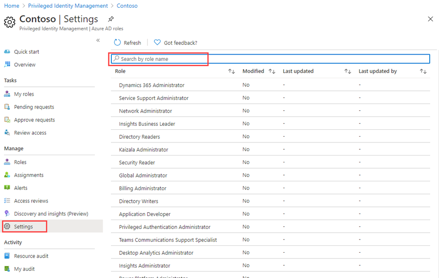
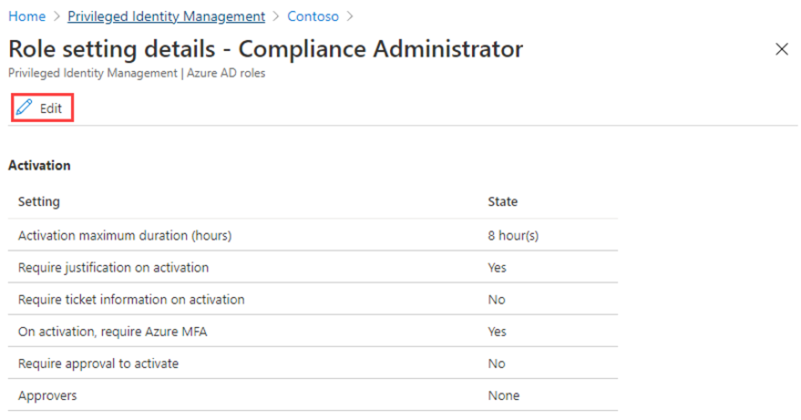
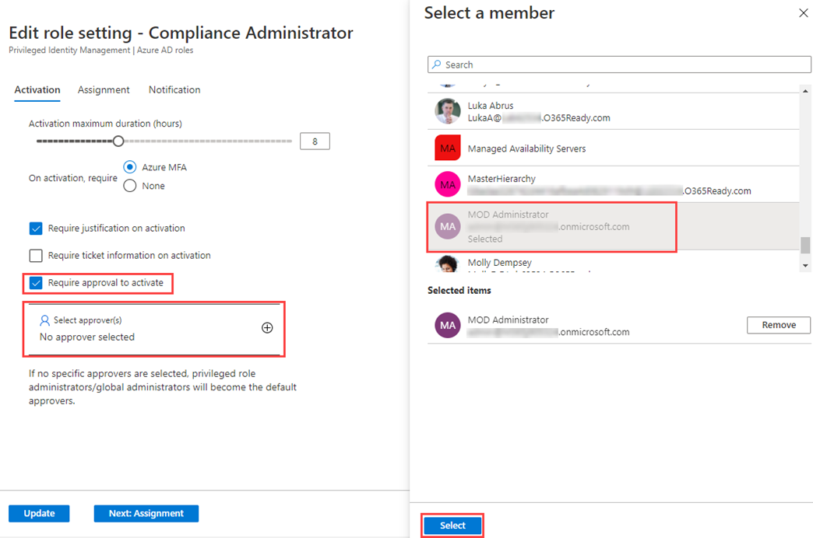

---
lab:
    title: '28 - Configure Privileged Identity Management for Azure AD roles'
    learning path: '04'
    module: 'Module 04 - Plan and Implement and Identity Governance Strategy'
---

# Lab 28: Configure Privileged Identity Management for Azure AD roles

## Lab scenario

A Privileged role administrator can customize Privileged Identity Management (PIM) in their Azure Active Directory (Azure AD) organization, including changing the experience for a user who is activating an eligible role assignment. You must become familiar with configuring PIM.

#### Estimated time: 15 minutes

### Exercise 1 - Configure Azure AD role settings

#### Task 1 - Open role settings

Follow these steps to open the settings for an Azure AD role.

1. Sign in to the [https://portal.azure.com](https://portal.azure.com) as a Global administrator.

2. Search for and then select **Azure AD Privileged Identity Management.**

3. In the Privileged Identity Management blade, in the left navigation, select **Azure AD roles.**

4. On the Quick start page, in the left navigation, select **Settings.**

    

5. Review the list of roles and then, in the **Search by role name**, enter **compliance**.

6. In the results, select **Compliance Administrator**.

7. Review the role setting details information.

#### Task 2 - Require approval to activate

If setting multiple approvers, approval completes as soon as one of them approves or denies. You cannot require approval from at least two users. To require approval to activate a role, follow these steps.

1. In the Role setting details page, on the top menu, select **Edit**.

    

2. In the Edit role setting – Compliance Administrator blade, select the **Require approval to activate** check box.

3. Select **Select approvers**.

4. In the Select a member pane, select your administrator account and then select **Select**.

    

5. Once you have configured the role settings, select **Update** to save your changes.
