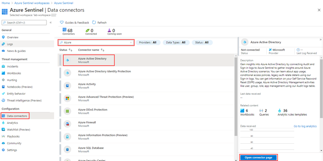
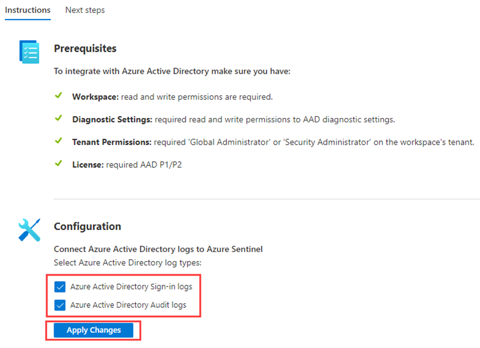

---
lab:
    title: '31 - Connect data from Azure Active Directory (Azure AD) to Microsoft Sentinel'
    learning path: '04'
    module: 'Module 04 - Monitor and maintain Azure Active Directory'
---

**NOTE -- this lab is being retired from the SC-300 labs on February 4th.  We will be introducing a more interesting lab to cover Microsoft Sentinel in the near future.  If you are teaching the SC-300 class, you can choose to optionally include or exclude this lab.  If you do use it, the students will need an Azure Pass and subscription set up.**

# Lab 31: Connect data from Azure Active Directory (Azure AD) to Microsoft Sentinel

## Lab scenario

Your company expects to begin using a Security information and event management (SIEM) solution. You know you have access to Microsoft Sentinel and need to become familiar with connecting it to your Azure AD.

#### Estimated time: 10 minutes

## Prerequisites

- Any Azure AD license (Free/O365/P1/P2) is sufficient to ingest sign-in logs into Microsoft Sentinel. Additional per-gigabyte charges may apply for Azure Monitor (Log Analytics) and Azure Sentinel.

- Your user must be assigned the Microsoft Sentinel Contributor role on the workspace.

- Your user must be assigned the Global Administrator or Security Administrator roles on the tenant you want to stream the logs from.

- Your user must have read and write permissions to the Azure AD diagnostic settings to be able to see the connection status.

## Create and add an Microsoft Sentinel Workspace

Use these instructions if you do not already have a workspace available to Microsoft Sentinel.

1. Sign in to [https://portal.azure.com](https://portal.azure.com) using a Global Administrator account.

2. Search for and select **Microsoft Sentinel**.

3. In the Microsoft Sentinel workspaces blade, on the menu, select **+ Create**.

4. If you already have an Microsoft Sentinel workspace, you can select that and continue to the next task.

5. In the Add Microsoft Sentinel to a workspace blade, select **Create a new workspace**.

6. Use the following information to create a new log analytics workspace:

    | Setting| Value|
    | :--- | :--- |
    | Subscription| Use your current subscription.|
    | Resource group| Use an existing resource group or create a new one.|
    | Name| **Lab-workspace-yourinitialsanddate** The workspace must be a globally unique value.|
    | Pricing tier| Pay-as-you-go (Per GB 2018) |

7. Select **Review + Create**.
8. When the **Validation passed** message appears, select **Create**.

9. When complete, select your new workspace and then select **Add** to add the workspace to Microsoft Sentinel.

## Connect to Azure Active Directory

You can use Microsoft Sentinel's built-in connector to collect data from [https://docs.microsoft.com/en-us/azure/active-directory/fundamentals/active-directory-whatis](https://docs.microsoft.com/en-us/azure/active-directory/fundamentals/active-directory-whatis) and stream it into Microsoft Sentinel. The connector allows you to stream [https://docs.microsoft.com/en-us/azure/active-directory/reports-monitoring/concept-sign-ins](https://docs.microsoft.com/en-us/azure/active-directory/reports-monitoring/concept-sign-ins) and [https://docs.microsoft.com/en-us/azure/active-directory/reports-monitoring/concept-audit-logs](https://docs.microsoft.com/en-us/azure/active-directory/reports-monitoring/concept-audit-logs).

1. In Microsoft Sentinel, in the navigation menu on the left, under **Configuration**, select **Data connectors**.

2. In the **Data connectors** list, select **Azure Active Directory** and then select **Open connector page**.

    

3. Under **Configuration**, select the **Azure Active Directory Sign-in logs** and **Audit logs** checkboxes and then select **Apply changes**.

    

4. Close the Azure Active Directory connector page.
